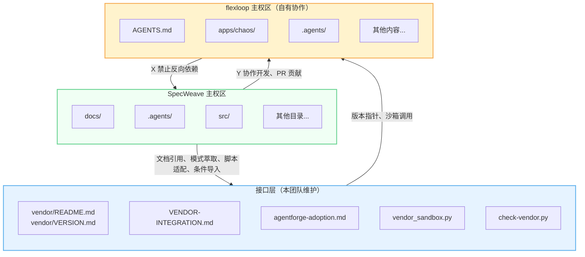
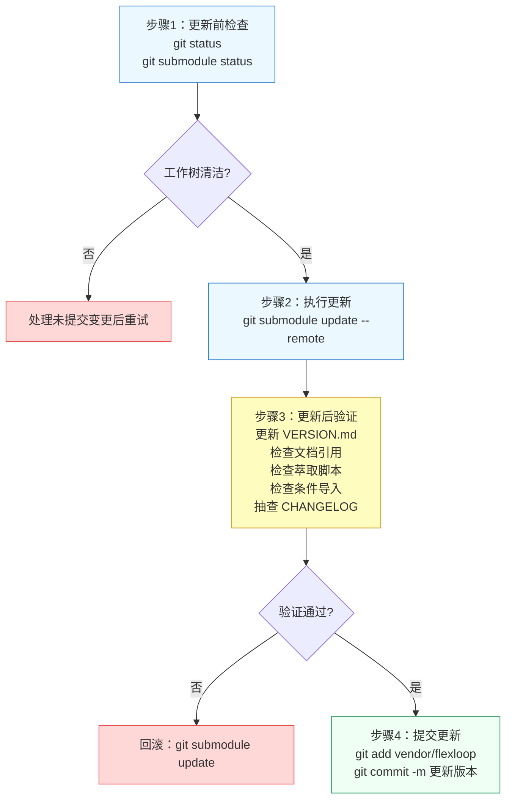
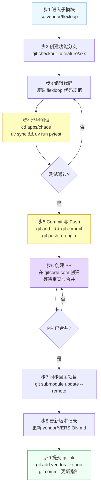
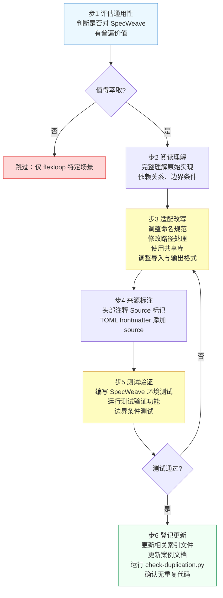

# flexloop 子模块治理团队 · 工作流操作手册

本手册是 flexloop 团队成员执行日常操作的一站式参考，涵盖版本更新、子模块开发、模式萃取三大核心工作流的标准操作步骤、验证检查清单与应急处理方案。执行任何与 flexloop 相关的操作前，请先阅读"前置准备"和"操作前快速检查清单"。

## 适用范围

- **适用角色**：team-flexloop 全体成员（architect、developer、reviewer、tester）
- **适用场景**：子模块版本同步、子模块内功能开发、从 flexloop 萃取模式/脚本
- **不适用场景**：第三方只读子模块（third_party 类型）的管理、flexloop 项目自身的 CI/CD 维护

## 前置准备

执行任何操作前，请确认以下环境条件已满足：

1. **子模块已初始化**：`vendor/flexloop/` 目录不为空，且存在 `.git` 文件（submodule 指针）
2. **工作树清洁**：`git status` 显示无未提交变更
3. **Git 远程可访问**：对 gitcode.com:flexloop/flexloop.git 有读写权限
4. **flexloop 环境就绪**（如需在子模块内测试）：
   ```bash
   cd vendor/flexloop/apps/chaos
   uv sync
   ```

## 三区域边界模型

所有操作必须在正确的区域内进行，禁止越权操作：



| 区域 | 颜色标记 | 操作权限 | 关键约束 |
|---|---|---|---|
| SpecWeave 主权区 | 绿色 | 自由读写 | 禁止添加指向 vendor 内部的硬编码路径 |
| 接口层 | 蓝色 | 团队维护 | 修改后须更新 VERSION.md 记录 |
| flexloop 主权区 | 黄色 | 允许开发 | 修改后必须 commit/push，禁止未提交存留 |

## 协作四原则

任何操作必须同时满足以下四项原则，缺一不可：

| 原则 | 核心要求 | 检查方法 |
|---|---|---|
| **可编辑** | 子模块内开发的修改必须 commit 并 push 到 flexloop 仓库，通过 PR 合并到 main | `git status vendor/flexloop` 无 modified content |
| **条件引** | 禁止裸 import vendor 模块，必须使用 vendor_sandbox 条件导入 | 运行 `check-vendor.py` 无非法导入告警 |
| **跟分支** | 跟踪 main 分支，按需手动更新，禁止自动更新 | `.gitmodules` 中配置 `branch = main` |
| **沙箱护** | 运行 flexloop 脚本必须通过 vendor_sandbox 沙箱，禁止直接 subprocess 调用 | 代码中使用 `run_flexloop_script()` |

## 快速参考命令卡

```bash
# 检查子模块状态
git submodule status vendor/flexloop

# 更新到 main 分支最新版本
git submodule update --remote vendor/flexloop

# 在子模块内开发
cd vendor/flexloop
git checkout -b feature/your-feature
# ... 开发、测试 ...
git add .
git commit -m "feat: describe changes"
git push -u origin feature/your-feature

# 合规检查
python .agents/scripts/check-vendor.py
python .agents/scripts/check-vendor.py --deep

# 运行沙箱脚本
python -c "from .agents.scripts.lib.vendor_sandbox import run_flexloop_script; print(run_flexloop_script('.agents/scripts/check_gitignore.py'))"
```

---

## 工作流 1：子模块版本更新（同步上游）

适用场景：flexloop 仓库 main 分支有新提交，需要同步到 SpecWeave 主项目。



### 步骤详解

**步骤 1：更新前检查**（执行者：developer）

1. 确认主项目工作树清洁：
   ```bash
   git status
   ```
   如有未提交变更，先 commit 或 stash 后再继续。
2. 记录当前版本，用于回滚参考：
   ```bash
   git submodule status vendor/flexloop
   ```
   记录输出中的 commit 哈希。
3. 查看 flexloop 远程更新内容（可选但推荐）：
   ```bash
   cd vendor/flexloop
   git fetch origin
   git log HEAD..origin/main --oneline -20
   cd ../..
   ```

**步骤 2：执行更新**（执行者：developer）

```bash
git submodule update --remote vendor/flexloop
```

执行后，`vendor/flexloop` 将切换到 main 分支最新的 commit。

**步骤 3：更新后验证**（执行者：tester + reviewer）

这是最关键的步骤，必须逐项完成：

| 序号 | 验证项 | 操作方法 | 通过标准 |
|---|---|---|---|
| 1 | 更新版本记录 | 编辑 [vendor/VERSION.md](../../vendor/VERSION.md) | 更新分支名和 commit 短哈希为 `main@xxxxxxx` 格式 |
| 2 | 文档引用检查 | 运行 `python .agents/scripts/check-links.py --path vendor/` | 无失效外链，无反向依赖 |
| 3 | 萃取脚本检查 | 确认从 flexloop 萃取的脚本在新版本下仍兼容 | 运行萃取脚本的测试用例 |
| 4 | 条件导入检查 | 运行 `python .agents/scripts/check-vendor.py` | 无非法导入告警 |
| 5 | CHANGELOG 抽查 | 查看 `vendor/flexloop/CHANGELOG.md`（如有） | 无破坏性变更或已评估影响 |
| 6 | 深度验证 | 运行 `python .agents/scripts/check-vendor.py --deep` | 所有检查项通过 |

**步骤 4：提交更新**（执行者：developer）

```bash
git add vendor/flexloop vendor/VERSION.md
git commit -m "chore(vendor): update flexloop to main@<commit-hash>"
```

提交信息中必须包含目标 commit 哈希前缀，以及更新原因（如"同步xx功能"、"修复xx Bug"）。

### 回滚方案

如果验证失败需要快速回滚：
```bash
git submodule update vendor/flexloop
```
这会将子模块指针恢复到 VERSION.md 中记录的上一个稳定 commit。回滚后重新执行步骤 3 验证。

---

## 工作流 2：子模块内开发（向 flexloop 贡献）

适用场景：需要在 flexloop 子模块内开发新功能或修复 Bug，并将贡献合并到 flexloop 上游。



### 步骤详解

**步骤 1-2：进入子模块并创建分支**（执行者：developer）

```bash
cd vendor/flexloop
git checkout main
git pull origin main
git checkout -b feature/your-feature-name
```

- 分支命名规范：`feature/xxx`（新功能）、`fix/xxx`（Bug 修复）、`docs/xxx`（文档更新）
- **禁止**直接在 main 分支上开发

**步骤 3：编辑代码**（执行者：developer）

- 遵循 flexloop 项目自身的代码规范（见 `vendor/flexloop/AGENTS.md`）
- 不要在 flexloop 的 Markdown 文件中添加指向 SpecWeave 的链接（反向依赖）
- 完成编辑后，回到 flexloop 根目录运行检查（如有）：
  ```bash
  cd /path/to/vendor/flexloop
  # 根据 flexloop 自身规范运行 lint/test
  ```

**步骤 4：在 flexloop 环境中测试**（执行者：developer + tester）

```bash
cd apps/chaos
uv sync
uv run pytest
```

- **必须**在 flexloop 自己的 uv 环境中运行测试
- **禁止**在 SpecWeave 根目录的 .venv 环境中运行 flexloop 测试
- 所有测试通过后方可提交

**步骤 5-6：Commit 并 Push**（执行者：developer）

```bash
cd /path/to/vendor/flexloop
git add .
git status
git commit -m "feat: describe your changes in detail"
git push -u origin feature/your-feature-name
```

- Commit 信息遵循 Conventional Commits 规范
- Push 前确认 `git status` 显示所有修改已纳入提交
- Push 成功后记录远程分支名

**步骤 7：创建 PR**（执行者：developer）

1. 访问 https://gitcode.com/flexloop/flexloop/pulls 创建 Pull Request
2. PR 描述中清晰说明修改目的、影响范围、测试情况
3. 指定 reviewer 等待代码审查
4. 根据审查意见修改并 push 到同一分支（PR 自动更新）

**步骤 8-9：PR 合并后同步回 SpecWeave**（执行者：developer）

```bash
cd /path/to/SpecWeave
git submodule update --remote vendor/flexloop
```

**步骤 10-11：更新版本记录并提交**（执行者：developer）

1. 更新 [vendor/VERSION.md](../../vendor/VERSION.md) 中的 commit 哈希
2. 提交 gitlink 更新：
   ```bash
   git add vendor/flexloop vendor/VERSION.md
   git commit -m "chore(vendor): update flexloop after PR merge - <feature-description>"
   ```

### 开发期间的注意事项

- **禁止**在 `vendor/flexloop/` 内有未 commit 的修改时提交 SpecWeave 主仓库
- 如需临时中断开发，可在子模块内 `git stash` 暂存修改
- 同步主项目变更前，先处理子模块内的未提交修改
- 子模块内的分支不会影响 SpecWeave 主仓库，只有 commit 哈希（gitlink）会被追踪

---

## 工作流 3：模式萃取（从 flexloop 到 SpecWeave）

适用场景：发现 flexloop 中有普遍价值的脚本、工具或模式，需要复制适配到 SpecWeave 主项目复用。



### 步骤详解

**步骤 1：评估通用性**（执行者：architect）

萃取前先回答以下问题：
- 该功能是否仅在 flexloop 特定场景下使用？
- SpecWeave 是否已有同类工具/脚本？（查阅 [.agents/scripts/lib/](../../.agents/scripts/lib/) 共享库）
- 适配成本是否高于重写成本？

如果仅适用于 flexloop 或 SpecWeave 已有等效实现，则跳过萃取。

**步骤 2：阅读理解**（执行者：developer）

1. 完整阅读源文件，理解：
   - 输入输出约定
   - 外部依赖（第三方库、项目内其他模块）
   - 隐含假设（路径结构、工作目录、环境变量）
   - 边界条件处理逻辑
2. 确认哪些部分是核心逻辑，哪些是 flexloop 特有逻辑

**步骤 3：适配改写**（执行者：developer）

按以下顺序进行适配：

| 适配项 | 操作 |
|---|---|
| 命名规范 | 调整变量名、函数名、文件名符合 SpecWeave 风格 |
| 路径处理 | 替换 flexloop 特有的路径常量，使用 `.agents/scripts/lib/paths.py` 共享路径工具 |
| 导入语句 | 替换 flexloop 内部导入为 SpecWeave 共享库导入 |
| 输出格式 | 遵循 `.agents/scripts/lib/cli.py` 的输出规范（使用 ASCII 标记替代 emoji） |
| 移除特性 | 删除 flexloop 特有的约束、配置、依赖 |
| 功能边界 | 只萃取通用核心逻辑，不移植 flexloop 特定业务逻辑 |

**步骤 4：来源标注**（执行者：developer）

在萃取后的文件中添加来源标注：

1. **Python 脚本**：在文件头部添加注释
   ```python
   # Source: vendor/flexloop/apps/chaos/.agents/scripts/xxx.py
   # Adapted: 说明适配修改内容（如有重大修改）
   ```
2. **Markdown 文档**：在 TOML frontmatter 中添加
   ```toml
   +++
   source = "vendor/flexloop/path/to/original.md#章节"
   +++
   ```

**步骤 5：测试验证**（执行者：developer + tester）

1. 编写适配 SpecWeave 环境的单元测试
2. 在 SpecWeave 的 .venv 环境中运行测试：
   ```bash
   # 运行新添加的测试
   pytest tests/test_xxx.py -v
   ```
3. 边界条件测试：
   - flexloop 子模块未初始化时的行为
   - 路径包含空格/中文时的处理
   - 跨平台路径兼容性（Windows/Unix）

**步骤 6：登记更新**（执行者：developer）

1. 更新相关索引文件（如 [.agents/scripts/README.md](../../.agents/scripts/README.md)）
2. 如适用，更新 [agentforge-adoption.md](../../.agents/cases/agentforge-adoption.md) 案例文档
3. 运行重复代码检查：
   ```bash
   python .agents/scripts/check-duplication.py
   ```
   确认未引入跨文件重复代码
4. 运行链接检查：
   ```bash
   python .agents/scripts/check-links.py --path .agents/scripts/
   ```

---

## 合规检查工具

团队成员可使用以下自动化工具进行自检：

| 工具 | 命令 | 检查内容 | 执行时机 |
|---|---|---|---|
| vendor 基础检查 | `python .agents/scripts/check-vendor.py` | 子模块模式、分支跟踪、非法导入、工作树清洁、反向链接 | 提交前必执行 |
| vendor 深度检查 | `python .agents/scripts/check-vendor.py --deep` | 上述检查 + 初始化状态、元数据一致性、测试隔离 | 版本更新后必执行 |
| 链接有效性 | `python .agents/scripts/check-links.py --path vendor/` | 文档链接、反向依赖 | 修改文档后必执行 |
| 重复代码检查 | `python .agents/scripts/check-duplication.py` | 跨脚本重复代码 | 萃取新脚本后必执行 |
| Mermaid 检查 | `python .agents/scripts/check-mermaid.py --fix` | Mermaid 语法安全 | 修改含图的文档后必执行 |
| 反向链接修复 | `python .agents/scripts/fix-flexloop-reverse-links.py` | 自动修复遗留反向依赖链接 | 发现反向依赖时执行 |

## 应急处理

### 场景 A：子模块工作树污染（modified content）

**症状**：`git status` 显示 `modified: vendor/flexloop (modified content)`

**处理流程**：
1. 判断修改来源：
   - 正在进行的开发工作 → 遵循工作流2继续开发，完成后 commit/push
   - 意外修改或临时文件 → 清理：
     ```bash
     cd vendor/flexloop
     git checkout .
     git clean -fd
     ```
   - 需保留参考 → 暂存：
     ```bash
     cd vendor/flexloop
     git stash
     ```
2. 确认 `git status vendor/flexloop` 不再显示 modified content

### 场景 B：更新后出现兼容性问题

**症状**：子模块更新后，SpecWeave 功能异常或测试失败

**处理流程**：
1. 立即回滚到上一个稳定版本：
   ```bash
   git submodule update vendor/flexloop
   ```
2. 确认 VERSION.md 中记录的 commit 哈希与回滚后的指针一致
3. 重新运行关键测试验证回滚成功
4. 分析兼容性问题原因，在下一次更新前制定适配方案

### 场景 C：发现反向依赖链接

**症状**：check-vendor.py 报告反向依赖，或 check-links.py 发现失效外链

**处理流程**：
1. 运行自动修复脚本：
   ```bash
   python .agents/scripts/fix-flexloop-reverse-links.py
   ```
2. 检查修复结果，确认链接语义保留完整
3. 进入 flexloop 子模块 commit 并 push：
   ```bash
   cd vendor/flexloop
   git add .
   git commit -m "docs: fix reverse dependency links to SpecWeave"
   git push
   ```
4. 回到 SpecWeave 更新子模块指针
5. 提交 gitlink 更新

### 场景 D：子模块处于 detached HEAD 状态

**症状**：`cd vendor/flexloop && git status` 显示 HEAD detached at xxxxxxx

**处理流程**：
1. 切回 main 分支：
   ```bash
   cd vendor/flexloop
   git checkout main
   ```
2. 如需保留 detached HEAD 上的修改，先创建分支：
   ```bash
   git checkout -b temp-changes
   git checkout main
   git merge temp-changes
   ```

## 操作前快速检查清单

执行任何与 flexloop 相关的操作前，逐项确认：

- [ ] 子模块已初始化（`vendor/flexloop/AGENTS.md` 存在）
- [ ] 主项目工作树清洁或已 stash 非相关变更
- [ ] 不在 flexloop 内添加指向 SpecWeave 的 Markdown 链接
- [ ] 不使用裸 import，条件导入使用 vendor_sandbox.py
- [ ] 不将 vendor 路径加入 sys.path 永久
- [ ] 不在 SpecWeave 环境中运行 flexloop 测试
- [ ] 子模块内修改已 commit 并 push（提交主项目前）
- [ ] VERSION.md 中的 commit 哈希与子模块指针一致
- [ ] 已运行 `check-vendor.py` 基础检查
- [ ] 文档引用使用相对路径，无 file:/// 绝对路径

全部确认无误后方可提交或推送。

## 相关文档索引

| 文档 | 用途 |
|---|---|
| [flexloop-team.md](flexloop-team.md) | 团队定义、职责矩阵、治理原则 |
| [data/team-flexloop.yaml](data/team-flexloop.yaml) | 团队配置数据（成员、权限、工作流） |
| [VENDOR-INTEGRATION.md](../VENDOR-INTEGRATION.md) | 子模块协同规范（完整技术细节） |
| [dependency-management.md](../protocols/dependency-management.md) | 临时依赖管理协议 |
| [vendor_sandbox.py](../scripts/lib/vendor_sandbox.py) | 沙箱运行与条件导入工具 |
| [check-vendor.py](../scripts/check-vendor.py) | vendor 合规检查入口 |
