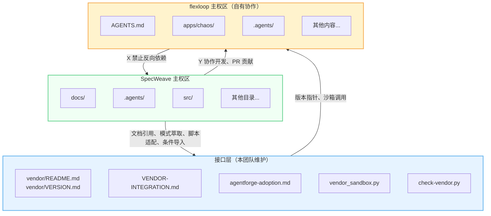

# flexloop团队手册：三区域边界与协作原则

所有操作必须在正确的区域内进行，禁止越权操作：



| 区域 | 颜色标记 | 操作权限 | 关键约束 |
|---|---|---|---|
| SpecWeave 主权区 | 绿色 | 自由读写 | 禁止添加指向 vendor 内部的硬编码路径 |
| 接口层 | 蓝色 | 团队维护 | 修改后须更新 VERSION.md 记录 |
| flexloop 主权区 | 黄色 | 允许开发 | 修改后必须 commit/push，禁止未提交存留 |

# 协作四原则

任何操作必须同时满足以下四项原则，缺一不可：

| 原则 | 核心要求 | 检查方法 |
|---|---|---|
| **可编辑** | 子模块内开发的修改必须 commit 并 push 到 flexloop 仓库，通过 PR 合并到 main | `git status vendor/flexloop` 无 modified content |
| **条件引** | 禁止裸 import vendor 模块，必须使用 vendor_sandbox 条件导入 | 运行 `check-vendor.py` 无非法导入告警 |
| **跟分支** | 跟踪 main 分支，按需手动更新，禁止自动更新 | `.gitmodules` 中配置 `branch = main` |
| **沙箱护** | 运行 flexloop 脚本必须通过 vendor_sandbox 沙箱，禁止直接 subprocess 调用 | 代码中使用 `run_flexloop_script()` |

# 快速参考命令卡

```bash
# 检查子模块状态
git submodule status vendor/flexloop

# 更新到 main 分支最新版本
git submodule update --remote vendor/flexloop

# 在子模块内开发
cd vendor/flexloop
git checkout -b feature/your-feature
# ... 开发、测试 ...
git add .
git commit -m "feat: describe changes"
git push -u origin feature/your-feature

# 合规检查
python .agents/scripts/check-vendor.py
python .agents/scripts/check-vendor.py --deep

# 运行沙箱脚本
python -c "from .agents.scripts.lib.vendor_sandbox import run_flexloop_script; print(run_flexloop_script('.agents/scripts/check_gitignore.py'))"
```

---
---
## 相关模式

- [三层委员会制度](../../../docs/retrospective/patterns/methodology-patterns/governance-strategy/three-tier-board-system.md)
- [三层治理](../../../docs/retrospective/patterns/methodology-patterns/governance-strategy/three-tier-governance.md)
---
← 上一章: [01 概述与前置准备](01-overview-preparation.md) | **[返回索引](../flexloop-team-operations.md)** | 下一章 → [03 工作流1：版本更新](03-workflow-version-update.md)
