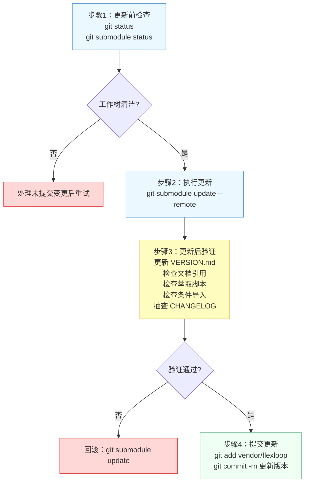

# flexloop团队手册：工作流1-子模块版本更新

适用场景：flexloop 仓库 main 分支有新提交，需要同步到 SpecWeave 主项目。



## 步骤详解

**步骤 1：更新前检查**（执行者：developer）

1. 确认主项目工作树清洁：
   ```bash
   git status
   ```
   如有未提交变更，先 commit 或 stash 后再继续。
2. 记录当前版本，用于回滚参考：
   ```bash
   git submodule status vendor/flexloop
   ```
   记录输出中的 commit 哈希。
3. 查看 flexloop 远程更新内容（可选但推荐）：
   ```bash
   cd vendor/flexloop
   git fetch origin
   git log HEAD..origin/main --oneline -20
   cd ../..
   ```

**步骤 2：执行更新**（执行者：developer）

```bash
git submodule update --remote vendor/flexloop
```

执行后，`vendor/flexloop` 将切换到 main 分支最新的 commit。

**步骤 3：更新后验证**（执行者：tester + reviewer）

这是最关键的步骤，必须逐项完成：

| 序号 | 验证项 | 操作方法 | 通过标准 |
|---|---|---|---|
| 1 | 更新版本记录 | 编辑 [vendor/VERSION.md](../../../vendor/VERSION.md) | 更新分支名和 commit 短哈希为 `main@xxxxxxx` 格式 |
| 2 | 文档引用检查 | 运行 `python .agents/scripts/check-links.py --path vendor/` | 无失效外链，无反向依赖 |
| 3 | 萃取脚本检查 | 确认从 flexloop 萃取的脚本在新版本下仍兼容 | 运行萃取脚本的测试用例 |
| 4 | 条件导入检查 | 运行 `python .agents/scripts/check-vendor.py` | 无非法导入告警 |
| 5 | CHANGELOG 抽查 | 查看 `vendor/flexloop/CHANGELOG.md`（如有） | 无破坏性变更或已评估影响 |
| 6 | 深度验证 | 运行 `python .agents/scripts/check-vendor.py --deep` | 所有检查项通过 |

**步骤 4：提交更新**（执行者：developer）

```bash
git add vendor/flexloop vendor/VERSION.md
git commit -m "chore(vendor): update flexloop to main@<commit-hash>"
```

提交信息中必须包含目标 commit 哈希前缀，以及更新原因（如"同步xx功能"、"修复xx Bug"）。

## 回滚方案

如果验证失败需要快速回滚：
```bash
git submodule update vendor/flexloop
```
这会将子模块指针恢复到 VERSION.md 中记录的上一个稳定 commit。回滚后重新执行步骤 3 验证。

---
---
## 相关模式

- [三层委员会制度](../../docs/retrospective/patterns/methodology-patterns/governance-strategy/three-tier-board-system.md)
- [三层治理](../../docs/retrospective/patterns/methodology-patterns/governance-strategy/three-tier-governance.md)
---
← 上一章: [02 区域模型与协作原则](02-boundary-principles.md) | **[返回索引](../flexloop-team-operations.md)** | 下一章 → [04 工作流2：子模块内开发](04-workflow-development.md)
