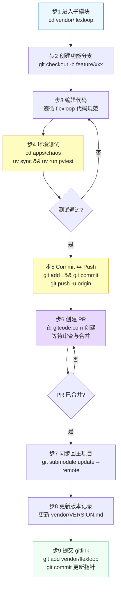

# flexloop团队手册：工作流2-子模块内开发

适用场景：需要在 flexloop 子模块内开发新功能或修复 Bug，并将贡献合并到 flexloop 上游。



## 步骤详解

**步骤 1-2：进入子模块并创建分支**（执行者：developer）

```bash
cd vendor/flexloop
git checkout main
git pull origin main
git checkout -b feature/your-feature-name
```

- 分支命名规范：`feature/xxx`（新功能）、`fix/xxx`（Bug 修复）、`docs/xxx`（文档更新）
- **禁止**直接在 main 分支上开发

**步骤 3：编辑代码**（执行者：developer）

- 遵循 flexloop 项目自身的代码规范（见 `vendor/flexloop/AGENTS.md`）
- 不要在 flexloop 的 Markdown 文件中添加指向 SpecWeave 的链接（反向依赖）
- 完成编辑后，回到 flexloop 根目录运行检查（如有）：
  ```bash
  cd /path/to/vendor/flexloop
  # 根据 flexloop 自身规范运行 lint/test
  ```

**步骤 4：在 flexloop 环境中测试**（执行者：developer + tester）

```bash
cd apps/chaos
uv sync
uv run pytest
```

- **必须**在 flexloop 自己的 uv 环境中运行测试
- **禁止**在 SpecWeave 根目录的 .venv 环境中运行 flexloop 测试
- 所有测试通过后方可提交

**步骤 5-6：Commit 并 Push**（执行者：developer）

```bash
cd /path/to/vendor/flexloop
git add .
git status
git commit -m "feat: describe your changes in detail"
git push -u origin feature/your-feature-name
```

- Commit 信息遵循 Conventional Commits 规范
- Push 前确认 `git status` 显示所有修改已纳入提交
- Push 成功后记录远程分支名

**步骤 7：创建 PR**（执行者：developer）

1. 访问 https://gitcode.com/flexloop/flexloop/pulls 创建 Pull Request
2. PR 描述中清晰说明修改目的、影响范围、测试情况
3. 指定 reviewer 等待代码审查
4. 根据审查意见修改并 push 到同一分支（PR 自动更新）

**步骤 8-9：PR 合并后同步回 SpecWeave**（执行者：developer）

```bash
cd /path/to/SpecWeave
git submodule update --remote vendor/flexloop
```

**步骤 10-11：更新版本记录并提交**（执行者：developer）

1. 更新 [vendor/VERSION.md](../../../vendor/VERSION.md) 中的 commit 哈希
2. 提交 gitlink 更新：
   ```bash
   git add vendor/flexloop vendor/VERSION.md
   git commit -m "chore(vendor): update flexloop after PR merge - <feature-description>"
   ```

## 开发期间的注意事项

- **禁止**在 `vendor/flexloop/` 内有未 commit 的修改时提交 SpecWeave 主仓库
- 如需临时中断开发，可在子模块内 `git stash` 暂存修改
- 同步主项目变更前，先处理子模块内的未提交修改
- 子模块内的分支不会影响 SpecWeave 主仓库，只有 commit 哈希（gitlink）会被追踪

---
---
## 相关模式

- [三层委员会制度](../../docs/retrospective/patterns/methodology-patterns/governance-strategy/three-tier-board-system.md)
- [三层治理](../../docs/retrospective/patterns/methodology-patterns/governance-strategy/three-tier-governance.md)
---
← 上一章: [03 工作流1：版本更新](03-workflow-version-update.md) | **[返回索引](../flexloop-team-operations.md)** | 下一章 → [05 工作流3：模式萃取](05-workflow-pattern-extraction.md)
