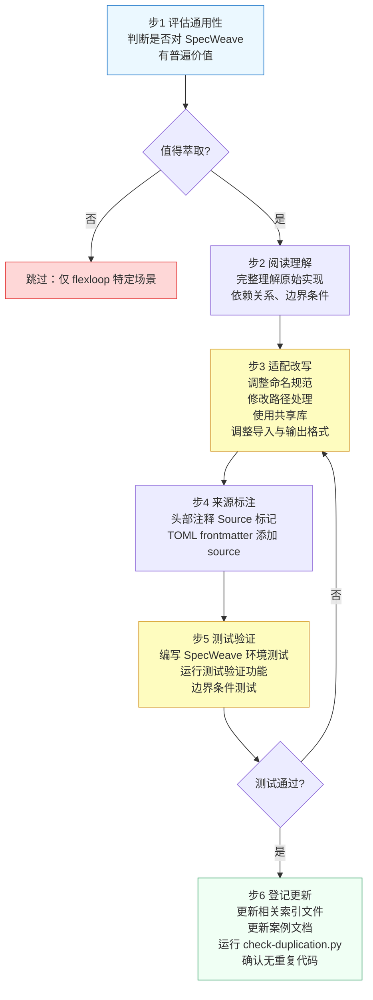

# flexloop团队手册：工作流3-模式萃取

适用场景：发现 flexloop 中有普遍价值的脚本、工具或模式，需要复制适配到 SpecWeave 主项目复用。



## 步骤详解

**步骤 1：评估通用性**（执行者：architect）

萃取前先回答以下问题：
- 该功能是否仅在 flexloop 特定场景下使用？
- SpecWeave 是否已有同类工具/脚本？（查阅 [.agents/scripts/lib/](../../../.agents/scripts/lib/) 共享库）
- 适配成本是否高于重写成本？

如果仅适用于 flexloop 或 SpecWeave 已有等效实现，则跳过萃取。

**步骤 2：阅读理解**（执行者：developer）

1. 完整阅读源文件，理解：
   - 输入输出约定
   - 外部依赖（第三方库、项目内其他模块）
   - 隐含假设（路径结构、工作目录、环境变量）
   - 边界条件处理逻辑
2. 确认哪些部分是核心逻辑，哪些是 flexloop 特有逻辑

**步骤 3：适配改写**（执行者：developer）

按以下顺序进行适配：

| 适配项 | 操作 |
|---|---|
| 命名规范 | 调整变量名、函数名、文件名符合 SpecWeave 风格 |
| 路径处理 | 替换 flexloop 特有的路径常量，使用 `.agents/scripts/lib/paths.py` 共享路径工具 |
| 导入语句 | 替换 flexloop 内部导入为 SpecWeave 共享库导入 |
| 输出格式 | 遵循 `.agents/scripts/lib/cli.py` 的输出规范（使用 ASCII 标记替代 emoji） |
| 移除特性 | 删除 flexloop 特有的约束、配置、依赖 |
| 功能边界 | 只萃取通用核心逻辑，不移植 flexloop 特定业务逻辑 |

**步骤 4：来源标注**（执行者：developer）

在萃取后的文件中添加来源标注：

1. **Python 脚本**：在文件头部添加注释
   ```python
   # Source: vendor/flexloop/apps/chaos/.agents/scripts/xxx.py
   # Adapted: 说明适配修改内容（如有重大修改）
   ```
2. **Markdown 文档**：在 TOML frontmatter 中添加
   ```toml
   +++
   source = "vendor/flexloop/path/to/original.md#章节"
   +++
   ```

**步骤 5：测试验证**（执行者：developer + tester）

1. 编写适配 SpecWeave 环境的单元测试
2. 在 SpecWeave 的 .venv 环境中运行测试：
   ```bash
   # 运行新添加的测试
   pytest tests/test_xxx.py -v
   ```
3. 边界条件测试：
   - flexloop 子模块未初始化时的行为
   - 路径包含空格/中文时的处理
   - 跨平台路径兼容性（Windows/Unix）

**步骤 6：登记更新**（执行者：developer）

1. 更新相关索引文件（如 [.agents/scripts/README.md](../../../.agents/scripts/README.md)）
2. 如适用，更新 [agentforge-adoption.md](../../../.agents/cases/agentforge-adoption.md) 案例文档
3. 运行重复代码检查：
   ```bash
   python .agents/scripts/check-duplication.py
   ```
   确认未引入跨文件重复代码
4. 运行链接检查：
   ```bash
   python .agents/scripts/check-links.py --path .agents/scripts/
   ```

---
---
## 相关模式

- [三层委员会制度](../../../docs/retrospective/patterns/methodology-patterns/governance-strategy/three-tier-board-system.md)
- [三层治理](../../../docs/retrospective/patterns/methodology-patterns/governance-strategy/three-tier-governance.md)
---
← 上一章: [04 工作流2：子模块内开发](04-workflow-development.md) | **[返回索引](../flexloop-team-operations.md)** | 下一章 → [06 合规检查与应急处理](06-compliance-emergency.md)
