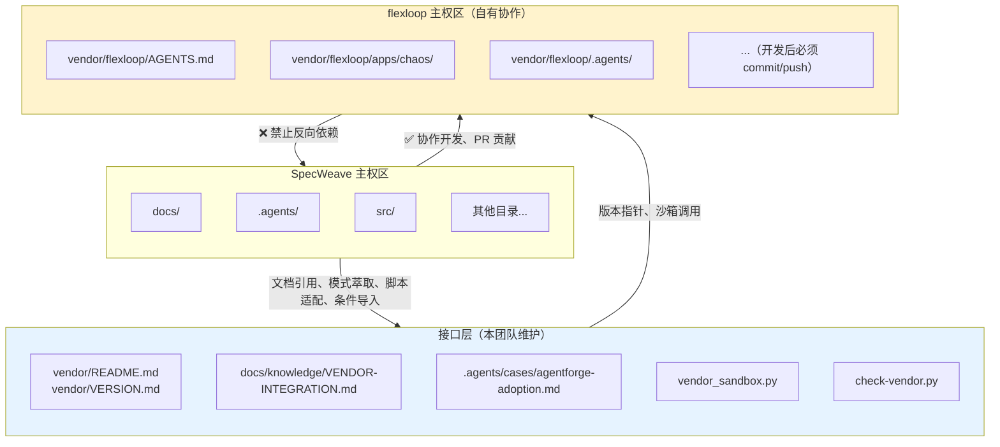
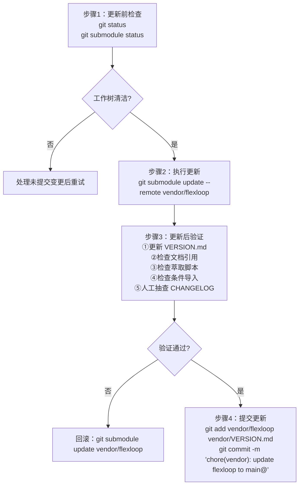

+++
id = "team-flexloop"
domain = "governance"
layer = "team-management"
source = "docs/knowledge/VENDOR-INTEGRATION.md#概述"

[bindings]
rules = ["docs/knowledge/VENDOR-INTEGRATION.md", ".agents/protocols/dependency-management.md"]
references = [".agents/teams/team-management.md", ".agents/teams/permission-system.md", ".agents/scripts/lib/checks/vendor.py"]
skills = []
+++

# Flexloop Team（flexloop 子模块治理团队）

## Description

flexloop（AgentForge）子模块治理团队，负责 `vendor/flexloop` 自有协作子模块的全生命周期管理。团队维护三区域边界模型，执行协作四原则，确保子模块与主项目之间依赖单向、环境隔离、版本可控、操作安全。

## 治理范围

### 主权区（flexloop Sovereign Zone）

`vendor/flexloop/` 目录下所有内容（.git 追踪的 submodule 内容）。团队成员可在此区域内开发，但所有修改必须 commit 并 push 到 flexloop 远程仓库，禁止未提交的工作树修改长期存留。

### 接口层（Interface Layer）

团队负责维护以下接口文件，确保主项目与子模块之间的交互合规：

| 文件 | 职责 |
|---|---|
| [vendor/README.md](../../vendor/README.md) | vendor 元数据总览 |
| [vendor/VERSION.md](../../vendor/VERSION.md) | 版本锁定记录（分支名 + commit 哈希） |
| [docs/knowledge/VENDOR-INTEGRATION.md](../../docs/knowledge/VENDOR-INTEGRATION.md) | 协同操作规范文档 |
| [.agents/cases/agentforge-adoption.md](../cases/agentforge-adoption.md) | AgentForge 案例引用 |
| [.agents/scripts/lib/vendor_sandbox.py](../scripts/lib/vendor_sandbox.py) | 沙箱运行与条件导入工具 |
| [.agents/scripts/lib/checks/vendor.py](../scripts/lib/checks/vendor.py) | vendor 合规检查脚本 |
| [.agents/scripts/check-vendor.py](../scripts/check-vendor.py) | vendor 检查入口 |
| [.agents/scripts/fix-flexloop-reverse-links.py](../scripts/fix-flexloop-reverse-links.py) | 反向链接修复工具 |

## 团队成员职责矩阵

| 角色 | 核心职责 | 典型任务 |
|---|---|---|
| architect | 架构边界决策 | 版本兼容性评估、模式萃取通用性判断、三区域边界模型维护、协作流程改进 |
| developer | 开发与适配 | 子模块内功能开发、脚本萃取适配、vendor_sandbox.py 维护、子模块更新执行 |
| reviewer | 合规审查 | 反向依赖检测、边界违规审查、提交规范检查、文档引用路径校验 |
| tester | 验证与隔离 | 沙箱环境测试、条件导入降级验证、版本更新回归测试、测试隔离校验 |

### SpecWeave ↔ flexloop 角色映射表

flexloop 角色体系（12 个，分 engineering + governance 两类）与 SpecWeave 角色体系（6+1，扁平）非一一对应。下表用于跨项目任务交接时的角色身份转换。

| SpecWeave 角色 | 对应 flexloop 角色 | 映射类型 | 协作说明 |
|---|---|---|---|
| orchestrator | execution-orchestrator | 语义近但不同 | SpecWeave orchestrator 负责任务分配与流程协调；flexloop execution-orchestrator 范围更窄 |
| architect | collaboration-architect | 同名异义 | SpecWeave architect 偏技术决策；flexloop collaboration-architect 偏协作架构 |
| developer | python-dev / full-stack / backend-dev / frontend-dev / devops | 一对多 | 进入 flexloop 开发时按技术栈选择对应角色 |
| reviewer | reviewer | 同名 | flexloop reviewer 在 engineering 类下，职责相近 |
| tester | （无独立角色） | 缺失 | flexloop 测试由 python-dev 兼任；SpecWeave tester 在 flexloop 内不映射 |
| co-founder | organization-steward | 部分对应 | 治理语义部分重叠，但权限边界不同 |
| （无对应） | governance-auditor | 缺失 | flexloop 独有，SpecWeave reviewer 部分覆盖 |
| （无对应） | python-manager | 缺失 | flexloop 独有 |
| （无对应） | boshu-laozi | 缺失 | flexloop 哲学/知识角色，SpecWeave 未引入此类，见 [VENDOR-INTEGRATION.md 第11.3节](../../docs/knowledge/VENDOR-INTEGRATION.md) |

**交接协议补充**：

- 任务从 SpecWeave 交接到 flexloop 内开发时，按上表转换角色身份；一对多情况下由 SpecWeave orchestrator 根据任务技术栈指定具体 flexloop 角色
- 反向交接（flexloop → SpecWeave）时，flexloop 角色退化为 SpecWeave 的最近似角色；多对一情况下由 SpecWeave orchestrator 重新分配
- `tester` 与 `governance-auditor` 在反向交接时统一映射为 SpecWeave `reviewer`，由 reviewer 决定是否进一步拆分给 tester
- 缺失角色（无对应）不强制映射，原角色职责在跨项目交接时由目标项目的 orchestrator 临时指派

## 核心治理原则

### 协作四原则（替代第三方子模块"四不原则"）

| 原则 | 执行要求 |
|---|---|
| **可编辑** | 允许在子模块内开发，修改必须 commit/push 到 flexloop 仓库并通过 PR 合并 |
| **条件引** | 必须通过 `vendor_sandbox.conditional_import()` 导入，禁止裸 import 和 sys.path 永久插入 |
| **跟分支** | 跟踪 main 分支，通过 `git submodule update --remote` 按需更新，不自动更新 |
| **沙箱护** | 运行 flexloop 脚本必须使用 `vendor_sandbox.run_flexloop_script()` 沙箱工具 |

### 三区域边界模型



### 禁止行为清单

团队成员须严格遵守以下禁止事项：

- ❌ 在 `vendor/flexloop/` 内创建/修改文件后不 commit 就提交到 SpecWeave 主仓库
- ❌ 裸 import vendor. 模块（无 try/except 保护，必须使用条件导入）
- ❌ 将 `vendor/` 路径加入 sys.path 永久（条件导入临时添加后恢复除外）
- ❌ 在主项目测试中遍历或收集 vendor/ 下的测试用例
- ❌ 将 flexloop 作为 pip 包安装到主项目 .venv 虚拟环境
- ❌ 在 SpecWeave 的 CI 流水线中运行 flexloop 的测试套件
- ❌ 允许 flexloop 脚本写入 SpecWeave 主权区任意位置（沙箱会限制）
- ❌ 在 flexloop 的 Markdown 文件中添加指向 SpecWeave 的链接（反向依赖）

## 标准工作流

### 工作流 1：子模块版本更新（同步上游）



### 工作流 2：子模块内开发（向 flexloop 贡献）

1. **进入子模块**：`cd vendor/flexloop`
2. **创建分支**：`git checkout -b feature/your-feature-name`
3. **编辑代码**：遵循 flexloop 代码规范
4. **flexloop 环境测试**：`cd apps/chaos && uv sync && uv run pytest`
5. **Commit & Push**：`git add . && git commit -m "feat: describe" && git push -u origin feature/xxx`
6. **创建 PR**：在 gitcode.com 创建 Pull Request
7. **PR 合并后同步**：回到 SpecWeave，`git submodule update --remote vendor/flexloop`
8. **更新版本记录**：更新 vendor/VERSION.md
9. **提交 gitlink**：`git add vendor/flexloop vendor/VERSION.md && git commit`

### 工作流 3：模式萃取（从 flexloop 到 SpecWeave）

1. **评估通用性**：判断是否对 SpecWeave 有普遍价值
2. **阅读理解**：完整理解原始实现、依赖关系、边界条件
3. **适配改写**：调整命名、路径、导入，使用 `.agents/scripts/lib/` 共享库
4. **来源标注**：头部注释 `# Source: vendor/flexloop/...`，TOML frontmatter 添加 source 字段
5. **测试验证**：编写 SpecWeave 环境下的测试用例并运行
6. **登记更新**：更新索引，运行 `check-duplication.py` 确认无重复代码

## 合规检查

团队可使用以下自动化工具进行合规检查：

| 工具 | 命令 | 检查内容 |
|---|---|---|
| vendor 合规检查 | `python .agents/scripts/check-vendor.py` | 子模块模式、分支跟踪、非法导入、工作树清洁、反向依赖 |
| vendor 深度检查 | `python .agents/scripts/check-vendor.py --deep` | 上述检查 + submodule 初始化状态、元数据一致性、测试隔离 |
| 链接有效性检查 | `python .agents/scripts/check-links.py --path vendor/` | 文档链接有效性，检测反向依赖 |
| Mermaid 检查 | `python .agents/scripts/check-mermaid.py --path docs/knowledge/` | Mermaid 图语法规范 |

## 应急处理

### 子模块工作树污染（modified content）

```bash
cd vendor/flexloop
# 若为意外修改：
git checkout .
git clean -fd
# 若需保留暂存：
git stash
```

提交前必须确认 `git status vendor/flexloop` 不显示 modified content。

### 更新后出现兼容性问题

快速回滚到上一个锁定版本：
```bash
git submodule update vendor/flexloop
```

回滚后重新验证关键引用、萃取脚本和条件导入的正确性。

### 发现反向依赖链接

运行自动修复脚本：
```bash
python .agents/scripts/fix-flexloop-reverse-links.py
```

修复后须进入 flexloop 子模块 commit 并 push，再更新主项目 gitlink。

## Non-Goals

- 不负责 flexloop 项目的整体架构决策（归 flexloop 项目维护者）
- 不负责 flexloop 自身的 CI/CD 流水线维护
- 不负责第三方只读子模块的治理（本团队仅负责 flexloop 自有协作子模块）
- 不直接修改主项目除接口层外的其他文件（归对应功能团队）
- 不在未经过兼容性评估的情况下自动更新子模块版本

## 协作关系

- **上游**：接收 orchestrator 的协作任务分配与 architect 的架构约束
- **下游**：向主项目其他团队提供稳定的 flexloop 集成接口与沙箱工具
- **外部**：与 flexloop 上游项目通过 PR 流程进行双向协作
