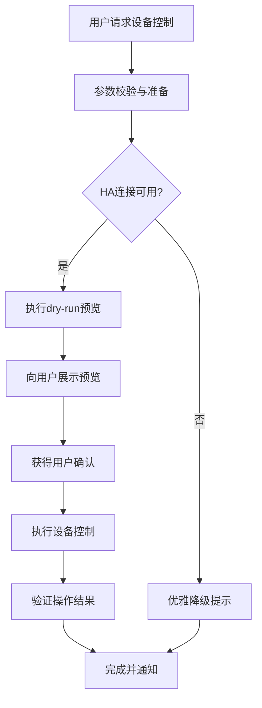
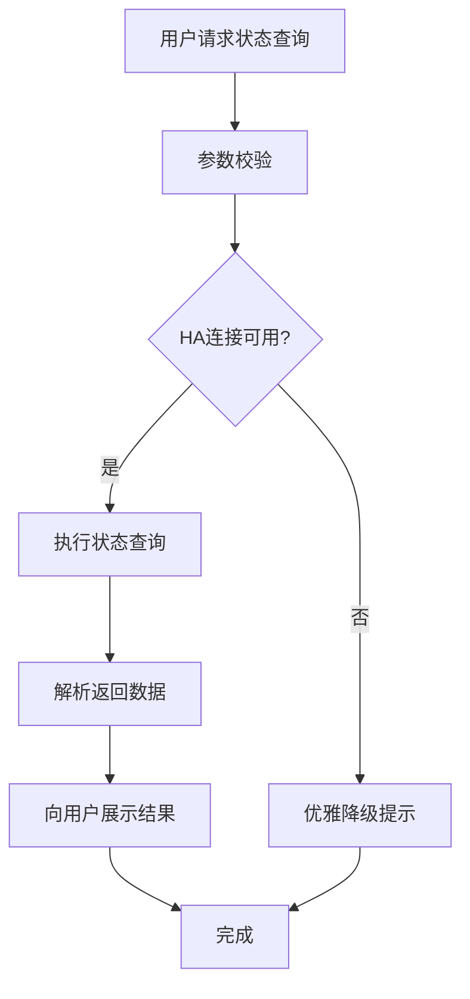
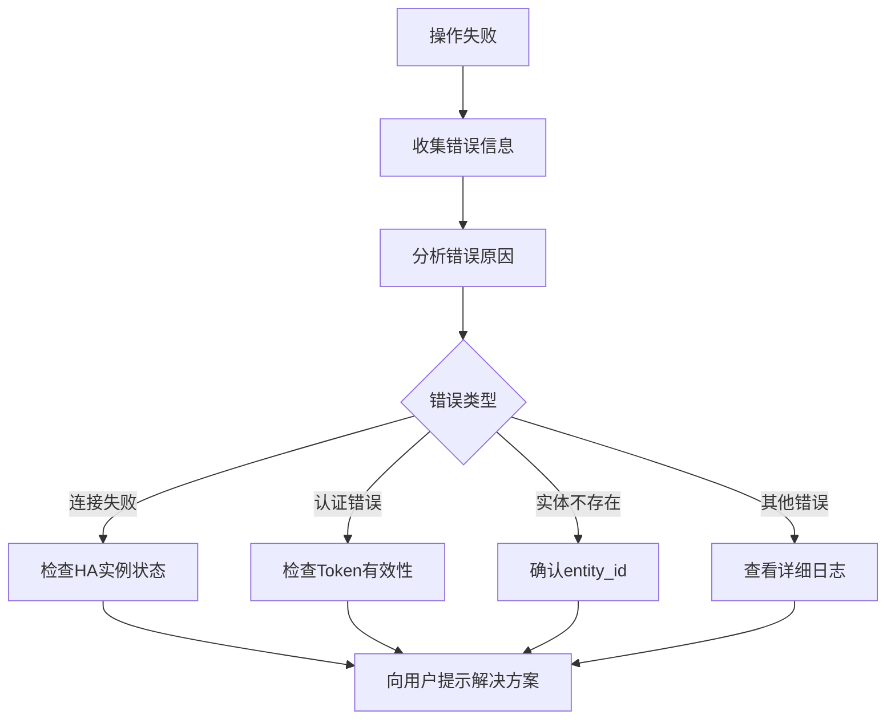

+++
id = "home-assistant-team"
category = "optional"
source = "AGENTS.md#home-assistant-team"
+++

# Home Assistant 集成治理团队

## 可选模块说明

**本团队配置为可选模块**：
- 不集成本团队配置时，核心团队运作正常，不受影响
- HA 集成功能仅在需要时启用，由 orchestrator 按需调用
- 团队职责与核心团队完全解耦，不引入硬依赖

## 团队定位

Home Assistant 集成治理团队负责管理与 Home Assistant 智能家居系统集成相关的所有活动，包括设备控制、状态查询、服务调用、集成配置管理等。

## 治理范围

| 领域 | 职责 |
|------|------|
| 设备控制 | 执行设备控制操作，确保操作安全可靠 |
| 状态查询 | 获取设备状态信息，提供数据支持 |
| 服务调用 | 调用 Home Assistant 服务，执行复杂操作 |
| 集成配置 | 管理 HA 连接参数和配置文件 |
| 问题排查 | 处理 HA 连接问题和操作失败 |
| 文档维护 | 维护 HA 集成相关文档 |

## 团队职责矩阵

| 职责 | orchestrator | developer | tester | reviewer | architect |
|:---|:---:|:---:|:---:|:---:|:---:|
| HA 操作触发与协调 | **R/A** | C | I | C | I |
| API 脚本开发与维护 | C | **R/A** | C | C | C |
| 技能文档编写与更新 | C | **R/A** | I | C | I |
| 指令集定义与治理 | C | C | I | **R/A** | C |
| 集成测试与验证 | C | C | **R/A** | C | I |
| 架构设计与技术评审 | C | C | I | C | **R/A** |
| 操作质量验收 | C | C | R | **A** | I |

## 工作流定义

### 设备控制工作流

### 状态查询工作流

### 问题排查工作流

## 权限边界

- **查询操作**：无需额外审批，直接执行
- **控制操作**：需向用户展示 dry-run 结果并获得确认
- **配置变更**：需 reviewer 审批
- **脚本修改**：需 reviewer 代码审查
- **HA 连接不可用**：自动降级，无需审批

## 关联资源

- [Home Assistant 集成技能](../skills/home-assistant/SKILL.md)
- [HA API 自动化脚本](../scripts/ha_api.py)
- [Home Assistant 集成指令集](../commands/home-assistant.md)
- [flexloop 治理团队](../teams/flexloop-team.md)