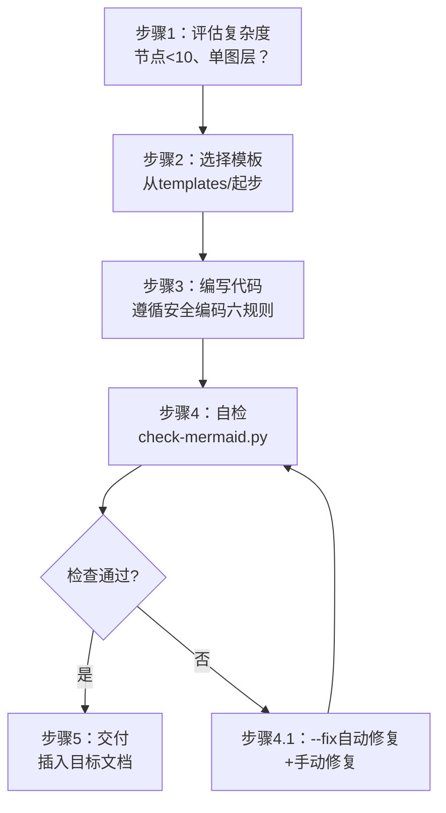
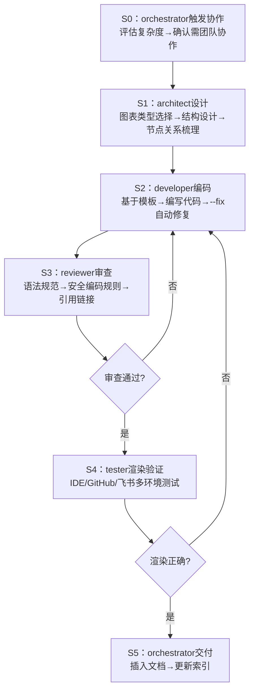
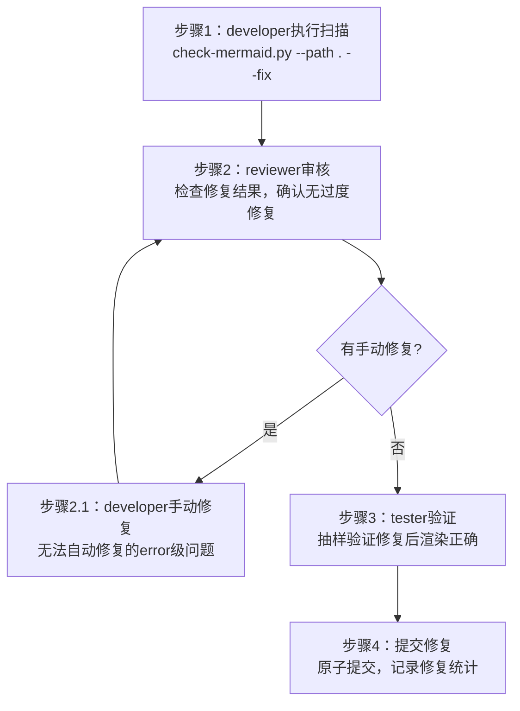

# Mermaid Team（Mermaid图表管理专项团队）

## Description

Mermaid图表全生命周期管理专项团队，负责项目中Mermaid图表的质量标准、模板维护、检查脚本、复杂图表协作创建和全项目Mermaid质量扫描。团队遵循"安全编码六规则"和"模板优先、检查必过"原则，确保Mermaid图表在IDE/GitHub/飞书等多环境中正确渲染。

## 治理范围

Mermaid相关资产，包括：

| 文件/目录 | 职责 |
|---|---|
| [.agents/templates/mermaid-templates/](../templates/mermaid-templates/) | Mermaid安全编码模板（8个） |
| [.agents/scripts/lib/checks/mermaid.py](../scripts/lib/checks/mermaid.py) | Mermaid语法检查与自动修复脚本 |
| [docs/retrospective/patterns/code-patterns/mermaid-safe-coding-rules.md](../../docs/retrospective/patterns/code-patterns/mermaid-safe-coding-rules.md) | Mermaid安全编码六规则文档 |
| 全项目*.md文件中的Mermaid代码块 | 质量标准执行 |
| [.agents/commands/mermaid.md](../commands/mermaid.md) | Mermaid指令集规范 |

## 团队成员职责矩阵

| 角色 | 核心职责 | 典型任务 |
|---|---|---|
| architect | 图表架构设计 | 图表类型选择决策、复杂架构图结构设计、模板体系维护、图表可读性优化 |
| developer | 代码编写修复 | Mermaid代码编写/修改、check-mermaid.py维护、自动修复规则扩展、模板更新 |
| reviewer | 规范质量审查 | Mermaid语法规范审查、安全编码规则合规检查、复杂图表验收、链接与引用检查 |
| tester | 渲染兼容性验证 | IDE/GitHub/飞书多环境渲染测试、检查脚本单元测试、修复后回归验证 |

## 核心治理原则

### Mermaid安全编码六规则

| 规则 | 执行要求 |
|---|---|
| **禁空行** | 代码块内禁止空行，空行会导致部分渲染器解析中断 |
| **文加引** | 含中文、空格、特殊字符（@#≥≤+）的文本必须用双引号包裹 |
| **避列表** | 文本不要以列表标记（- * + 1.）开头，会触发Markdown列表解析 |
| **换用br** | 文本内换行使用` `而非`\n` |
| **sub安格** | subgraph使用`subgraph EN_ID ["中文标题"]`格式，禁止裸中文ID |
| **边引对** | 边标签使用`-->| "标签" |`格式，中文标签必须加引号 |

### 三大工作原则

| 原则 | 执行要求 |
|---|---|
| **模板优先** | 创建新图表优先从templates/mermaid-templates/选择合适模板起步，而非从零开始 |
| **检查必过** | 所有Mermaid代码必须通过check-mermaid.py检查，零error级问题才能提交 |
| **复杂协作** | >20节点、多subgraph、跨文档引用的复杂图表必须触发团队协作流程，禁止单角色独立完成 |

## 标准工作流

### 工作流1：简单图表生成（单角色快速交付）

适用于<10节点、单图层的简单图表（如简单流程、时序图）。

执行者：developer单角色完成

### 工作流2：复杂图表协作（多角色协作）

适用于>20节点、多subgraph、跨文档引用的大型架构图。

参与角色：全团队4角色+orchestrator协调

### 工作流3：批量检查修复（全项目质量扫描）

适用于定期质量扫描、规则升级后的批量修复。

## 合规检查

| 工具 | 命令 | 检查内容 |
|---|---|---|
| Mermaid语法检查 | `python .agents/scripts/check-mermaid.py` | 空行、引号、列表触发、换行符等 |
| Mermaid自动修复 | `python .agents/scripts/check-mermaid.py --fix` | 空行删除、引号补全、\n→  |
| 链接有效性检查 | `python .agents/scripts/check-links.py` | 文档间引用链接有效性 |
| Skill质量检查 | `python .agents/scripts/check-skill-quality.py --path .agents/skills/mermaid-cmd/` | mermaid-cmd Skill五要素合规 |

## Non-Goals

- 不实现Mermaid服务端渲染或图片导出（由IDE/GitHub/飞书等宿主环境负责）
- 不创建新的Mermaid模板（新增模板需求需提交团队审批）
- 不负责vendor/目录下的Mermaid图表（vendor区域自治）
- 不替代architect做架构决策，团队只负责图表质量和规范执行

## 协作关系

- **上游**：接收orchestrator分配的复杂图表任务，遵循architect的架构设计约束
- **下游**：向全项目角色提供Mermaid模板、检查工具、规范指导
- **横向**：与其他专项团队（如flexloop-team）共享治理经验和工具模式
