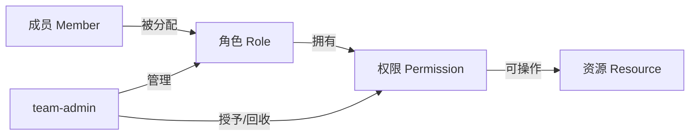
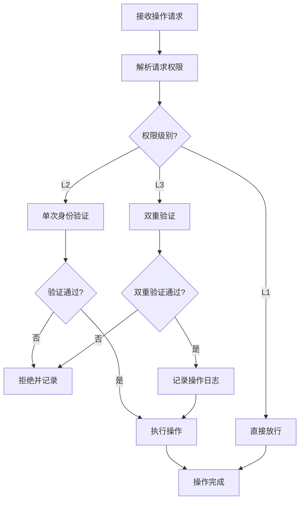

# 角色权限系统设计

本规范定义团队管理模块的角色权限体系，包括权限模型、权限分级、分配规则与回收机制。权限系统遵循最小权限原则，确保每个角色仅拥有完成职责所必需的权限。

## 权限模型

采用 RBAC（基于角色的访问控制）模型，权限通过角色间接授予成员。

## 权限分级

权限按敏感度分为三级，不同级别对应不同的校验强度。

| 级别 | 标识 | 说明 | 校验要求 | 典型权限 |
|---|---|---|---|---|
| L1 | public | 公开权限，所有角色默认拥有 | 无需额外校验 | read_team_info、view_member_list |
| L2 | internal | 内部权限，须 team-admin 显式授予 | 单次身份验证 | assign_role、modify_config |
| L3 | privileged | 特权权限，影响团队结构或安全 | 双重验证 + 操作日志 | create_role、dissolve_team、revoke_permission |

## 权限清单

### L1 公开权限

| 权限 | 说明 | 默认拥有 |
|---|---|---|
| read_team_info | 查看团队基本信息 | 是 |
| view_member_list | 查看团队成员列表 | 是 |
| view_team_config | 查看团队配置（脱敏） | 是 |

### L2 内部权限

| 权限 | 说明 | 授予方式 |
|---|---|---|
| assign_role | 为成员分配角色 | team-admin 显式授予 |
| modify_config | 修改团队配置 | team-admin 显式授予 |
| invite_member | 邀请新成员 | team-admin 显式授予 |
| remove_member | 移除团队成员 | team-admin 显式授予 |

### L3 特权权限

| 权限 | 说明 | 校验要求 |
|---|---|---|
| create_role | 创建新角色 | 双重验证 + 触发条件满足 |
| dissolve_team | 解散团队 | 双重确认 + orchestrator 备案 |
| revoke_permission | 回收成员权限 | 双重验证 + 操作日志 |
| modify_permission_policy | 修改权限策略 | 双重验证 + 影响评估 |

## 权限分配规则

### 1. 最小权限原则

- 角色权限须限定在完成职责所必需的最小集合内。
- 禁止授予超出角色职责范围的权限。
- 临时权限须设置有效期，到期自动回收。

### 2. 权限互斥规则

部分权限存在互斥关系，禁止同一角色同时拥有。

| 权限 A | 权限 B | 互斥原因 |
|---|---|---|
| assign_role | remove_member | 防止自行加入并分配角色 |
| create_role | revoke_permission | 防止创建角色后回收他人权限 |
| modify_config | dissolve_team | 防止修改配置后立即解散 |

### 3. 权限继承规则

- 角色可继承基础角色的 L1 权限。
- L2 与 L3 权限不可继承，须显式授予。
- 继承关系须在角色定义中声明 `extends` 字段。

### 4. 权限回收规则

| 回收场景 | 触发条件 | 执行方式 |
|---|---|---|
| 角色变更 | 成员角色调整 | 自动回收原角色的 L2/L3 权限 |
| 成员移除 | 成员被移除团队 | 回收所有权限并清理资源 |
| 权限滥用 | 检测到违规操作 | 立即回收相关权限并上报 |
| 临时权限到期 | 有效期结束 | 自动回收，记录日志 |

## 权限校验流程

## 使用约束

1. **权限分离原则**：敏感操作的发起与执行须由不同角色完成，避免单点权限滥用。
2. **权限审计**：所有 L2/L3 权限操作须记录审计日志，保留期不少于 90 天。
3. **权限变更通知**：权限授予或回收须通知受影响成员。
4. **权限策略固化**：`permission_policy` 一经确定，变更须经过影响评估。
5. **禁止权限转授**：拥有 `assign_role` 权限的角色不得将自身权限转授他人。
