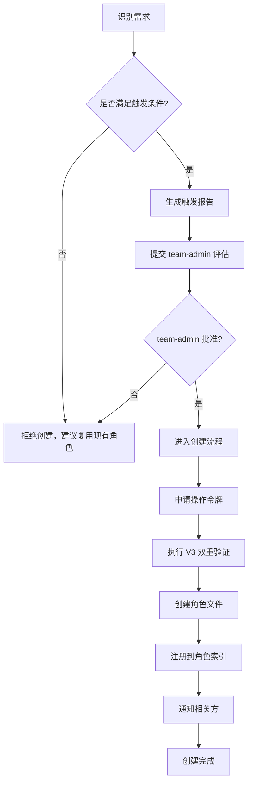

# 新角色自动创建触发与执行流程

本规范定义 team-admin 自动创建新角色的触发条件、执行流程与产出规范。新角色创建是 L3 特权操作，须严格遵循触发条件与校验流程，确保新角色必要、合规且可追溯。

## 触发条件

新角色创建须满足以下任一触发条件，禁止凭空创建。

| 触发条件 | 标识 | 说明 | 判定依据 |
|---|---|---|---|
| 职责空白 | responsibility-gap | 现有角色无法覆盖新出现的职责领域 | 职责矩阵分析报告 |
| 能力缺失 | capability-missing | 现有角色不具备完成特定任务所需能力 | 任务能力匹配分析 |
| 负载溢出 | overload-split | 某角色负载过高，须拆分职责 | 负载监控数据 |
| 架构演进 | architecture-evolution | 架构调整引入新的专业角色 | 架构决策文档 |

## 触发判定流程



## 触发报告规范

触发报告采用 YAML 格式，须包含触发依据与影响分析。

```yaml
trigger_report:
  trigger_type: "responsibility-gap"
  trigger_description: "数据分析职责无对应角色"
  evidence:
    - "现有角色均不具备数据建模能力"
    - "近 5 个任务涉及数据分析，均由 developer 兼任"
  proposed_role:
    id: "data-scientist"
    name: "数据科学家"
    domain: "analytics"
    layer: "analysis"
  impact_analysis:
    affected_roles: ["developer"]
    resource_impact: "low"
    migration_plan: "将数据分析任务从 developer 迁移至 data-scientist"
  submitted_by: "orchestrator"
  submitted_at: "2026-06-23T10:00:00Z"
```

## 触发条件详解

### 1. 职责空白（responsibility-gap）

**判定标准**：
- 出现现有角色矩阵（见 `.agents/roles/README.md`）未覆盖的职责领域。
- 该职责在近期任务中出现频率不低于 3 次。
- 现有角色兼任该职责导致效率下降或质量风险。

**判定依据**：职责矩阵分析报告，须由 orchestrator 或 architect 出具。

### 2. 能力缺失（capability-missing）

**判定标准**：
- 特定任务所需能力不在任何现有角色的能力范围内。
- 现有角色兼任导致任务延期或失败率上升。
- 能力差异无法通过培训或工具补充弥补。

**判定依据**：任务能力匹配分析，须包含能力差距清单。

### 3. 负载溢出（overload-split）

**判定标准**：
- 某角色任务负载持续超过阈值（如并发任务数 ≥ 5）。
- 任务排队时间超过 24 小时。
- 拆分后原角色职责仍可独立运作。

**判定依据**：负载监控数据，须覆盖近 7 天数据。

### 4. 架构演进（architecture-evolution）

**判定标准**：
- 架构决策文档明确引入新的专业领域。
- 新领域需要独立的能力栈与工具链。
- architect 出具架构演进说明。

**判定依据**：架构决策文档，须由 architect 签署。

## 创建执行流程

### 步骤 1：触发评估

- **负责角色**：team-admin
- **输入**：触发报告
- **执行要点**：
  1. 校验触发报告的完整性与依据充分性。
  2. 评估新角色的必要性与不可替代性。
  3. 确认新角色不与现有角色职责重叠。
- **完成标志**：team-admin 批准创建并签署意见。

### 步骤 2：权限申请

- **负责角色**：team-admin
- **输入**：批准的触发报告
- **执行要点**：
  1. 向 orchestrator 申请操作令牌（见 `admin-verification.md`）。
  2. 说明创建目的、目标角色 ID 与能力范围。
  3. 等待令牌签发。
- **完成标志**：获得有效的操作令牌。

### 步骤 3：双重验证

- **负责角色**：team-admin
- **输入**：操作令牌
- **执行要点**：
  1. 执行 V3 双重验证流程。
  2. 校验令牌有效性与操作绑定。
  3. 记录验证日志。
- **完成标志**：双重验证通过。

### 步骤 4：角色文件创建

- **负责角色**：team-admin
- **输入**：触发报告中的 proposed_role
- **执行要点**：
  1. 在 `.agents/roles/` 目录下创建角色定义文件，命名规范为 `{role-id}.md`。
  2. 文件须包含 TOML frontmatter，字段包括 `id`、`domain`、`layer`、`[bindings]`。
  3. 正文须包含 Description、Responsibilities、Non-Goals 三部分，遵循现有角色定义规范。
  4. 在 `.agents/prompts/{role-id}/` 下创建 `system-prompt.md` 与 `few-shot.md`。
- **完成标志**：角色文件创建完成并通过格式校验。

### 步骤 5：角色索引注册

- **负责角色**：team-admin
- **输入**：新角色文件
- **执行要点**：
  1. 更新 `.agents/roles/README.md` 的角色职责矩阵。
  2. 更新 `AGENTS.md` 的角色定义索引表。
  3. 更新 `.agents/README.md` 的目录结构说明（如必要）。
- **完成标志**：索引文件更新完成，链接校验通过。

### 步骤 6：通知与归档

- **负责角色**：team-admin
- **输入**：创建完成的角色与更新后的索引
- **执行要点**：
  1. 通知 orchestrator 新角色已就绪，可参与任务分配。
  2. 通知 architect 新角色的能力范围，便于后续架构协调。
  3. 归档触发报告与创建日志，便于追溯。
- **完成标志**：相关方收到通知，归档完成。

## 角色文件模板

新角色文件须遵循以下模板，确保与现有角色定义风格一致。

```markdown
+++
id = "{role-id}"
domain = "{领域}"
layer = "{层级}"

[bindings]
rules = [{绑定的规则文件}]
references = [{引用的文件}]
skills = []
+++

# {Role Name}（{中文名称}）

## Description
{角色定位描述}

## Responsibilities
- {职责 1}
- {职责 2}

## Non-Goals
- 不负责{职责 X}（归 {对应角色}）
```

## 使用约束

1. **触发条件强制**：新角色创建必须满足任一触发条件，禁止凭空创建。
2. **不可替代性校验**：创建前须确认无法通过现有角色调整或能力补充解决。
3. **命名规范**：角色 ID 须使用小写英文与连字符，如 `data-scientist`。
4. **职责不重叠**：新角色职责须与现有角色明确区分，避免职责重叠。
5. **索引同步**：角色文件创建后须同步更新所有相关索引文件。
6. **归档留存**：触发报告与创建日志须归档保存，保留期不少于 180 天。
7. **回滚机制**：若新角色创建后发现不符合预期，team-admin 须启动回滚流程，移除角色文件并恢复索引。
