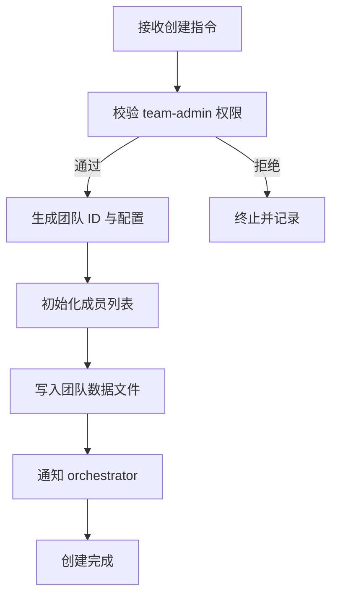
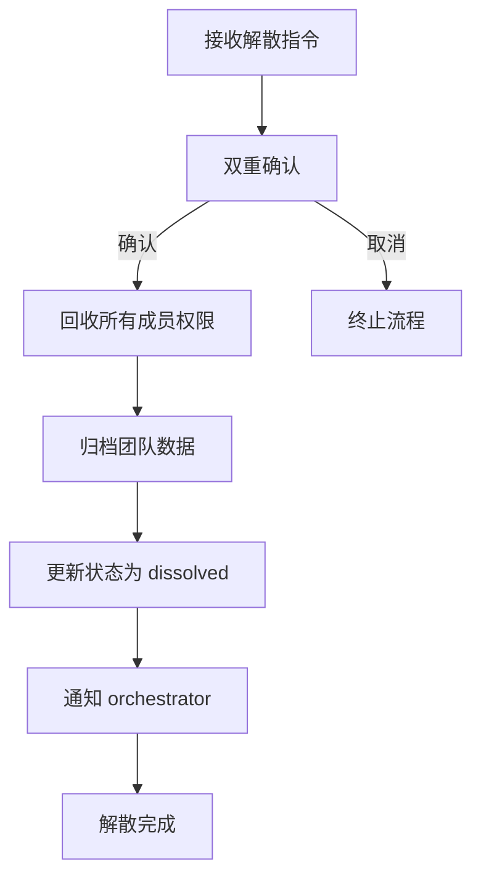

+++
id = "team-management"
domain = "governance"
layer = "team-management"
source = "AGENTS.md#协作协议概要"

[bindings]
rules = [".agents/protocols/handoff.md", ".agents/protocols/messaging.md"]
references = [".agents/teams/team-admin.md", ".agents/teams/permission-system.md"]
skills = []
+++

# 团队创建与管理核心功能

本规范定义团队生命周期的核心管理功能，包括团队创建、成员管理、配置维护与解散流程。所有操作由 team-admin 角色执行，须遵循权限校验与操作留痕原则。

## 团队数据模型

团队采用 YAML 格式定义，便于序列化与版本管理。

```yaml
team:
  id: "team-frontend"
  name: "前端开发团队"
  description: "负责前端界面与交互实现"
  admin: "team-admin"
  members:
    - id: "developer-001"
      role: "developer"
      joined_at: "2026-06-23T10:00:00Z"
    - id: "reviewer-001"
      role: "reviewer"
      joined_at: "2026-06-23T10:05:00Z"
  config:
    max_members: 10
    auto_role_creation: true
    permission_policy: "least-privilege"
  created_at: "2026-06-23T09:00:00Z"
  status: "active"
```

## 字段定义

| 字段名 | 类型 | 是否必填 | 说明 |
|---|---|---|---|
| id | string | 是 | 团队唯一标识，采用 `team-{领域}` 命名规范 |
| name | string | 是 | 团队显示名称 |
| description | string | 是 | 团队职责描述 |
| admin | string | 是 | 团队管理员角色标识，固定为 `team-admin` |
| members | list | 是 | 成员列表，每项含 id、role、joined_at |
| config | object | 是 | 团队配置，含成员上限、自动创建角色开关、权限策略 |
| created_at | string | 是 | 创建时间戳，ISO 8601 格式，UTC 时区 |
| status | string | 是 | 团队状态：active / suspended / dissolved |

## 核心功能

### 1. 团队创建



**执行要点**：
1. 校验发起方具备 `create_team` 特权。
2. 团队 ID 须全局唯一，遵循 `team-{领域}` 命名规范。
3. 初始成员至少包含一名 admin，默认为 team-admin。
4. 团队数据文件存储于 `.agents/teams/data/{team-id}.yaml`。
5. 创建完成后须通知 orchestrator 进行全局协调登记。

### 2. 成员管理

| 操作 | 触发条件 | 执行流程 | 留痕要求 |
|---|---|---|---|
| 加入团队 | 新成员加入请求 | 校验身份 → 分配角色 → 更新成员列表 | 记录 joined_at |
| 移除成员 | 成员离职或违规 | 校验权限 → 回收资源 → 移除记录 | 记录 removed_at 与原因 |
| 角色调整 | 成员职责变更 | 校验新角色 → 更新角色字段 | 记录 role_changed_at |

### 3. 配置维护

团队配置变更须遵循以下原则：

- **最小变更原则**：每次仅修改必要字段，避免批量重置。
- **版本留存原则**：配置变更须保留历史版本，便于回溯。
- **影响评估原则**：修改 `max_members` 或 `permission_policy` 须评估对现有成员的影响。
- **通知原则**：配置变更须通知所有受影响成员。

### 4. 团队解散



**执行要点**：
1. 解散须经过双重确认，防止误操作。
2. 解散前须回收所有成员的权限与资源访问。
3. 团队数据须归档保存，不得物理删除。
4. 状态更新为 `dissolved`，保留可追溯记录。
5. 须通知 orchestrator 更新全局团队登记。

## 使用约束

1. **权限前置**：所有团队管理操作须先通过 `admin-verification.md` 的身份验证。
2. **操作留痕**：所有管理操作须记录操作者、时间、变更内容，便于审计。
3. **并发控制**：同一团队的配置修改须串行执行，避免并发冲突。
4. **数据一致性**：成员列表与权限系统须保持同步，禁止出现孤儿权限。
5. **状态校验**：操作前须校验团队状态，`dissolved` 状态的团队禁止任何写操作。
