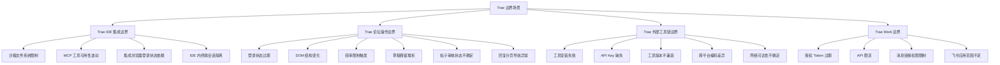
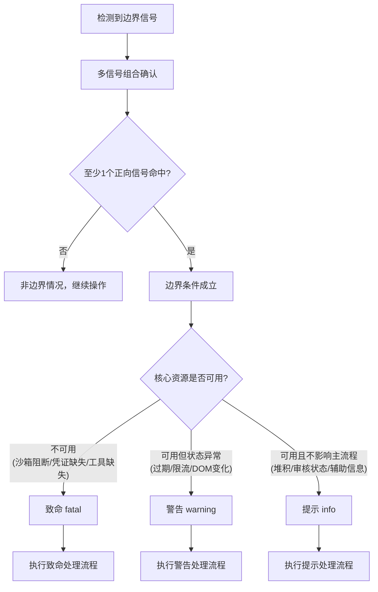
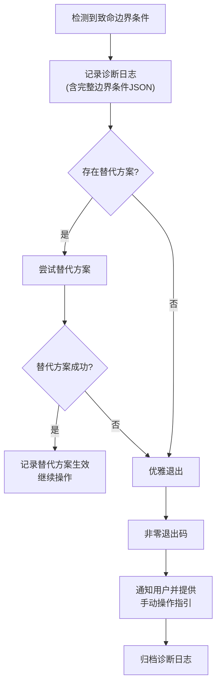
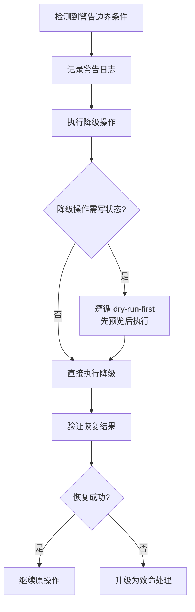

# Trae 边界情况处理规范

本规范定义 Trae 生态下边界情况处理的统一标准，覆盖 Trae IDE 集成、论坛操作、外部工具链与 Trae Work 四大边界场景的识别、判断、处理与适配。规范旨在消除"每次遇到边界情况都重新探索"的低效循环，为智能体提供预定义的判断标准、处理流程与适配策略。

## 模块概述

### 定位

trae-edge-case-handler 是团队管理模块的边界治理子模块，定位为 Trae 生态边界情况的"判断词典 + 处理手册"。它不直接执行业务操作，而是为执行层智能体提供边界条件的识别标准、分级判断与处理决策，确保边界情况被一致地识别、分级与处理。

### 职责

- 定义 Trae 生态四大边界场景的分类体系与边界条件清单
- 提供边界条件的多信号组合检测标准与三级分级规则
- 定义致命/警告/提示三级异常处理流程
- 提供已知特殊场景的预定义适配策略
- 定义与团队管理模块、脚本模块的接口规范
- 提供规范完整性与一致性的验证清单

### 核心概念

| 概念 | 定义 | 说明 |
|---|---|---|
| 边界场景 | Trae 生态中可能阻断或降级操作的典型场景类别 | 共四大类：IDE 集成、论坛操作、外部工具链、Trae Work |
| 边界条件 | 边界场景下可观测的具体异常情形 | 每个条件有检测信号与判断方法 |
| 检测信号 | 用于判断边界条件是否成立的可观测信息 | 遵循多信号组合检测，单一信号不构成判定 |
| 分级 | 边界条件的严重程度分类 | 致命（fatal）/警告（warning）/提示（info）三级 |
| 适配策略 | 针对已知特殊场景的预定义处理方案 | 优先级递减，含回退路径 |

## 四大边界场景分类体系



### 场景一：Trae IDE 集成边界

智能体在 Trae IDE 内使用集成浏览器（integrated_browser MCP）、内置终端等集成能力时遇到的边界情况。

| 边界条件 | 检测信号 | 判断方法 | 默认分级 |
|---|---|---|---|
| 沙箱文件系统限制 | 写入操作返回权限错误；目标路径不在可写目录列表内 | 错误信息包含 `permission denied` 或 `access is denied`，且路径不在沙箱 `writableDirectories` 声明范围内 | 致命 |
| MCP 工具可用性波动 | MCP 工具调用返回 `not found` / `timeout` / `method not found` | 查询当前可用 MCP 工具列表，目标工具不在列表中或调用超时连续 ≥ 2 次 | 警告 |
| 集成浏览器登录状态依赖 | 浏览器操作跳转至登录页；Cookie/Session 标记失效；页面 DOM 出现登录表单 | 多信号检测：当前 URL 含 `/login` 路径、页面存在登录表单元素、API 返回 401，任一命中即确认 | 警告 |
| IDE 内终端会话隔离 | 终端命令的工作目录或环境变量与预期不符；命令间状态不持久 | 命令输出的 `PWD` / `ENV` 与预期不一致，或前序命令设置的变量在后续命令不可见 | 提示 |

### 场景二：Trae 论坛操作边界

智能体执行 forum.trae.cn 论坛自动化（发帖、回复、清理草稿等）时遇到的边界情况。

| 边界条件 | 检测信号 | 判断方法 | 默认分级 |
|---|---|---|---|
| 登录状态过期 | Cookie 失效；页面跳转登录页；API 返回 401；用户名检测返回空 | 多信号组合检测（参考 [multi-signal-detection](../../docs/retrospective/patterns/methodology-patterns/tools-automation/multi-signal-detection.md)），至少 2 个独立信号命中 | 警告 |
| DOM 结构变化 | CSS 选择器返回空；元素定位超时；备选选择器全部失效 | 主选择器 + ≥ 2 个备选选择器均未命中，且页面已加载完成（`networkidle`） | 警告 |
| 频率限制触发 | HTTP 响应 429；页面提示"操作太频繁"；响应头含 `Retry-After` | 响应状态码为 429，或错误文案包含"频繁/限流/rate limit" | 警告 |
| 草稿残留堆积 | 草稿列表数量超过阈值；历史会话遗留草稿未清理 | 草稿列表 API 返回条目数 ≥ 阈值（默认 10），或检测到非当前会话产生的草稿 | 提示 |
| 帖子审核状态不确定 | 帖子状态字段为 `pending` / `queued`；帖子对匿名用户不可见 | 帖子 `visible` 字段为 `false`，或状态字段含 `pending`/`queued` | 提示 |
| 回复分页导航异常 | 分页选择器失效；页码跳转后内容与预期不符；分页元素缺失 | 请求页码 N 返回的内容首帖 ID 与上一页末帖 ID 不连续，或分页导航元素未找到 | 警告 |

### 场景三：Trae 外部工具链边界

智能体使用 agent-browser CLI、Discourse REST API、@discourse/mcp 等外部工具链时遇到的边界情况。

| 边界条件 | 检测信号 | 判断方法 | 默认分级 |
|---|---|---|---|
| 工具安装失败 | 命令返回 `command not found`；安装命令 exit code 非 0 | `which`/`where` 查询无结果，或安装日志含错误且目标二进制不可执行 | 致命 |
| API Key 缺失 | 环境变量为空；API 返回 401/403；配置文件无对应字段 | 环境变量检查为空且 API 错误码为认证失败（401/403） | 致命 |
| 工具版本不兼容 | 命令报参数不支持；`--version` 输出低于要求版本；功能缺失报错 | `--version` 输出经语义化版本比较低于要求版本，或目标参数在帮助文档中不存在 | 警告 |
| 跨平台编码差异（PowerShell vs bash） | 中文输出乱码；引号转义异常；多行文本被截断 | 输出含乱码字符（U+FFFD 等），或命令解析报引号/语法错误，且仅在某平台出现 | 警告 |
| 网络可达性不确定 | 连接超时；DNS 解析失败；TLS 握手失败 | 网络探测命令（如 curl/测试请求）连续失败 ≥ 2 次，错误为超时或解析失败 | 警告 |

### 场景四：Trae Work 边界

智能体通过 Trae 生态进行工作协作（飞书消息、文档、任务等）时遇到的边界情况。

| 边界条件 | 检测信号 | 判断方法 | 默认分级 |
|---|---|---|---|
| 授权 Token 过期 | API 返回 401；错误码为 `token_expired` / `invalid_grant`；刷新令牌失败 | API 响应错误码匹配 `token_expired`/`invalid_grant`，或刷新流程返回失败 | 警告 |
| API 限流 | HTTP 响应 429；响应头含 `X-RateLimit-Remaining: 0`；错误码为 `rate_limited` | 响应状态码 429，或限流相关响应头/错误码命中 | 警告 |
| 消息链接权限限制 | 访问消息链接返回 403；错误码为 `permission_denied`；链接预览为空 | 响应状态码 403，或错误信息含 `permission`/`forbidden`，且链接资源确实存在 | 提示 |
| 飞书应用范围不足 | API 返回 `app_scope_insufficient`；错误信息提示缺少某 scope | 错误码为 `app_scope_insufficient`，或错误信息明确列出缺失的 scope 名称 | 致命 |

## 边界条件判断标准

### 多信号组合检测

边界条件判断须遵循 [多信号组合检测模式](../../docs/retrospective/patterns/methodology-patterns/tools-automation/multi-signal-detection.md)，禁止依赖单一信号下结论。

| 要求 | 说明 |
|---|---|
| 信号源数量 | 每个边界条件至少提供 2 个独立信号源 |
| 信号排序 | 信号源按可靠性排序，最可靠的优先检查（JS 全局对象 > Meta 标签 > data-* 属性 > CSS 类名 > 元素文本） |
| 反向信号 | 提供反向信号辅助确认"未处于该状态"（如登录页存在"登录"按钮即反向确认未登录） |
| 诊断输出 | DEBUG 模式下输出完整检测 JSON，包含每个信号的命中情况与返回值 |
| 命中阈值 | 至少 1 个正向信号命中即确认边界条件成立；反向信号存在且无正向命中即确认未成立 |

### 三级分级标准

边界条件识别后，按严重程度分级，每级对应不同处理策略。

| 级别 | 标识 | 含义 | 判定依据 | 处理策略概要 |
|---|---|---|---|---|
| 致命 | fatal | 阻断当前操作，无法通过降级继续 | 操作所需的核心资源不可用（如沙箱阻断、凭证缺失、工具未安装） | 记录 → 替代 → 退出 → 通知 |
| 警告 | warning | 操作可降级继续，但须执行恢复动作 | 状态过期、限流、DOM 变化等可恢复情形 | 记录 → 降级 → 验证 → 继续 |
| 提示 | info | 不影响操作，仅记录供汇总 | 轻微变化或非阻断的辅助信息（草稿堆积、审核状态不确定） | 记录 → 继续 → 汇总 |

### 边界条件分级决策图



## 异常处理流程

### 致命级处理流程

适用于沙箱限制阻断、工具未安装、API Key 缺失、飞书应用范围不足等无法降级的情形。



**执行要点**：
1. 诊断日志须包含边界条件类型、检测信号命中情况、环境上下文（平台/工具版本/路径）。
2. 替代方案按优先级尝试，每尝试一个须记录结果。
3. 退出码非零（建议 130 表示边界阻断），便于上层编排识别。
4. 通知内容须包含：受阻操作描述、边界原因、手动操作步骤、诊断日志路径。
5. 诊断日志须遵循 [check-and-restore](../../docs/retrospective/patterns/code-patterns/check-and-restore.md) 模式——检查与记录不改变业务状态。

### 警告级处理流程

适用于登录过期、限流、DOM 变化、版本不兼容等可恢复情形。



**执行要点**：
1. 降级操作（如重新登录、切换选择器、等待重试）须遵循 [dry-run-first](../../docs/retrospective/patterns/methodology-patterns/tools-automation/dry-run-first.md) 原则——涉及状态变更时先预览再执行。
2. 验证恢复结果须使用多信号检测确认，不能仅凭无报错即判定成功。
3. 降级失败须升级为致命级处理，不得静默吞掉错误。
4. 同一警告级边界条件在单次任务内降级失败 ≥ 2 次，须升级为致命级。

### 提示级处理流程

适用于草稿堆积、审核状态不确定、消息链接权限限制等不影响主流程的情形。

| 步骤 | 操作 | 说明 |
|---|---|---|
| 记录 | 写入提示级日志 | 含边界条件类型与上下文，不中断操作 |
| 继续 | 继续原操作 | 不执行任何恢复或降级动作 |
| 汇总 | 操作完成后汇总报告 | 在任务总结中列出所有提示级边界情况，供后续优化 |

**执行要点**：
1. 提示级边界情况不触发任何状态变更。
2. 汇总报告须包含每个提示级边界情况的发现次数与影响评估。
3. 同一提示级边界情况在多次任务中反复出现，须提请优化（如更新选择器常量、调整草稿清理策略）。

## 特殊场景适配策略

针对已知的典型边界场景，提供预定义适配策略，避免每次遇到时重新探索。策略按优先级递减排列，前一优先级不可用时回退至下一级。

### 沙箱限制适配

**触发场景**：智能体在 Trae IDE 沙箱中无法访问用户目录或安装依赖。

| 优先级 | 适配方案 | 适用条件 | 注意事项 |
|---|---|---|---|
| 1 | 优先使用 Trae 集成浏览器 | 操作目标为浏览器自动化且集成浏览器已登录 | 集成浏览器不受沙箱文件系统限制 |
| 2 | 使用 `dangerouslyDisableSandbox` 绕过 | 操作必须在沙箱外执行（如安装依赖、访问用户目录） | 须用户显式确认；遵循 AGENTS.md 中 sandbox 禁用规则，识别具体受限资源 |
| 3 | 回退到手动操作指引 | 前两优先级均不可用 | 输出详细的手动操作步骤与预期结果 |

### PowerShell 编码适配

**触发场景**：智能体在 Windows PowerShell 环境下执行命令遇到编码或引号问题。

| 优先级 | 适配方案 | 适用条件 | 注意事项 |
|---|---|---|---|
| 1 | 多行文本使用 `-F` 文件参数而非 `-m` 内联参数 | 命令需传入多行或含特殊字符的文本 | 避免引号转义地狱；临时文件须清理 |
| 2 | 中文输出乱码不影响实际内容时忽略 | 乱码仅出现在日志/输出，不影响命令执行结果 | 须验证实际写入内容正确（如文件内容校验） |
| 3 | 编码冲突时显式设置 `chcp 65001` | 命令输出含乱码且影响结果判断 | 在命令前缀 `chcp 65001 >nul &&` 切换至 UTF-8 |

### 论坛登录状态过期适配

**触发场景**：智能体检测到论坛登录状态过期（Cookie 失效）。

| 步骤 | 操作 | 说明 |
|---|---|---|
| 1 | 多信号确认过期 | 使用 [multi-signal-detection](../../docs/retrospective/patterns/methodology-patterns/tools-automation/multi-signal-detection.md)，至少 2 个信号命中（URL 跳转、登录表单、API 401） |
| 2 | 提示用户重新执行 login 命令 | 输出明确的重新登录指令与命令 |
| 3 | 重新登录后恢复操作 | 恢复前须验证登录态（多信号检测） |
| 4 | 记录过期频率用于优化 | 统计单次任务内过期次数，≥ 3 次须提请优化登录持久化策略 |

### DOM 结构变化适配

**触发场景**：智能体检测到论坛 DOM 结构变化导致选择器失效。

| 优先级 | 适配方案 | 适用条件 | 注意事项 |
|---|---|---|---|
| 1 | 优先使用语义定位 | 目标元素有稳定的文本/role/label | 如 `getByRole`、`getByText`、`getByLabel` |
| 2 | 使用多选择器备选链 | 已预定义 ≥ 2 个备选选择器 | 按可靠性顺序尝试，遵循 [multi-signal-detection](../../docs/retrospective/patterns/methodology-patterns/tools-automation/multi-signal-detection.md) 排序原则 |
| 3 | 使用 JavaScript DOM 查询兜底 | 选择器全部失效但页面结构可编程访问 | 通过 `page.evaluate` 执行 JS 查询 |
| 4 | 记录新 DOM 结构用于更新选择器常量 | 适配成功后 | 输出新结构特征，提请更新选择器常量配置 |

## 模块接口规范

### 与团队管理模块的接口

trae-edge-case-handler 与团队管理模块（team-admin、permission-system、admin-verification 等）协作时，遵循以下接口规范。

| 接口类型 | 方向 | 规范 |
|---|---|---|
| 输入接口 | orchestrator → 本模块 | 接收 orchestrator 提交的边界情况报告，含场景类别、检测信号、上下文 |
| 输出接口 | 本模块 → 调用方 | 返回处理决策（继续 continue / 降级 degrade / 退出 exit）与诊断信息 JSON |
| 日志接口 | 本模块 → 日志系统 | 所有边界判断结果写入结构化日志，遵循 SG-LOG 格式（见 [.agents/rules/stage-guardrails.md](../rules/stage-guardrails.md)） |
| 验证接口 | 本模块 → admin-verification | 边界处理若涉及特权操作（如禁用沙箱、大规模回退），须遵循 [admin-verification.md](./admin-verification.md) 的 V2/V3 验证分级 |

**输出决策 JSON 示例**：

```yaml
decision:
  boundary_type: "trae-forum-login-expired"
  level: "warning"
  action: "degrade"
  rationale: "Cookie 失效，多信号确认过期，执行重新登录降级"
  signals_hit:
    - "url_redirect_to_login"
    - "api_401"
  fallback_used: "relogin"
  recovered: true
  diagnostic_log: ".agents/logs/boundary-20260629T100000Z.log"
```

### 与脚本模块的接口

`.agents/scripts/` 下的脚本调用边界处理规范时，遵循以下接口约定。

| 约定 | 规范 |
|---|---|
| 调用位置 | 脚本须在核心分支（写操作、外部调用、状态变更前）调用边界检查函数 |
| 检查函数语义 | 边界检查函数遵循 [check-and-restore](../../docs/retrospective/patterns/code-patterns/check-and-restore.md) 模式——检查不改变状态，必要时保存-检测-恢复 |
| 结果传递 | 边界处理结果通过返回值传递，不通过副作用（全局变量、文件写入） |
| 日志输出 | 边界检查结果写入结构化日志，与脚本主日志分离（遵循双通道分层日志） |
| 退出码 | 致命级边界导致脚本退出时，退出码非零（建议 130） |

**脚本调用示例**：

```python
def post_reply(topic_id, content):
    # 核心分支前调用边界检查
    status = check_boundary("trae-forum-login")
    if status.level == "fatal":
        log_boundary(status)
        sys.exit(130)
    if status.level == "warning":
        recover_login()  # 降级操作
        if not verify_recovered():
            sys.exit(130)

    # 边界检查通过后执行主操作
    return do_post_reply(topic_id, content)
```

## 边界情况验证清单

本模块为纯规范文档，以结构化验证清单替代单元测试，确保规范的有效性与一致性。

### 规范完整性验证

| 验证项 | 验证方法 | 通过标准 |
|---|---|---|
| 四大边界场景均有判断标准 | 检查每个场景章节含边界条件表 | IDE/论坛/工具链/Trae Work 四节均存在且含表格 |
| 每个边界条件有检测信号 | 检查边界条件表的"检测信号"列 | 每行检测信号非空且可观测 |
| 每个边界条件有判断方法 | 检查边界条件表的"判断方法"列 | 每行判断方法非空且含具体阈值或匹配规则 |
| 每个异常处理流程有完整链路 | 检查三级处理流程的 Mermaid 图 | 致命/警告/提示三级均有流程图且覆盖检测到恢复 |
| 每个特殊场景有预定义策略 | 检查特殊场景适配策略章节 | 沙箱/PowerShell/登录过期/DOM 变化四节均有优先级表 |
| 接口规范定义清晰 | 检查模块接口规范章节 | 输入/输出/日志/验证四接口均有定义 |
| Mermaid 流程图 ≥ 2 个 | 统计文档中 Mermaid 代码块 | 至少含分级决策图与异常处理流程图 |

### 规范一致性验证

| 验证项 | 验证方法 | 通过标准 |
|---|---|---|
| 引用模式存在且成熟度达标 | 核对 [multi-signal-detection](../../docs/retrospective/patterns/methodology-patterns/tools-automation/multi-signal-detection.md)、[dry-run-first](../../docs/retrospective/patterns/methodology-patterns/tools-automation/dry-run-first.md)、[check-and-restore](../../docs/retrospective/patterns/code-patterns/check-and-restore.md) | 三模式文件均存在，成熟度均 ≥ L2 |
| 与 teams/README.md 模块职责矩阵一致 | 核对 [.agents/teams/README.md](./README.md) | 职责矩阵含 trae-edge-case-handler 条目 |
| 与 AGENTS.md 团队管理索引一致 | 核对 [AGENTS.md](../../AGENTS.md) 团队管理路由 | 索引含本模块引用 |
| 格式风格与现有 teams/ 文档一致 | 对比 team-admin.md、permission-system.md 等 | 标题层级、表格风格、Mermaid 用法一致 |
| 相对路径链接有效 | 运行 `python .agents/scripts/check-links.py` | 无断链 |
| 规范一致性校验通过 | 运行 `python .agents/scripts/check-spec-consistency.py` | 校验通过 |

## 使用约束

1. **多信号强制**：边界条件判断必须使用多信号组合检测，禁止依赖单一信号下结论。
2. **分级强制**：所有边界条件须明确分级，处理流程须与分级匹配，禁止跳级处理。
3. **dry-run 优先**：警告级降级操作涉及状态变更时，须遵循 dry-run-first 原则先预览后执行。
4. **检查不污染**：边界检查函数须遵循 check-and-restore 模式，检查不改变调用方状态。
5. **替代优先于退出**：致命级边界须先尝试替代方案，无可行替代方可退出。
6. **日志留痕**：所有级别的边界判断与处理须写入结构化日志，致命级须归档。
7. **反复出现须优化**：同一提示级或警告级边界情况在多次任务中反复出现，须提请优化根因（如更新选择器常量、调整登录持久化策略）。
8. **索引同步**：本规范变更后须同步更新 [.agents/teams/README.md](./README.md) 的目录结构、职责矩阵与核心概念关系图。

## 相关模式

- [多信号检测](../../docs/retrospective/patterns/methodology-patterns/tools-automation/multi-signal-detection.md)
- [检查与恢复模式](../../docs/retrospective/patterns/code-patterns/check-and-restore.md)
- [Dry-run优先原则](../../docs/retrospective/patterns/methodology-patterns/tools-automation/dry-run-first.md)
