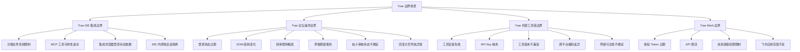

# 模块概述与四大边界场景分类体系

## 模块概述

### 定位

trae-edge-case-handler 是团队管理模块的边界治理子模块，定位为 Trae 生态边界情况的"判断词典 + 处理手册"。它不直接执行业务操作，而是为执行层智能体提供边界条件的识别标准、分级判断与处理决策，确保边界情况被一致地识别、分级与处理。

### 职责

- 定义 Trae 生态四大边界场景的分类体系与边界条件清单
- 提供边界条件的多信号组合检测标准与三级分级规则
- 定义致命/警告/提示三级异常处理流程
- 提供已知特殊场景的预定义适配策略
- 定义与团队管理模块、脚本模块的接口规范
- 提供规范完整性与一致性的验证清单

### 核心概念

| 概念 | 定义 | 说明 |
|---|---|---|
| 边界场景 | Trae 生态中可能阻断或降级操作的典型场景类别 | 共四大类：IDE 集成、论坛操作、外部工具链、Trae Work |
| 边界条件 | 边界场景下可观测的具体异常情形 | 每个条件有检测信号与判断方法 |
| 检测信号 | 用于判断边界条件是否成立的可观测信息 | 遵循多信号组合检测，单一信号不构成判定 |
| 分级 | 边界条件的严重程度分类 | 致命（fatal）/警告（warning）/提示（info）三级 |
| 适配策略 | 针对已知特殊场景的预定义处理方案 | 优先级递减，含回退路径 |

## 四大边界场景分类体系

### 场景一：Trae IDE 集成边界

智能体在 Trae IDE 内使用集成浏览器（integrated_browser MCP）、内置终端等集成能力时遇到的边界情况。

| 边界条件 | 检测信号 | 判断方法 | 默认分级 |
|---|---|---|---|
| 沙箱文件系统限制 | 写入操作返回权限错误；目标路径不在可写目录列表内 | 错误信息包含 `permission denied` 或 `access is denied`，且路径不在沙箱 `writableDirectories` 声明范围内 | 致命 |
| MCP 工具可用性波动 | MCP 工具调用返回 `not found` / `timeout` / `method not found` | 查询当前可用 MCP 工具列表，目标工具不在列表中或调用超时连续 ≥ 2 次 | 警告 |
| 集成浏览器登录状态依赖 | 浏览器操作跳转至登录页；Cookie/Session 标记失效；页面 DOM 出现登录表单 | 多信号检测：当前 URL 含 `/login` 路径、页面存在登录表单元素、API 返回 401，任一命中即确认 | 警告 |
| IDE 内终端会话隔离 | 终端命令的工作目录或环境变量与预期不符；命令间状态不持久 | 命令输出的 `PWD` / `ENV` 与预期不一致，或前序命令设置的变量在后续命令不可见 | 提示 |

### 场景二：Trae 论坛操作边界

智能体执行 forum.trae.cn 论坛自动化（发帖、回复、清理草稿等）时遇到的边界情况。

| 边界条件 | 检测信号 | 判断方法 | 默认分级 |
|---|---|---|---|
| 登录状态过期 | Cookie 失效；页面跳转登录页；API 返回 401；用户名检测返回空 | 多信号组合检测（参考 [multi-signal-detection](../../../docs/retrospective/patterns/methodology-patterns/tools-automation/multi-signal-detection.md)），至少 2 个独立信号命中 | 警告 |
| DOM 结构变化 | CSS 选择器返回空；元素定位超时；备选选择器全部失效 | 主选择器 + ≥ 2 个备选选择器均未命中，且页面已加载完成（`networkidle`） | 警告 |
| 频率限制触发 | HTTP 响应 429；页面提示"操作太频繁"；响应头含 `Retry-After` | 响应状态码为 429，或错误文案包含"频繁/限流/rate limit" | 警告 |
| 草稿残留堆积 | 草稿列表数量超过阈值；历史会话遗留草稿未清理 | 草稿列表 API 返回条目数 ≥ 阈值（默认 10），或检测到非当前会话产生的草稿 | 提示 |
| 帖子审核状态不确定 | 帖子状态字段为 `pending` / `queued`；帖子对匿名用户不可见 | 帖子 `visible` 字段为 `false`，或状态字段含 `pending`/`queued` | 提示 |
| 回复分页导航异常 | 分页选择器失效；页码跳转后内容与预期不符；分页元素缺失 | 请求页码 N 返回的内容首帖 ID 与上一页末帖 ID 不连续，或分页导航元素未找到 | 警告 |

### 场景三：Trae 外部工具链边界

智能体使用 agent-browser CLI、Discourse REST API、@discourse/mcp 等外部工具链时遇到的边界情况。

| 边界条件 | 检测信号 | 判断方法 | 默认分级 |
|---|---|---|---|
| 工具安装失败 | 命令返回 `command not found`；安装命令 exit code 非 0 | `which`/`where` 查询无结果，或安装日志含错误且目标二进制不可执行 | 致命 |
| API Key 缺失 | 环境变量为空；API 返回 401/403；配置文件无对应字段 | 环境变量检查为空且 API 错误码为认证失败（401/403） | 致命 |
| 工具版本不兼容 | 命令报参数不支持；`--version` 输出低于要求版本；功能缺失报错 | `--version` 输出经语义化版本比较低于要求版本，或目标参数在帮助文档中不存在 | 警告 |
| 跨平台编码差异（PowerShell vs bash） | 中文输出乱码；引号转义异常；多行文本被截断 | 输出含乱码字符（U+FFFD 等），或命令解析报引号/语法错误，且仅在某平台出现 | 警告 |
| 网络可达性不确定 | 连接超时；DNS 解析失败；TLS 握手失败 | 网络探测命令（如 curl/测试请求）连续失败 ≥ 2 次，错误为超时或解析失败 | 警告 |

### 场景四：Trae Work 边界

智能体通过 Trae 生态进行工作协作（飞书消息、文档、任务等）时遇到的边界情况。

| 边界条件 | 检测信号 | 判断方法 | 默认分级 |
|---|---|---|---|
| 授权 Token 过期 | API 返回 401；错误码为 `token_expired` / `invalid_grant`；刷新令牌失败 | API 响应错误码匹配 `token_expired`/`invalid_grant`，或刷新流程返回失败 | 警告 |
| API 限流 | HTTP 响应 429；响应头含 `X-RateLimit-Remaining: 0`；错误码为 `rate_limited` | 响应状态码 429，或限流相关响应头/错误码命中 | 警告 |
| 消息链接权限限制 | 访问消息链接返回 403；错误码为 `permission_denied`；链接预览为空 | 响应状态码 403，或错误信息含 `permission`/`forbidden`，且链接资源确实存在 | 提示 |
| 飞书应用范围不足 | API 返回 `app_scope_insufficient`；错误信息提示缺少某 scope | 错误码为 `app_scope_insufficient`，或错误信息明确列出缺失的 scope 名称 | 致命 |

---

## 相关模式

- - [forum-posting Skill](../../skills/forum-posting/SKILL.md)
- - [trae_edge_case_handler.py脚本](../../scripts/trae_edge_case_handler.py)
- - [任务交接协议](../../protocols/handoff.md)

**[返回索引](../trae-edge-case-handler.md)** | 下一章 → [边界条件判断标准与异常处理流程](02-criteria-process.md)
