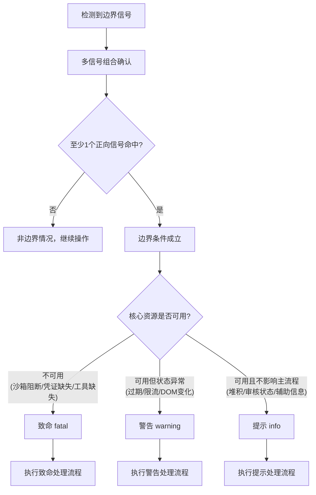
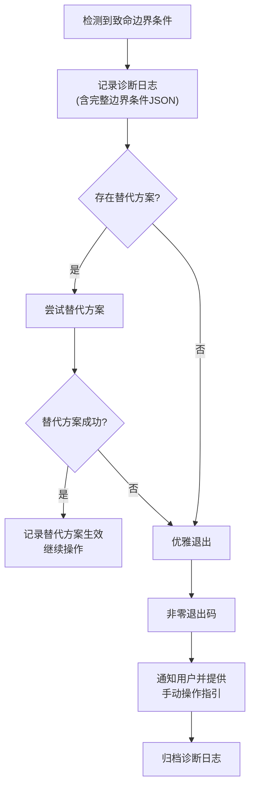
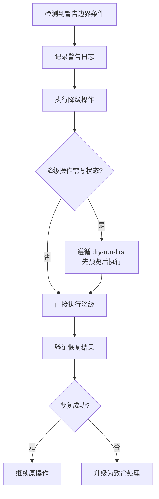

# 边界条件判断标准与异常处理流程

## 边界条件判断标准

### 多信号组合检测

边界条件判断须遵循 [多信号组合检测模式](../../../docs/retrospective/patterns/methodology-patterns/tools-automation/multi-signal-detection.md)，禁止依赖单一信号下结论。

| 要求 | 说明 |
|---|---|
| 信号源数量 | 每个边界条件至少提供 2 个独立信号源 |
| 信号排序 | 信号源按可靠性排序，最可靠的优先检查（JS 全局对象 > Meta 标签 > data-* 属性 > CSS 类名 > 元素文本） |
| 反向信号 | 提供反向信号辅助确认"未处于该状态"（如登录页存在"登录"按钮即反向确认未登录） |
| 诊断输出 | DEBUG 模式下输出完整检测 JSON，包含每个信号的命中情况与返回值 |
| 命中阈值 | 至少 1 个正向信号命中即确认边界条件成立；反向信号存在且无正向命中即确认未成立 |

### 三级分级标准

边界条件识别后，按严重程度分级，每级对应不同处理策略。

| 级别 | 标识 | 含义 | 判定依据 | 处理策略概要 |
|---|---|---|---|---|
| 致命 | fatal | 阻断当前操作，无法通过降级继续 | 操作所需的核心资源不可用（如沙箱阻断、凭证缺失、工具未安装） | 记录 → 替代 → 退出 → 通知 |
| 警告 | warning | 操作可降级继续，但须执行恢复动作 | 状态过期、限流、DOM 变化等可恢复情形 | 记录 → 降级 → 验证 → 继续 |
| 提示 | info | 不影响操作，仅记录供汇总 | 轻微变化或非阻断的辅助信息（草稿堆积、审核状态不确定） | 记录 → 继续 → 汇总 |

### 边界条件分级决策图

## 异常处理流程

### 致命级处理流程

适用于沙箱限制阻断、工具未安装、API Key 缺失、飞书应用范围不足等无法降级的情形。

**执行要点**：
1. 诊断日志须包含边界条件类型、检测信号命中情况、环境上下文（平台/工具版本/路径）。
2. 替代方案按优先级尝试，每尝试一个须记录结果。
3. 退出码非零（建议 130 表示边界阻断），便于上层编排识别。
4. 通知内容须包含：受阻操作描述、边界原因、手动操作步骤、诊断日志路径。
5. 诊断日志须遵循 [check-and-restore](../../../docs/retrospective/patterns/code-patterns/check-and-restore.md) 模式——检查与记录不改变业务状态。

### 警告级处理流程

适用于登录过期、限流、DOM 变化、版本不兼容等可恢复情形。

**执行要点**：
1. 降级操作（如重新登录、切换选择器、等待重试）须遵循 [dry-run-first](../../../docs/retrospective/patterns/methodology-patterns/tools-automation/dry-run-first.md) 原则——涉及状态变更时先预览再执行。
2. 验证恢复结果须使用多信号检测确认，不能仅凭无报错即判定成功。
3. 降级失败须升级为致命级处理，不得静默吞掉错误。
4. 同一警告级边界条件在单次任务内降级失败 ≥ 2 次，须升级为致命级。

### 提示级处理流程

适用于草稿堆积、审核状态不确定、消息链接权限限制等不影响主流程的情形。

| 步骤 | 操作 | 说明 |
|---|---|---|
| 记录 | 写入提示级日志 | 含边界条件类型与上下文，不中断操作 |
| 继续 | 继续原操作 | 不执行任何恢复或降级动作 |
| 汇总 | 操作完成后汇总报告 | 在任务总结中列出所有提示级边界情况，供后续优化 |

**执行要点**：
1. 提示级边界情况不触发任何状态变更。
2. 汇总报告须包含每个提示级边界情况的发现次数与影响评估。
3. 同一提示级边界情况在多次任务中反复出现，须提请优化（如更新选择器常量、调整草稿清理策略）。

---

## 相关模式

- - [forum-posting Skill](../../skills/forum-posting/SKILL.md)
- - [trae_edge_case_handler.py脚本](../../scripts/trae_edge_case_handler.py)
- - [任务交接协议](../../protocols/handoff.md)

← 上一章: [模块概述与四大边界场景分类体系](01-overview-classification.md) | **[返回索引](../trae-edge-case-handler.md)** | 下一章 → [特殊场景适配策略与模块接口规范](03-adaptation-interface.md)
