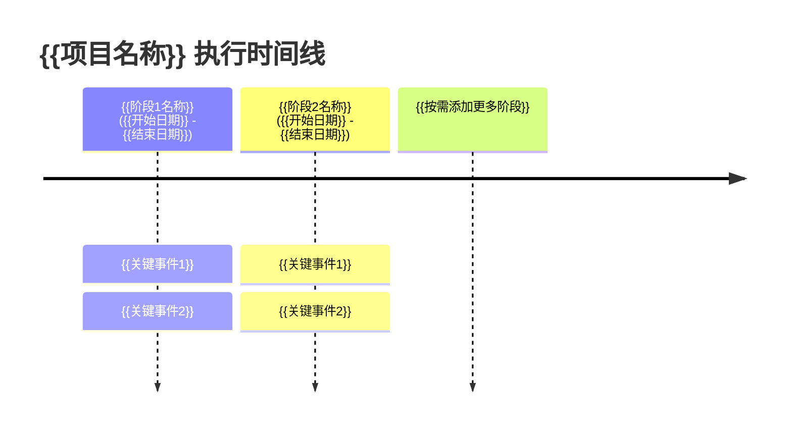

# {{项目名称}} 复盘——执行概览

> **SSOT职责**：执行概览、背景目标、关键决策、Mermaid时间线。详细阶段事实见 [execution-phases.md](execution-phases.md)，洞察分析见 [insight-extraction.md](insight-extraction.md)。

---

## 一、背景与目标

### 1.1 项目背景

{{为什么做这个项目？当时的上下文是什么？2-3段说明触发因素、业务/技术需求、约束条件。}}

### 1.2 原始目标

{{项目启动时设定的目标。建议用编号列表，SMART原则。}}

1. {{目标1：具体、可衡量}}
2. {{目标2}}
3. {{目标3}}

### 1.3 约束条件

{{时间/人力/技术栈/依赖等约束。}}

---

## 二、结果概览

### 2.1 目标达成情况

| 原始目标 | 达成状态 | 说明 |
|---------|---------|------|
| {{目标1}} | ✅/⚠️/❌ | {{简要说明}} |
| {{目标2}} | ✅/⚠️/❌ | {{...}} |
| {{目标3}} | ✅/⚠️/❌ | {{...}} |

### 2.2 核心数据

| 指标 | 数值 |
|------|------|
| 周期 | {{N}}天（{{开始日期}}→{{结束日期}}） |
| 总提交 | {{N}}次 |
| 新增文件 | {{N}}个 |
| 修改文件 | {{N}}个 |
| 删除文件 | {{N}}个 |
| 代码/文档行数 | +{{N}}/-{{N}}行 |

---

## 三、关键决策记录

> 记录项目过程中做出的重要决策、决策依据和结果。格式：**决策内容** → 依据 → 结果。

### D1：{{决策标题}}

- **时间**：{{YYYY-MM-DD}}
- **决策**：{{具体决策内容}}
- **依据**：{{为什么这么决策}}
- **结果**：✅ 有效 / ⚠️ 部分有效 / ❌ 失误
- **经验**：{{从这个决策中学到了什么}}

---

## 四、执行时间线

---

## 五、阶段导航

> 各阶段详细事实记录（做了什么、交付了什么、关键数据）见 [execution-phases.md](execution-phases.md)。

| 阶段 | 时间 | 核心产出 | 关键指标 |
|------|------|---------|---------|
| S1：{{阶段名}} | {{日期范围}} | {{核心产出}} | {{指标}} |
| S2：{{阶段名}} | {{日期范围}} | {{核心产出}} | {{指标}} |
| S3：{{阶段名}} | {{日期范围}} | {{核心产出}} | {{指标}} |
| {{按需添加}} | {{...}} | {{...}} | {{...}} |

---

## 六、复盘过程记录

| 阶段 | 时间 | 内容 | 产出物 |
|------|------|------|--------|
| 复盘准备 | {{日期}} | {{收集上下文、确定范围}} | 本报告目录 |
| 事实收集 | {{日期}} | {{回顾提交历史、文档、产出物}} | execution-phases.md |
| 洞察萃取 | {{日期}} | {{根因分析、模式提取}} | insight-extraction.md |
| 建议生成 | {{日期}} | {{P0/P1/P2建议、模式更新}} | export-suggestions.md |
| 行动执行 | {{日期}} | {{执行改进项、自举验证}} | final-execution-summary.md |
