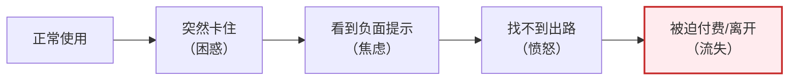
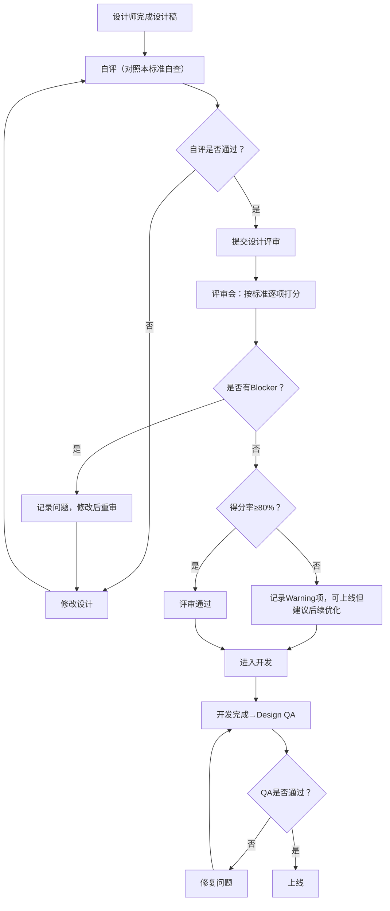

# 设计评审标准：情绪曲线管理 + 跨平台一致性

> 本标准用于设计评审（Design Review）和设计走查（Design QA）环节，聚焦两个高频出错领域：
> 1. **情绪曲线管理**：用户在遇到限制/错误/等待时的情绪体验设计
> 2. **跨平台一致性**：同一功能在网页/IDE/CLI/移动端/推送的体验一致性
>
> 配套文档：
> - [ui-pitfalls-guide.md](file:///d:/spaces/SpecWeave/.agents/templates/ui-pitfalls-guide.md)
> - [new-user-first-quota-onboarding.md](file:///d:/spaces/SpecWeave/.agents/templates/new-user-first-quota-onboarding.md)
> - [saas-pricing-quickref.md](file:///d:/spaces/SpecWeave/.agents/templates/saas-pricing-quickref.md)

---

## 评审说明

### 评分等级

| 等级 | 分数 | 含义 |
|---|---|---|
| ✅ **通过（Pass）** | 2分 | 完全符合标准，可上线 |
| ⚠️ **建议改进（Warning）** | 1分 | 不阻塞上线，但建议优化；记录后可带过 |
| ❌ **不通过（Blocker）** | 0分 | 违反核心原则，必须修改后重新评审 |

### 评审方式

1. **自评**：设计师提交设计稿前，先按本标准自查
2. **评审会**：评审参与者按标准逐项打分，Blocker项必须全过
3. **走查**：开发完成后Design QA阶段再次验证

### 合格线

- **Blocker项**：100%通过（0个❌）
- **总得分率**：≥80%（即Warning不超过20%）

---

## 第一部分：情绪曲线管理评审标准

### 核心原则

> **用户遇到问题时的体验，决定了他对产品的信任度。**
> 好的情绪设计让用户在遇到问题后反而更信任产品；差的情绪设计让用户永久流失。

### 标准1.1：负面情绪触发点识别（设计前评审）

评审目标：设计方案是否识别了所有可能引发负面情绪的触发点？

| 检查项 | 权重 | ✅ 通过（2分） | ⚠️ 建议（1分） | ❌ 不通过（0分） |
|---|---|---|---|---|
| **1.1.1 触发点完整性** | Blocker | 已列出用户旅程中所有可能的负面触发点（错误、等待、限制、失败）并设计了对应状态 | 列出了主要触发点，遗漏1-2个边缘场景 | 只设计了理想路径，完全没有考虑异常/限制状态 |
| **1.1.2 用户情绪预判** | Blocker | 对每个触发点预判了用户的情绪反应（困惑/焦虑/愤怒/沮丧）并设计了对应安抚策略 | 有情绪预判但没有对应策略 | 完全没有考虑用户情绪，只从功能角度设计 |
| **1.1.3 新用户vs老用户区分** | Warning | 新用户首次遇到问题时有专门的引导设计，老用户用更简洁的提示 | 有区分但差异不够明显 | 新老用户用完全一样的提示文案和交互 |

### 标准1.2：文案情绪管理

评审目标：提示文案是否避免了焦虑/指责/技术化，是否传递了安抚和掌控感？

| 检查项 | 权重 | ✅ 通过（2分） | ⚠️ 建议（1分） | ❌ 不通过（0分） |
|---|---|---|---|---|
| **1.2.1 第一句话是安抚** | Blocker | 提示的第一句/标题是安抚性语言（"没关系""别担心""这很正常"） | 第一句中立，不是安抚但也不是指责 | 第一句就是负面词汇（"错误""失败""已用完""限制"） |
| **1.2.2 禁止使用技术术语** | Blocker | 用户可见文案中无"配额""rate limit""滑动窗口""API"等技术术语 | 技术术语在帮助/详情链接中出现，主文案没有 | 主文案直接使用技术术语解释问题 |
| **1.2.3 禁止使用指责性语言** | Blocker | 无"您输入错了""您必须""不允许""禁止"等指责/命令式语言 | 个别词汇偏硬但整体可接受 | 使用"您必须升级""您已超出限制"等指责/强迫语言 |
| **1.2.4 时间表述精确** | Warning | 等待时间具体到分钟（"约3小时20分钟后，下午5:42"） | 有时间但不精确（"约3小时后"） | 使用"稍后""请耐心等待""一会儿"等模糊表述 |
| **1.2.5 承诺明确具体** | Warning | 明确承诺用户关心的内容（"不会丢失对话""Codex记得之前的内容"） | 有安全承诺但比较笼统（"您的数据是安全的"） | 没有任何承诺，用户不知道操作后会怎样 |
| **1.2.6 按钮文案是动作** | Warning | 按钮文字是具体动作（"继续工作""切换到轻量模型"） | 按钮文案是"确定""确认"等无信息词汇 | 按钮文案是"立即升级""立即购买"等推销词汇（在非付费场景） |

**禁止词汇清单（Blocker，出现即0分）**：
- ❌ 配额、配额已用完、您已达到限制
- ❌ 错误、失败、操作失败、访问被拒绝
- ❌ 您必须、您需要、请购买、立即升级（非付费场景）
- ❌ Rate limit、API限制、滑动窗口
- ❌ 降级、您被降级、弱模型
- ❌ 稍后、请重试、请耐心等待（无具体时间）
- ❌ 最后X小时、即将过期（虚假紧迫感）

### 标准1.3：情绪曲线走向

评审目标：整体设计是否引导情绪从负面走向正面，最终建立信任？


| 检查项 | 权重 | ✅ 通过（2分） | ⚠️ 建议（1分） | ❌ 不通过（0分） |
|---|---|---|---|---|
| **1.3.1 每个问题都有即时出口** | Blocker | 用户遇到问题后能在一个界面内看到所有可选方案，一键继续 | 有方案但需要多次点击/跳转 | 遇到问题后没有出路（只有"请升级"或"请稍后重试"） |
| **1.3.2 零成本选项优先** | Blocker | 视觉上最突出的按钮是免费/零成本的解决方案（如"继续使用免费版"） | 免费选项可见但和付费按钮同级 | 付费/升级按钮是唯一主按钮，免费选项藏在角落或没有 |
| **1.3.3 给用户掌控感** | Blocker | 表述为"您可以选择A/B/C"，用户感觉自己在做决定 | 选项存在但表述偏引导 | 表述为"您必须A才能继续"，用户感觉被强迫 |
| **1.3.4 问题解决后有正反馈** | Warning | 操作成功后有明确的✅正向反馈，让用户确认问题已解决 | 有反馈但不明显 | 操作成功后无反馈，默默回到界面，用户不确定是否成功 |
| **1.3.5 不打断心流** | Warning | 不打断用户正在进行的工作（非阻塞提示优先），仅在必须时用模态框 | 用了模态框但时机合理 | 在用户打字/操作中途弹模态框，打断工作流 |

### 标准1.4：负面情绪曲线（绝对禁止）

以下情绪曲线出现任何一个即判定为Blocker：



**禁止出现的体验**（出现任意一项即Blocker）：
- ❌ 用户正在工作中突然被强制打断弹付费窗口
- ❌ 错误/限制提示后没有任何免费继续的选项
- ❌ 做了一半的工作因限制/错误丢失（或提示"可能丢失"）
- ❌ 用户关闭弹窗后找不到回来的路径（丢失上下文）
- ❌ 反复弹窗推销，用户点了"继续免费"还持续骚扰

---

## 第二部分：跨平台一致性评审标准

### 核心原则

> **同一功能在不同平台上应该让用户感觉"这是同一个产品"，但要适配每个平台的交互习惯。**
> 一致≠一模一样；一致是指核心价值、文案语气、选项优先级保持统一，但交互方式适配平台特性。

### 标准2.1：核心信息一致性

| 检查项 | 权重 | ✅ 通过（2分） | ⚠️ 建议（1分） | ❌ 不通过（0分） |
|---|---|---|---|---|
| **2.1.1 核心选项一致** | Blocker | 同一功能在各平台的核心选项（如4个出口）完全一致，没有平台缺少关键选项 | 核心选项都有但顺序/表述略有差异 | 某个平台缺失关键选项（如CLI里没有切换模型选项） |
| **2.1.2 选项优先级一致** | Blocker | 推荐选项在所有平台都是最优先展示的（绿色/主按钮/第一个选项） | 优先级基本一致但视觉权重有差异 | 某个平台把付费选项放第一，免费选项放最后（和其他平台相反） |
| **2.1.3 文案语气一致** | Warning | 所有平台的文案语气统一（友好/安抚/说人话），CLI可以简洁但不能生硬 | 语气基本一致，CLI偏技术化但可接受 | 不同平台文案语气差异巨大（网页很友好，CLI满屏"ERROR"） |
| **2.1.4 关键承诺一致** | Warning | 所有平台都包含对用户的关键承诺（"不丢上下文""会恢复"） | 主要平台有，边缘平台缺失 | 不同平台承诺不一致（网页说"不丢内容"，CLI没有任何说明） |

### 标准2.2：各平台专项标准

#### 2.2.1 网页/桌面端

| 检查项 | 权重 | ✅ 通过（2分） | ⚠️ 建议（1分） | ❌ 不通过（0分） |
|---|---|---|---|---|
| 模态框大小合适 | Warning | 模态框内容不超过屏幕高度，所有选项一屏可见，不需要滚动 | 内容略长但主要选项可见 | 模态框超过屏幕高度需要滚动，关键按钮在首屏外 |
| 关闭方式完整 | Blocker | 右上角X、ESC键、点击遮罩层都可以关闭 | 有X和ESC，但点击遮罩不能关 | 没有明显关闭方式，必须点按钮才能退出 |
| 视觉层级清晰 | Warning | 推荐选项→次要选项→付费选项视觉权重递减清晰 | 层级有但对比不够明显 | 所有按钮/卡片颜色大小相同，不知道该点哪个 |

#### 2.2.2 IDE内（VS Code/JetBrains/Cursor）

| 检查项 | 权重 | ✅ 通过（2分） | ⚠️ 建议（1分） | ❌ 不通过（0分） |
|---|---|---|---|---|
| **不遮挡代码** | Blocker | 提示用内联浮层/状态栏，不覆盖代码编辑区 | 有浮层但可拖动/可最小化 | 弹大模态框遮挡正在编写的代码 |
| **极度紧凑** | Blocker | 文案精简到最短，选项用小按钮/链接，不超过2-3行高度 | 提示比理想的大但不遮挡代码 | 提示占用大量屏幕空间，像网页弹窗一样 |
| **不打断心流** | Blocker | 用户在IDE里可以忽略提示继续打字（不强制阻断） | 提示出现但可以继续工作 | 提示弹出后强制聚焦/阻断输入，必须先处理 |
| **信息密度高** | Warning | 用图标/短词/符号替代长句，符合开发者阅读习惯 | 简洁但偏口语化 | 用和网页一样长的文案，在IDE里显得啰嗦 |

**IDE正确示例**：
```
┌─ Codex ──────────────────┐
│ Quota reached.           │
│ [Switch to mini] [Wait]  │
│ [Buy more] [Upgrade]     │
└──────────────────────────┘
```

**IDE错误示例**（❌）：
```
┌──────────────────────────────────────┐
│  😊 亲爱的用户，您今天使用 Codex     │
│  比较多哦！让我为您解释一下配额     │
│  机制................................│
│                                      │
│  [立即切换到轻量模型继续工作！]      │
│  [我想休息一下，等会儿再来]          │
│  [了解Plus计划获得更多使用量]        │
└──────────────────────────────────────┘
（遮挡了半个编辑器）
```

#### 2.2.3 CLI终端

| 检查项 | 权重 | ✅ 通过（2分） | ⚠️ 建议（1分） | ❌ 不通过（0分） |
|---|---|---|---|---|
| **快捷键选择** | Blocker | 选项支持数字键/单键选择（如`[1] Switch mini [2] Wait`） | 需要输入命令但支持tab补全 | 必须输入完整长命令才能操作 |
| **信息密度最高** | Warning | 无ASCII艺术框、无大段说明，单行+选项列表 | 简洁但有少量装饰 | 大段ASCII边框/多行解释，在终端里占满屏幕 |
| **斜杠命令符合习惯** | Warning | 使用`/model mini` `/buy` `/upgrade`等斜杠命令，符合CLI惯例 | 有命令但命名不一致 | 命令名和产品其他地方不统一，或需要记特殊命令 |
| **wait支持后台通知** | Warning | `wait`命令后释放终端，配额恢复后发桌面通知 | wait阻塞终端但有进度提示 | wait命令完全阻塞终端，用户不知道什么时候回来 |

**CLI正确示例**：
```
⚠️  GPT-5.4 quota used up.
    Options:
    1) /model mini     → Continue with mini (instant)
    2) wait            → Resets ~3h20m (notifies when ready)
    3) /buy 5          → $5 for 100 extra messages
    4) /upgrade pro    → Upgrade to Pro
    Select [1-4]: _
```

#### 2.2.4 移动端（iOS/Android）

| 检查项 | 权重 | ✅ 通过（2分） | ⚠️ 建议（1分） | ❌ 不通过（0分） |
|---|---|---|---|---|
| **按钮尺寸达标** | Blocker | 所有可点击区域≥44x44pt（iOS HIG规范），不挤在一起 | 主按钮达标，次要文字链接偏小 | 按钮太小/太密，手机上容易点错 |
| **选项数量控制** | Blocker | 一屏内选项≤3个，不展示4个卡片 | 3个选项+1个文字链接 | 把网页上4-5个选项卡片全搬到手机上，需要滚动 |
| **文案最短** | Warning | 文案压缩到最精简，主标题≤15字，说明≤2行 | 文案比网页短但还可以更精简 | 直接搬网页长文案，手机上密密麻麻 |
| **底部弹层非全屏** | Warning | 用底部sheet（半屏弹层）而非全屏模态框，用户可下滑关闭 | 用了半屏弹层但关闭手势不支持 | 弹全屏模态框，没有关闭按钮只能选一个 |

#### 2.2.5 推送通知

| 检查项 | 权重 | ✅ 通过（2分） | ⚠️ 建议（1分） | ❌ 不通过（0分） |
|---|---|---|---|---|
| **正文≤2行** | Blocker | 推送正文控制在2行以内，一眼看完 | 3行但可接受 | 长段文字，通知中心显示不全 |
| **禁止焦虑性内容** | Blocker | 不发"配额快用完了""马上过期""即将失去访问"等焦虑性推送 | 有轻微紧迫感但不严重 | 发恐吓/焦虑类推送催促用户上线/付费 |
| **明确行动点** | Warning | 推送里有明确的下一步动作（"点击继续你的项目"） | 有内容但行动点不明确 | 只说"你的配额恢复了"，不告诉用户能做什么 |
| **点击落地正确** | Blocker | 推送点击打开用户之前正在做的事（对话/项目/文件），不是首页 | 打开相关页面但不是具体上下文 | 点击永远打开首页，用户要重新找到之前的内容 |
| **频率控制** | Blocker | 同类通知24小时内不超过1条 | 略有重复但不构成骚扰 | 短时间内多次推送同一事件 |

**推送正确示例**：
```
Codex: 你的使用量恢复啦 👋
之前的对话还在，点这里继续做你的项目
```

**推送错误示例**（❌）：
```
⚠️【紧急通知】您的Codex配额即将过期！
请立即打开App升级到Plus，否则您的工作将丢失！
立即升级→
```

### 标准2.3：适配 vs 一致的平衡

| 检查项 | 权重 | ✅ 通过（2分） | ⚠️ 建议（1分） | ❌ 不通过（0分） |
|---|---|---|---|---|
| 核心价值一致 | Blocker | 所有平台都传达相同的核心价值和选项优先级 | 核心一致但有小差异 | 不同平台传达的信息/推荐方向不一样 |
| 交互方式适配平台 | Warning | 交互方式符合平台规范（网页用模态框、IDE用内联、CLI用快捷键、移动端用底部sheet） | 有适配但有些地方可以更原生 | 直接把网页UI搬到所有平台，完全不适配 |
| 文案长度适配 | Warning | 文案长度根据平台调整（网页详细、CLI极简、移动端精简） | 长度差异不够大 | 所有平台用一模一样的长文案 |
| 功能可用范围一致 | Warning | 核心功能在所有平台都可用，平台特有功能作为补充 | 核心功能都有，个别高级功能在某些平台暂缺 | 关键功能只在网页有，其他平台完全用不了 |

---

## 第三部分：评审流程与记录表

### 评审流程



### 评审记录表模板

**评审基本信息**

| 项目 | 内容 |
|---|---|
| 评审日期 | YYYY-MM-DD |
| 设计师 | |
| 评审参与者 | |
| 设计稿链接 | |
| 评审场景 | □ 配额提示 □ 错误提示 □ 付费转化 □ Onboarding □ 跨平台 □ 其他 |

**情绪曲线管理评分**

| 检查项 | 权重 | 评分（0/1/2） | 备注 |
|---|---|---|---|
| 1.1.1 触发点完整性 | Blocker | | |
| 1.1.2 用户情绪预判 | Blocker | | |
| 1.1.3 新老用户区分 | Warning | | |
| 1.2.1 第一句话是安抚 | Blocker | | |
| 1.2.2 禁止技术术语 | Blocker | | |
| 1.2.3 禁止指责语言 | Blocker | | |
| 1.2.4 时间表述精确 | Warning | | |
| 1.2.5 承诺明确具体 | Warning | | |
| 1.2.6 按钮文案是动作 | Warning | | |
| 1.3.1 每个问题都有出口 | Blocker | | |
| 1.3.2 零成本选项优先 | Blocker | | |
| 1.3.3 给用户掌控感 | Blocker | | |
| 1.3.4 成功后有正反馈 | Warning | | |
| 1.3.5 不打断心流 | Warning | | |
| **情绪曲线小计** | — | /28 | 需0个Blocker❌，得分率≥80%即≥22分 |

**跨平台一致性评分**

| 检查项 | 权重 | 评分（0/1/2） | 备注 |
|---|---|---|---|
| 2.1.1 核心选项一致 | Blocker | | |
| 2.1.2 选项优先级一致 | Blocker | | |
| 2.1.3 文案语气一致 | Warning | | |
| 2.1.4 关键承诺一致 | Warning | | |
| 网页：模态框大小合适 | Warning | | |
| 网页：关闭方式完整 | Blocker | | |
| 网页：视觉层级清晰 | Warning | | |
| IDE：不遮挡代码 | Blocker | | |
| IDE：极度紧凑 | Blocker | | |
| IDE：不打断心流 | Blocker | | |
| IDE：信息密度高 | Warning | | |
| CLI：快捷键选择 | Blocker | | |
| CLI：信息密度最高 | Warning | | |
| CLI：斜杠命令习惯 | Warning | | |
| CLI：wait后台通知 | Warning | | |
| 移动端：按钮尺寸达标 | Blocker | | |
| 移动端：选项数量≤3 | Blocker | | |
| 移动端：文案最短 | Warning | | |
| 移动端：底部弹层 | Warning | | |
| 推送：正文≤2行 | Blocker | | |
| 推送：禁止焦虑内容 | Blocker | | |
| 推送：明确行动点 | Warning | | |
| 推送：点击落地正确 | Blocker | | |
| 推送：频率控制 | Blocker | | |
| 核心价值一致 | Blocker | | |
| 交互适配平台 | Warning | | |
| 文案长度适配 | Warning | | |
| 功能可用一致 | Warning | | |
| **跨平台小计** | — | /56 | 需0个Blocker❌，得分率≥80%即≥45分 |

**评审结论**

| 结论类型 | 勾选 |
|---|---|
| ✅ 通过（0个Blocker，得分率≥80%） | □ |
| ⚠️ 有条件通过（0个Blocker，Warning项可上线后优化） | □ |
| ❌ 不通过（有Blocker或得分率<80%，需修改后重审） | □ |

**Blocker问题清单（必须修改）**：

| # | 问题描述 | 所属标准 | 建议修改方向 |
|---|---|---|---|
| 1 | | | |
| 2 | | | |

**Warning问题清单（建议优化）**：

| # | 问题描述 | 所属标准 | 建议 |
|---|---|---|---|
| 1 | | | |
| 2 | | | |

**评审签字**

| 角色 | 签字 | 日期 |
|---|---|---|
| 设计师 | | |
| 产品经理 | | |
| 设计评审负责人 | | |

---

## 附录：快速参考卡

### 情绪设计5秒测试

看到任何错误/限制/状态提示时，5秒内回答：
1. 第一句话是在安慰我还是在指责我？
2. 我知道现在能做什么吗？（有明确的按钮/选项）
3. 我能不花钱就继续吗？（零成本选项明显可见）
4. 我知道要等多久吗？（有具体时间）
5. 我怕不怕之前做的东西丢了？（有明确承诺）

5个问题有任何一个回答"否"，设计就需要改。

### 跨平台适配记忆

- **网页**：可以详细，模态框可展示4个选项卡片
- **IDE**：紧凑紧凑再紧凑，不挡代码，不打断打字
- **CLI**：快捷键数字，信息密度最高，支持斜杠命令
- **移动端**：按钮够大，选项≤3个，底部弹层
- **推送**：2行以内，明确行动点，绝不发焦虑推送

### 跨平台一致性三问

1. 如果一个用户只用CLI/手机，他能获得和网页用户一样的核心信息和选项吗？
2. 推荐选项（我们最希望用户点的那个）在所有平台上都是最容易点到的吗？
3. 不同平台的文案读起来像是同一个产品说的话吗？

---

**版本历史**：
- v1.0 (2026-07-08)：初始版本，基于ChatGPT Codex Wiki分析提炼
