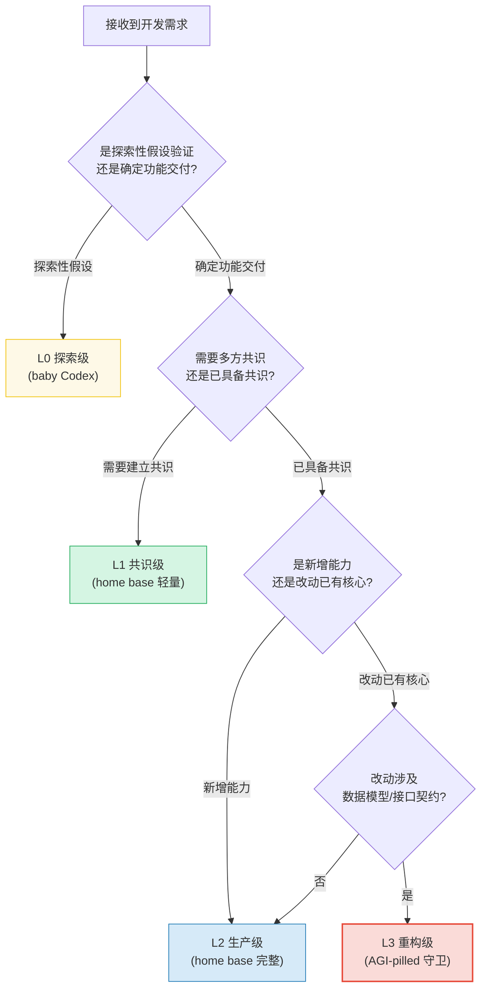
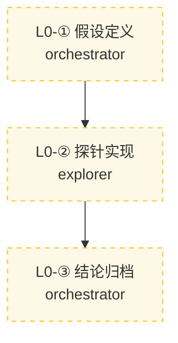
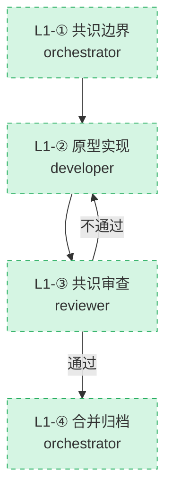
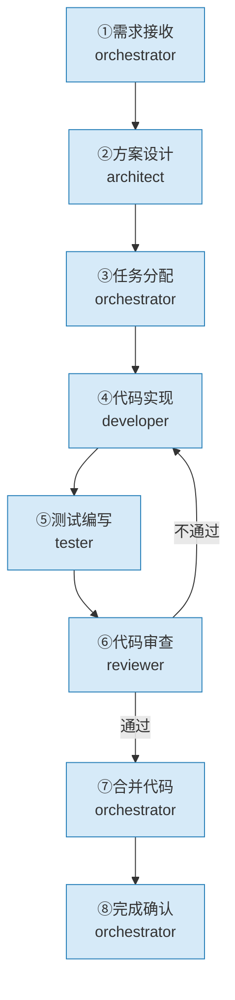
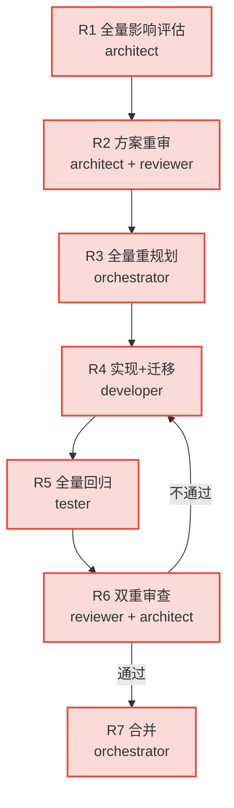

# L0-L3 流程分级示例模板

> 本模板基于 Codex 产品哲学深度访谈中的三大产品哲学概念（baby Codex / home base / AGI-pilled），为 SpecWeave 提供一套「流程分级」示例框架。旨在将「实现便宜时代」的探索合法化，同时不放弃生产级质量保护。
>
> **适用场景**：在启动开发任务前，根据任务复杂度选择合适的流程层级（L0-L3），避免用生产级流程约束原型级探索，也避免用轻量流程交付生产级任务。

---

## 一、设计溯源：三大产品哲学概念

本模板的设计灵感来源于 OpenAI Codex 负责人 Andrew Ambrosino 提出的三大产品哲学概念，每个概念对应流程分级的一个维度。

### 1.1 baby Codex（探索阶段载体 · 设计层）

- **原始定义**：Codex 团队内部的极简代码库，专门用于快速探索交互方案，不做生产级代码。
- **在 SpecWeave 中的映射**：L0 探索级流程的核心理念。承认「实现便宜」时代原型的合法性，为「明确标注为非生产级」的探针式实现提供合法通道。
- **核心命题**：原型精致度与上线准备度脱钩——精致的东西可能仍在探索阶段，但没人告诉你这一点。baby Codex 通过显式标注解决这个识别问题。

### 1.2 home base（工作场景载体 · 产品形态层）

- **原始定义**：区别于「超级应用」（把所有工具锁进一个矩形），home base 是工作的起点、终点与自动工作平台，通过连接器、浏览器、扩展与用户已有的工具对话。
- **在 SpecWeave 中的映射**：L1/L2 流程的协作哲学。流程不应是把所有工作锁进 8 步矩形里的「超级流程」，而是工作的起点与终点——通过角色协作协议、交接协议、外部工具连接器与已有工具对话。
- **核心命题**：流程与工具解耦——流程框架（「我们在哪个阶段」）应保留，但流程工具绑定（「这个阶段必须用 PRD」）应放松。

### 1.3 AGI-pilled（形态-能力匹配警示 · 战略层）

- **原始定义**：Andrew 用以描述最初 Codex Web 形态的反思性概念——过度信任模型自主性，假定模型已具备 AGI 级别的能力。产品形态必须与模型当前能力（而非未来能力）相匹配。
- **在 SpecWeave 中的映射**：L3 重构级流程的治理判据。流程选择必须与任务当前复杂度（而非未来复杂度）相匹配——不要用 L3 重量流程去约束 L0 探索任务（过度治理），也不要用 L0 轻流程去交付 L3 生产任务（治理不足）。
- **核心命题**：形态-能力匹配判据——流程形态必须与任务当前复杂度相匹配，而不是与任务未来复杂度相匹配。

### 1.4 三大概念 × 四级流程对应关系

| 产品哲学概念 | 对应流程层级 | 核心作用 | 反模式警示 |
|---|---|---|---|
| **baby Codex** | L0 探索级 | 探索阶段载体 | 用生产级流程约束原型探索 |
| **home base** | L1 共识级 / L2 生产级 | 协作平台与工具连接器 | 把所有工作锁进单一刚性流程 |
| **AGI-pilled** | L3 重构级 | 形态-能力匹配警示 | 用重型流程押注未来复杂度 |

---

## 二、流程分级判定决策树

在启动任何开发任务前，orchestrator 必须首先判定任务的流程层级（L0-L3），选择对应的流程路径。

### 2.1 分级判定矩阵

| 流程层级 | 适用场景 | 风险等级 | 阶段守卫强度 | 产出物 | 对应概念 |
|---|---|---|---|---|---|
| **L0 探索级** | 假设验证、交互方案探索、技术可行性探针 | 极低 | 无（探针豁免） | `baby-` 前缀探针代码 + 探索笔记 | baby Codex |
| **L1 共识级** | 边界澄清、跨方对齐、轻量级功能交付 | 低 | 轻量（4步） | 轻量 spec + 原型 + 共识审查 | home base 轻量 |
| **L2 生产级** | 新增生产功能、完整生命周期交付 | 中 | 完整（8步） | 生产代码 + 测试 + 文档 | home base 完整 |
| **L3 重构级** | 改动核心结构、数据模型、接口契约 | 高 | 重量（7步）+ 双重审查 | 迁移方案 + 全量回归 | AGI-pilled 守卫 |

**判定依据必须记录在任务分解清单的「流程层级」字段中。**

---

## 三、L0 探索级流程（baby Codex 载体）

### 3.1 流程图

### 3.2 步骤详情

#### 步骤 L0-①：假设定义

- **负责角色**：orchestrator
- **阶段守卫**：探针豁免——无需进入标准阶段守卫；唯一约束是「假设必须可证伪」
- **📋 前置文档**：探索问题陈述（一段话即可，无需完整 spec）
- **输入**：待验证的假设（如「侧边栏能否支持群聊？」）
- **输出**：假设卡片（含假设陈述、成功判据、失效判据、预估探索时长）
- **执行要点**：
  1. 明确假设的可证伪判据——什么结果算「假设成立」、什么结果算「假设证伪」
  2. 设定探索时长上限（建议 ≤ 1 个工作日），超时未得出结论即归档为「未决」
  3. 标注探针代码的 `baby-` 前缀，明确不入主干、不进生产
- **完成标志**：假设卡片已创建，`baby-` 前缀已标注

#### 步骤 L0-②：探针实现

- **负责角色**：explorer（可由 developer 角色兼任，但产出物不进入 developer 的生产任务清单）
- **阶段守卫**：探针豁免——允许跨阶段操作（直接写代码、直接测试、直接迭代），无需经过需求→设计→实现的标准序列
- **📋 前置文档**：假设卡片
- **输入**：假设卡片
- **输出**：`baby-` 前缀的探针代码 + 探索笔记
- **执行要点**：
  1. 探针代码必须以 `baby-` 前缀命名（如 `baby-sidebar-chat-test.tsx`）
  2. 探针代码必须放置在 `.temp/baby/` 目录下，不进入 `src/` 主干
  3. 探索笔记记录：验证了什么、观察到什么、假设是否成立、是否值得升级到 L1/L2
- **完成标志**：探针代码已运行，探索笔记已记录

#### 步骤 L0-③：结论归档

- **负责角色**：orchestrator
- **阶段守卫**：无（归档动作本身不触发阶段守卫）
- **📋 前置文档**：探针代码、探索笔记
- **输入**：探索笔记
- **输出**：探索结论 + 流程升级决策
- **执行要点**：
  1. 根据探索笔记判定：假设成立 → 升级到 L1/L2 进入正式交付；假设证伪 → 归档探针代码；未决 → 保留探针等待模型/条件成熟
  2. 归档探针代码到 `.temp/baby/archive/`，标注过期时间戳
  3. 若升级到 L1/L2，将假设卡片转化为 spec 的需求边界陈述
- **完成标志**：探索结论已归档，升级决策已记录

### 3.3 探针实现豁免规则（baby Codex 合法化机制）

| 规则项 | 约束 |
|---|---|
| **命名前缀** | 必须以 `baby-` 开头，便于全局识别 |
| **存放位置** | 必须在 `.temp/baby/` 目录下，禁止进入 `src/`、`apps/`、`docs/` 等正式目录 |
| **生命周期** | 单个探针最长保留 30 天，超期自动归档；归档后再保留 90 天后可清理 |
| **主干隔离** | 禁止合并到主干分支；禁止被生产代码 import；禁止进入 CI 流水线 |
| **阶段豁免** | 可在任何标准阶段（需求/设计/实现）编写，不触发阶段守卫拦截 |
| **审计要求** | 探针代码必须关联假设卡片 ID，便于反向追溯 |

---

## 四、L1 共识级流程（home base 轻量形态）

### 4.1 流程图

### 4.2 步骤详情

#### 步骤 L1-①：共识边界

- **负责角色**：orchestrator
- **阶段守卫**：轻量守卫——只要求「边界澄清 + 验收标准对齐」，不强制产出完整 PRD
- **📋 前置文档**：用户需求描述、相关历史 spec（如有）
- **输入**：需求描述
- **输出**：轻量 spec（含功能边界、验收标准、媒介选择决策）
- **执行要点**：
  1. 明确功能边界——做什么、不做什么、与已有功能的关系
  2. 对齐验收标准——什么算「完成」
  3. 媒介选择决策——根据「受众规模 × 变更频率 × 认知负担 × 协作跨度」四维判定，是写文档、写原型还是直接写代码
- **完成标志**：轻量 spec 经相关方确认

#### 步骤 L1-②：原型实现

- **负责角色**：developer
- **阶段守卫**：轻量守卫——允许直接实现，不强制经过独立设计阶段；但要求实现前有明确的技术路径陈述
- **📋 前置文档**：轻量 spec
- **输入**：轻量 spec
- **输出**：可运行的原型代码 + 基础测试
- **执行要点**：
  1. 按轻量 spec 直接实现，技术路径在代码注释或 PR 描述中说明
  2. 编写基础测试覆盖核心路径（覆盖率要求可降低至 60%，区别于 L2 的 80%）
  3. PR 描述必须包含「为什么这样做」的简述（home base 理念：开始工作有起点）
- **完成标志**：原型代码已提交，PR 已创建

#### 步骤 L1-③：共识审查

- **负责角色**：reviewer
- **阶段守卫**：轻量守卫——审查聚焦「共识对齐」与「边界遵守」，不强制完整架构审查
- **📋 前置文档**：轻量 spec、原型代码
- **输入**：原型代码 + PR
- **输出**：审查报告（简化版）
- **执行要点**：
  1. 审查实现是否遵守轻量 spec 的边界
  2. 审查验收标准是否已满足
  3. 审查「为什么这样做」的合理性
- **完成标志**：审查报告已输出，合并决策已明确

#### 步骤 L1-④：合并归档

- **负责角色**：orchestrator
- **阶段守卫**：轻量守卫——审查通过即可合并，CI 通过即可（不强制全量 8 项检查）
- **📋 前置文档**：审查通过报告
- **输入**：审查通过的报告
- **输出**：合并后的代码 + 归档的轻量 spec
- **执行要点**：
  1. 确认审查通过
  2. 执行合并
  3. 归档轻量 spec（任务完成后可归档或删除，避免文档堆积）
- **完成标志**：代码已合并，轻量 spec 已归档

---

## 五、L2 生产级流程（home base 完整形态）

### 5.1 流程引用

L2 生产级流程即 SpecWeave 现有的「新功能完整流程（8步）」，详见：

→ [02 新功能完整流程（8步）](../workflows/feature-development/02-new-feature-flow.md)

### 5.2 与 home base 哲学的对齐

| home base 命题 | L2 流程的体现 |
|---|---|
| **开始工作有起点** | 步骤 1（需求接收）作为唯一入口 |
| **结束工作有终点** | 步骤 8（完成确认）作为唯一出口 |
| **自动工作平台** | 阶段守卫自动拦截越界操作 |
| **通过连接器与工具对话** | 步骤间通过交接协议、模板、PDR-LOG 协同 |
| **工具不够用时自己写扩展** | 允许在流程中调用外部 Skill、自定义脚本 |

### 5.3 L2 的边界

L2 流程保护的是「生产级实现」的质量——测试、文档、向后兼容、维护成本。这个保护在「实现便宜」时代依然必要，因为生产级实现仍然昂贵。但 L2 不应约束 L0 探索——若任务处于假设验证阶段，应先走 L0，验证通过后再进入 L2。

---

## 六、L3 重构级流程（AGI-pilled 守卫）

### 6.1 流程图

L3 流程的详细步骤定义见：→ [04 功能重构重量流程（7步）](../workflows/feature-development/04-refactoring-flow.md)

### 6.2 AGI-pilled 形态-能力匹配检查清单

L3 流程在启动前必须通过以下「形态-能力匹配」检查，避免过度治理：

#### 检查项 1：复杂度匹配验证

- [ ] 当前任务的真实复杂度是否真的需要 7 步流程？
- [ ] 是否存在「用 L3 流程押注未来复杂度」的倾向？
- [ ] 如果改用 L2 流程，会损失什么？这个损失是否可接受？

#### 检查项 2：回归必要性验证

- [ ] 改动是否真的影响核心结构、数据模型或接口契约？
- [ ] 全量回归测试的 ROI 是否为正（回归测试成本 vs 缺陷修复成本）？
- [ ] 是否存在更轻量的「增量回归 + 关键路径测试」替代方案？

#### 检查项 3：双重审查必要性验证

- [ ] 架构审查是否真的必要，还是只是流程惯性？
- [ ] reviewer 单独审查是否会遗漏关键风险？
- [ ] 双重审查增加的成本是否对应同等增量价值？

#### 检查项 4：迁移方案必要性验证

- [ ] 是否真的需要独立迁移方案，还是可以直接实现？
- [ ] 迁移方案是否会成为「没人想读的文档」（AGI-pilled 反面：过度文档化）？
- [ ] 是否可以用「代码 + 测试」替代「迁移方案文档」？

**判定规则**：若以上 4 项中有 ≥ 2 项未通过，应降级到 L2 流程。AGI-pilled 的教训是——不要用未来的复杂度押注当下的流程形态。

---

## 七、角色参与矩阵（L0-L3 全景）

| 角色 | L0 探索级 | L1 共识级 | L2 生产级 | L3 重构级 |
|---|---|---|---|---|
| **orchestrator** | 假设定义、结论归档 | 共识边界、合并归档 | 需求接收、任务分配、合并、确认 | 全量重规划、合并 |
| **architect** | —（豁免） | —（轻量） | 方案设计 | 全量评估、方案重审、双重审查 |
| **developer** | 探针实现（以 explorer 身份） | 原型实现 | 代码实现 | 实现+数据迁移 |
| **tester** | —（探针无需测试） | —（基础测试由 developer 完成） | 测试编写 | 全量回归测试 |
| **reviewer** | —（探针无需审查） | 共识审查 | 代码审查 | 双重审查（代码+架构） |

---

## 八、治理规则映射

### 8.1 阶段守卫的分级应用

| 流程层级 | 阶段守卫强度 | 拦截机制 | 跳转审批 |
|---|---|---|---|
| L0 | 无（探针豁免） | 不拦截 | 不需要审批 |
| L1 | 轻量 | 仅拦截「跨流程层级」操作 | 单角色审批（orchestrator） |
| L2 | 完整 | 8 阶段全拦截 | 标准跳转审批流程 |
| L3 | 重量 | 7 阶段全拦截 + 双重审查 | 双角色审批（orchestrator + architect） |

### 8.2 PDR-LOG 的分级要求

| 流程层级 | PDR-LOG 要求 | 日志粒度 |
|---|---|---|
| L0 | 仅记录假设卡片 ID + 探针代码路径 | 粗粒度（开始/结束） |
| L1 | 记录轻量 spec ID + 媒介选择决策 | 中粒度（4 步节点） |
| L2 | 完整 PDR-LOG（8 步全部记录） | 细粒度（每步前置文档确认） |
| L3 | 完整 PDR-LOG + 形态-能力匹配检查清单 | 最细粒度（每步 + 双重审查记录） |

### 8.3 探针实现豁免的运行时支持

阶段守卫运行时（`check-stage-guardrail-runtime.py`）应识别 `baby-` 前缀的探针代码，对其跨阶段操作不触发拦截。具体识别规则：

1. 文件名以 `baby-` 开头 → 标记为探针
2. 文件路径包含 `.temp/baby/` → 标记为探针
3. SG-LOG 中探针操作必须包含 `baby_code: true` 字段

---

## 九、三大产品哲学判据应用指南

本模板从三大产品哲学概念中提炼出三个可复用的判据，供流程分级决策时参考：

### 9.1 形态-能力匹配判据（来自 AGI-pilled）

- **判据**：流程形态必须与任务当前复杂度（而非未来复杂度）相匹配。
- **应用**：在 L3 流程启动前执行「形态-能力匹配检查清单」（见 §6.2）。若任务当前复杂度不需要 L3，应降级到 L2 或 L1。
- **反模式**：用 L3 重量流程去约束 L0 探索任务，等于把探索效率抵押给尚未到来的复杂度。

### 9.2 工具-流程解耦判据（来自 home base）

- **判据**：流程框架（「我们在哪个阶段」）应保留，但流程工具绑定（「这个阶段必须用 PRD」）应放松。
- **应用**：在 L1 流程中，允许「需求阶段用原型澄清边界」、「设计阶段用可运行代码验证架构」。阶段守卫约束「做什么类型的认知工作」，而非「用什么工具做」。
- **反模式**：把所有工作锁进 8 步矩形的「超级流程」，禁止任何跨工具协作。

### 9.3 媒介-情境适配判据（来自 baby Codex + PRD 媒介选择）

- **判据**：文档与原型不是替代关系，而是情境适配关系。
- **应用**：在 L1 步骤 ① 中执行媒介选择决策（受众规模 × 变更频率 × 认知负担 × 协作跨度）。在 L0 中允许「原型替代文档」作为探索笔记。
- **反模式**：强制所有任务都写完整 spec，忽略「实现便宜」时代原型的信息密度优势。

### 9.4 媒介选择决策矩阵

| 场景特征 | 推荐媒介 | 推荐流程层级 | 理由 |
|---|---|---|---|
| 需求边界不清、利益相关方多 | 文档（PRD） | L1/L2 | 文档便于多方评议、变更可追溯 |
| 交互方案分歧大、视觉细节敏感 | 原型（baby Codex） | L0 | 原型能消除「想象偏差」，比文档更精确 |
| 工程实现路径明确、风险低 | 直接代码 | L1/L2 | 实现便宜时，代码即文档 |
| 跨团队协作、依赖关系复杂 | spec/tasks/checklist | L2/L3 | 结构化任务便于分工与追踪 |

---

## 十、使用示例

### 10.1 示例场景一：验证「侧边栏群聊」功能假设（L0）

**情境**：产品团队想验证「在侧边栏增加群聊能否提升协作效率」这一假设，但不确定交互方案是否可行。

**分级决策**：

1. 这是「探索性假设验证」→ 进入 L0 探索级
2. 假设卡片：
   - 假设：侧边栏群聊能提升协作效率
   - 成功判据：群聊消息响应时间 < 2s
   - 失效判据：侧边栏空间不足以容纳群聊 UI
3. 探针实现：创建 `baby-sidebar-chat-probe.tsx`，放置在 `.temp/baby/`
4. 探索结论：假设成立 → 升级到 L1 共识级，正式实现

### 10.2 示例场景二：跨团队对齐 API 接口规范（L1）

**情境**：两个团队需要统一 API 接口规范，已有初步共识但需要正式对齐。

**分级决策**：

1. 这是「确定功能交付」+「需要建立共识」→ 进入 L1 共识级
2. 轻量 spec：
   - 边界：统一 `/api/v2/` 前缀
   - 验收标准：接口文档通过双方审查
   - 媒介选择：文档（受众规模=多人）
3. 原型实现：直接实现接口规范代码 + 基础测试
4. 共识审查：双方 reviewer 共同审查
5. 合并归档

### 10.3 示例场景三：新增用户认证模块（L2）

**情境**：项目需要从零构建一个全新的用户认证模块，不涉及已有功能修改。

**分级决策**：

1. 这是「确定功能交付」+「已具备共识」+「新增能力」→ 进入 L2 生产级
2. 执行标准 8 步流程
3. 完整测试覆盖率 ≥ 80%
4. 完整 PDR-LOG 记录

### 10.4 示例场景四：重构数据模型以支持多租户（L3）

**情境**：现有数据模型是单租户设计，需要重构为多租户支持，涉及核心数据结构变更。

**分级决策**：

1. 这是「改动已有核心」+「涉及数据模型」→ 进入 L3 重构级
2. AGI-pilled 检查：
   - 复杂度匹配 ✓（核心数据结构变更确实需要重量流程）
   - 回归必要性 ✓（多租户改造影响全局）
   - 双重审查必要性 ✓（架构风险高）
   - 迁移方案必要性 ✓（数据迁移路径复杂）
   → 4 项全通过，维持 L3
3. 执行 7 步流程
4. 全量回归测试 + 双重审查
5. 合并

---

## 十一、相关模式

- [学习-验证-采用](../../docs/retrospective/patterns/methodology-patterns/governance-strategy/learn-validate-adopt.md)
- [两阶段处理](../../docs/retrospective/patterns/methodology-patterns/document-architecture/two-phase-processing.md)
- [Spec即代码自动门禁](../../docs/retrospective/patterns/methodology-patterns/tools-automation/spec-as-code-automated-gates.md)
- [三层检查工具模式](../../docs/retrospective/patterns/code-patterns/three-tier-check-tool.md)

---

## 附录：与 SpecWeave 现有体系的关系

| 现有资产 | 本模板的关系 |
|---|---|
| [feature-development.md](../workflows/feature-development.md) | L2 生产级 = 现有新功能 8 步流程；L3 重构级 = 现有重构 7 步流程 |
| [stage-guardrails.md](../rules/stage-guardrails.md) | L0 通过探针豁免绕过阶段守卫；L1 使用轻量守卫；L2/L3 使用完整守卫 |
| [handoff-template.md](handoff-template.md) | L1/L2/L3 的步骤间交接使用；L0 不强制交接 |
| [task-template.md](task-template.md) | L1/L2/L3 的任务创建使用；L0 使用假设卡片替代 |
| [01-change-type-overview.md](../workflows/feature-development/01-change-type-overview.md) | 本模板的 L2/L3 与现有的新功能/重构流程对应；L0/L1 是对现有体系的扩展 |

---

← 返回 [模板索引](README.md) | 上级 [工作流索引](../workflows/README.md)
