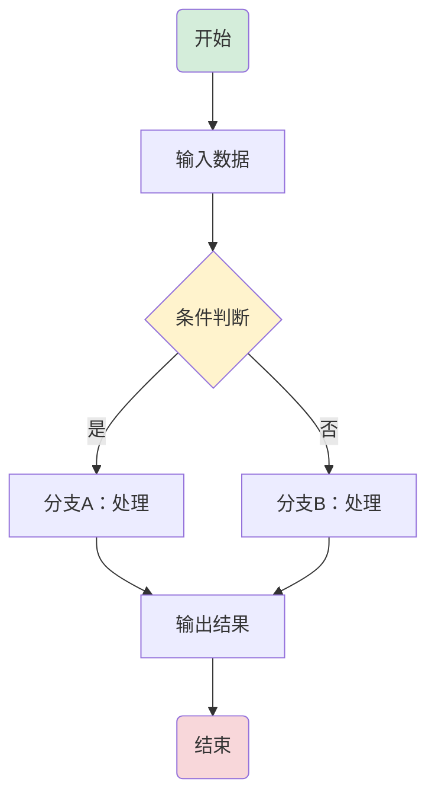

# 决策/判断流程图模板

```mermaid
flowchart TB
    START("开始") --> INPUT["输入数据"]
    INPUT --> CHECK{"条件判断"}
    CHECK -->|"是"| PROCESS_YES["分支A：处理"]
    CHECK -->|"否"| PROCESS_NO["分支B：处理"]
    PROCESS_YES --> OUTPUT["输出结果"]
    PROCESS_NO --> OUTPUT
    OUTPUT --> END("结束")
    style START fill:#d4edda
    style END fill:#f8d7da
    style CHECK fill:#fff3cd
```

## 编号要点

- 步骤编号使用中文冒号：`"1：第一步"` 而非 `"1. 第一步"`，避免触发Markdown列表解析
- 也可使用圈号数字：`"①第一步"`、`"②第二步"`
- 判断节点使用菱形 `{}`，文本双引号包裹
- Style 语句前禁止空行
