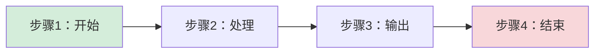
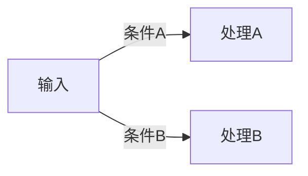

# 流程图模板（左→右布局）

```mermaid
flowchart LR
    A["步骤1：开始"] --> B["步骤2：处理"]
    B --> C["步骤3：输出"]
    C --> D["步骤4：结束"]
    style A fill:#d4edda
    style D fill:#f8d7da
```

## 节点类型

| 语法 | 形状 | 用途 |
|------|------|------|
| `id["文本"]` | 矩形 | 普通步骤 |
| `id("文本")` | 圆角矩形 | 开始/结束 |
| `id{"文本"}` | 菱形 | 判断/决策 |
| `id[("文本")]` | 圆形 | 连接点 |

## 边带标签

```mermaid
flowchart LR
    A["输入"] -->|"条件A"| B["处理A"]
    A -->|"条件B"| C["处理B"]
```
