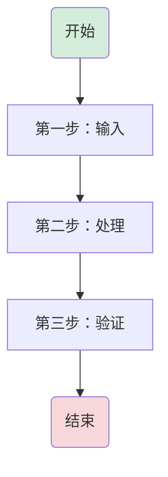
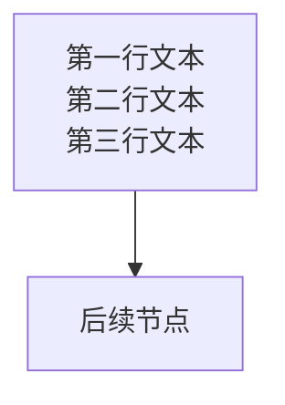

# 流程图模板（上→下布局）

```mermaid
flowchart TB
    START("开始") --> STEP1["第一步：输入"]
    STEP1 --> STEP2["第二步：处理"]
    STEP2 --> STEP3["第三步：验证"]
    STEP3 --> END("结束")
    style START fill:#d4edda
    style END fill:#f8d7da
```

## 多行文本节点

使用 ` ` 实现换行，避免列表触发模式：

```mermaid
flowchart TB
    A["第一行文本<br/>第二行文本<br/>第三行文本"] --> B["后续节点"]
```

## 编号格式

步骤编号使用中文冒号或圈号数字，避免「数字+英文句点+空格」：
- ✅ `"步骤1：输入"`、`"①输入"`
- ❌ `"1. 输入"`（触发Markdown列表解析）
