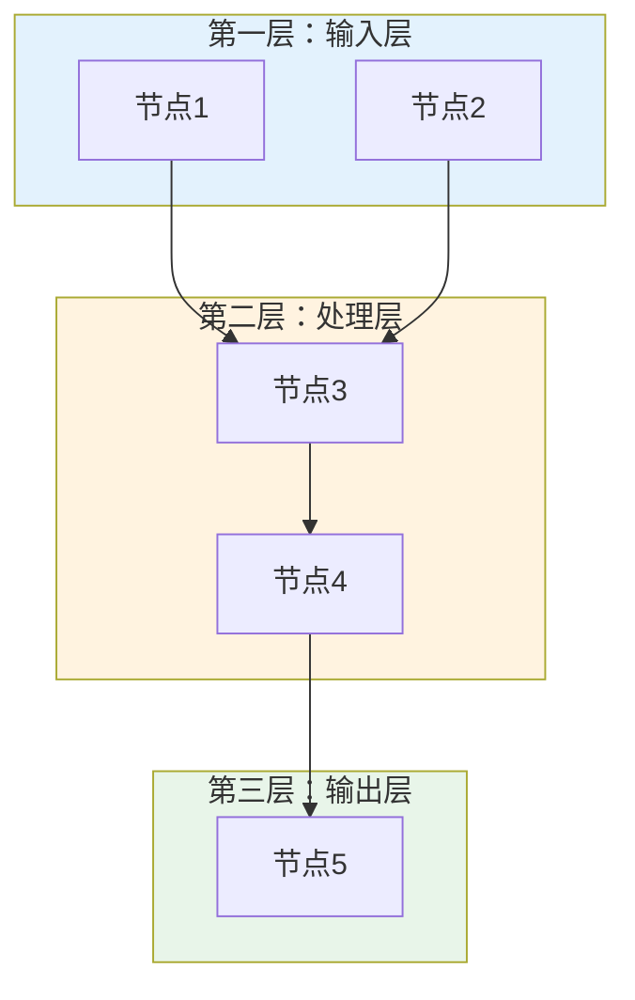

# 分层流程图模板（含 Subgraph）

```mermaid
flowchart TB
    subgraph LAYER1 ["第一层：输入层"]
        N1["节点1"]
        N2["节点2"]
    end
    subgraph LAYER2 ["第二层：处理层"]
        N3["节点3"]
        N4["节点4"]
    end
    subgraph LAYER3 ["第三层：输出层"]
        N5["节点5"]
    end
    N1 --> N3
    N2 --> N3
    N3 --> N4
    N4 --> N5
    style LAYER1 fill:#e3f2fd
    style LAYER2 fill:#fff3e0
    style LAYER3 fill:#e8f5e9
```

## Subgraph 安全格式要点

- ID 使用英文标识符（字母开头）
- 中文标题放在双引号内，方括号与引号之间无空格
- 禁止使用含全角冒号 `：` 的裸 ID
- Subgraph 块之间、style 语句前禁止空行
