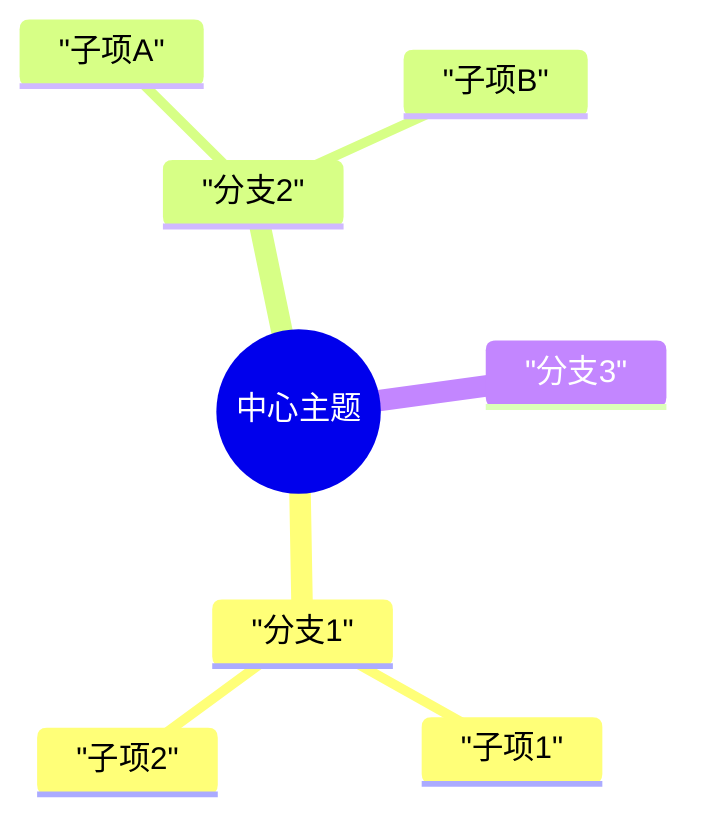
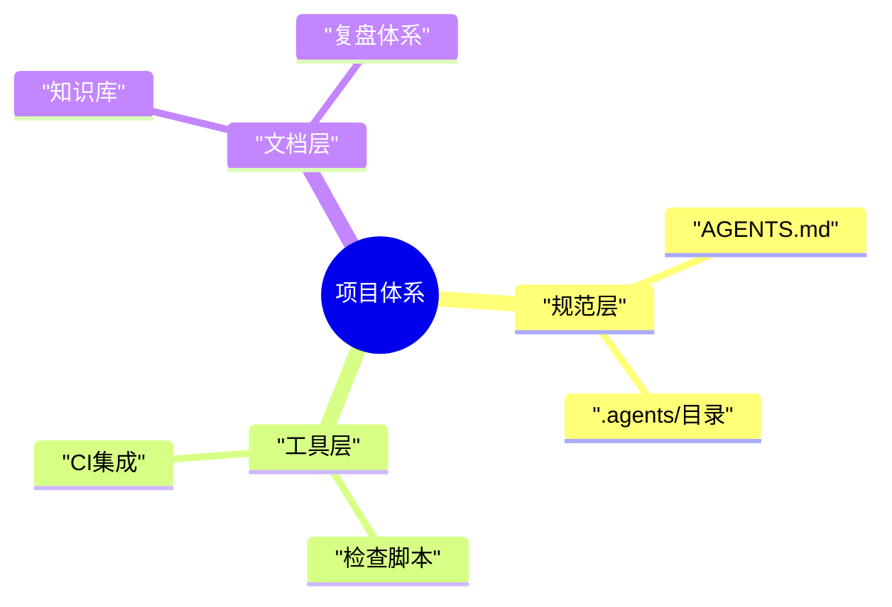

# 思维导图模板

## 思维导图语法要点

- 使用缩进表示层级关系（2空格缩进）
- 中心节点支持形状修饰：
  - `root(("文本"))` 圆形
  - `root(("文本"))` 双圆（默认中心节点）
  - `root("文本")` 圆角矩形
  - `root["文本"]` 矩形
- 中文节点直接书写即可，含特殊字符（`:()`+空格等）时建议加双引号
- **注意**：mindmap节点语法与flowchart不同，不使用 `id["文本"]` 格式，而是直接写文本
- 代码块内禁止空行

## 图标与格式示例

## 安全注意事项

- mindmap文本中避免使用「数字+英文句点+空格」格式（如 `1. 项目`），可能触发Markdown列表解析
- 建议使用中文冒号或圈号数字代替编号（`1：项目`、`①项目`）
