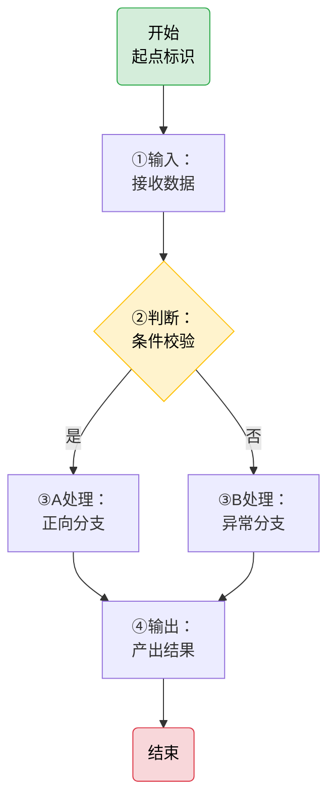
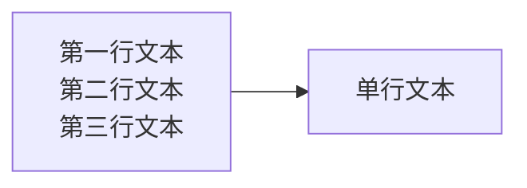
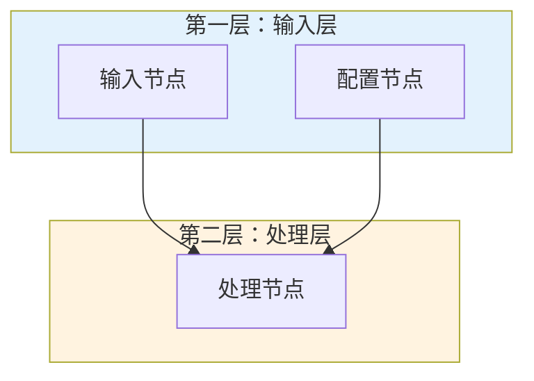

# Mermaid 安全起步模板

> **用途**：新建 Mermaid 图表时默认使用此模板。代码块内用 `%%` 注释内嵌了完整安全编码提醒，编辑时直接可见，删除注释和占位符即可完成。
>
> 使用前请先阅读下方的「六规则速查」和「陷阱速查」。



## 填写指南

### 节点 ID 命名规范

- 使用英文大写字母+数字：`START`、`STEP1`、`CHECK_A`
- 禁止在 ID 中使用中文、全角字符、空格、特殊符号
- 同一图表内 ID 唯一

### 节点形状选择

| 语法 | 形状 | 用途 |
|------|------|------|
| `id("文本")` | 圆角矩形 | 开始/结束节点 |
| `id["文本"]` | 矩形 | 普通步骤/处理节点 |
| `id{"文本"}` | 菱形 | 判断/决策节点 |
| `id(("文本"))` | 圆形 | 连接点/中心节点 |
| `id(["文本"])` | 体育场形 | 输入/输出 |
| `id[["文本"]]` | 子程序形 | 子流程/外部模块 |

### 多行文本正确写法

使用 `<br/>` 标签实现节点内换行，**禁止使用 `\n`**：



### 编号格式避坑

步骤编号避免触发 Markdown 列表解析：

| 禁止写法 | 正确写法 | 说明 |
|---------|---------|------|
| `["1. 启动协议"]` | `["1：启动协议"]` | 英文句点→中文冒号 |
| `["- 列表项"]` | `["-列表项"]` 或 `["·列表项"]` | 去掉空格或改用中点 |
| `["* 注意事项"]` | `["⚠ 注意事项"]` | 改用 emoji |

### Subgraph 分层写法



## 六规则速查（完整版）

### 规则 ① 禁止空行
代码块内禁止任何空行（含仅含空格的行）。`subgraph` 块之间、边定义与 `style` 语句之间的空行会导致解析器误判图表结束。

### 规则 ② 文本加引号
含中文、特殊字符（`@#:()-`+空格）、英文短语的节点/标签/subgraph标题，一律用**双引号**包裹：
- ✅ `id["中文节点"]` `id{"判断"}` `subgraph ID ["标题"]`
- ❌ `id[中文节点]` `id{判断}`
- 纯英文单词/标识符可省略：`A[Start]` ✅

### 规则 ②b 避免列表触发
引号不能穿透 Markdown 层，以下模式即使被引号包裹仍会触发列表解析，导致 "Unsupported markdown: list" 错误：
- 禁止 `"数字. 空格"` 开头（如 `"1. 步骤"`）→ 改为中文冒号 `"1：步骤"`
- 禁止 `"- 空格"` 开头（如 `"- 项目"`）→ 改为 `"-项目"` 或 `"·项目"`
- 禁止 `"* 空格"` 开头（如 `"* 注意"`）→ 改为 `"⚠ 注意"`

### 规则 ②c 换行用 `<br/>`
节点文本内换行**统一使用 HTML 的 `<br/>` 标签**，禁止使用 `\n`：
- `\n` 在 flowchart/stateDiagram 节点中不会被解释为换行（部分渲染器显示为字面 `\n`，部分压缩为单行）
- 虽然 `\n` 在 sequenceDiagram 的 Note 和消息文本中可以换行，但统一使用 `<br/>` 可避免记忆上下文差异
- ✅ `A["第一行<br/>第二行"]`
- ❌ `A["第一行\n第二行"]`

### 规则 ③ Subgraph 安全格式
- `subgraph EN_ID ["中文标题"]`：ID 为纯英文标识符（字母开头），中文标题放在方括号内双引号中
- ID 与方括号之间有一个空格
- 禁止使用含全角字符的裸 ID（如 `subgraph 感知层`）

### 规则 ④ 边标签格式
- `-->|"标签"|目标`：含中文/特殊字符的边标签用双引号包裹，标签与箭头之间无空格
- 判断分支标签也使用此格式：`-->|"是"| YES` `-->|"否"| NO`

### 规则 ⑤ 完成后检查
写完图后务必运行自动化检查：
```bash
python .agents/scripts/check-mermaid.py --fix
```
该脚本可自动检测并修复：空行删除、`\n`→`<br/>`、subgraph标题引号补全、边标签引号补全、participant名称引号补全。

## 陷阱速查

遇到渲染问题时按以下顺序排查：

1. **空行**：代码块内有无空行（最常见，运行 `--fix` 自动删除）
2. **引号**：中文/含特殊字符的节点/标签是否用双引号包裹
3. **列表触发**：文本中是否有 `"数字. 空格"` 或 `"- 空格"` 模式
4. **换行符**：节点内是否使用了 `\n` 而非 `<br/>`
5. **Subgraph ID**：ID 是否为纯英文标识符，标题是否用 `["文本"]` 格式
6. **括号闭合**：方括号/圆括号/大括号是否成对闭合

> 不同渲染器（GitHub/飞书/VS Code）对 Mermaid 容错度不同，请遵循最严格的语法规范。
> 完整规则与正反例见 [mermaid-safe-coding-rules.md](../../docs/retrospective/patterns/code-patterns/mermaid-safe-coding-rules.md)
