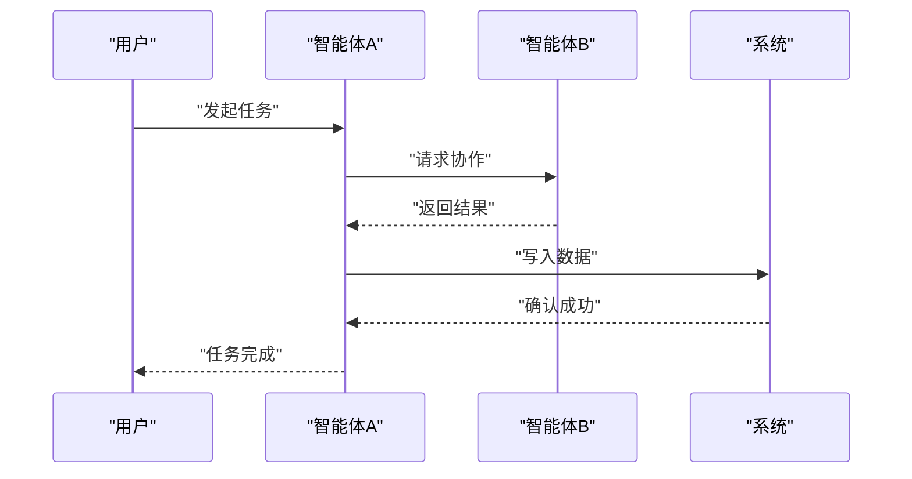

# 时序图模板

```mermaid
sequenceDiagram
    participant U as "用户"
    participant A as "智能体A"
    participant B as "智能体B"
    participant S as "系统"
    U->>A: "发起任务"
    A->>B: "请求协作"
    B-->>A: "返回结果"
    A->>S: "写入数据"
    S-->>A: "确认成功"
    A-->>U: "任务完成"
```

## 时序图语法要点

- `->>` 实线箭头（请求）
- `-->>` 虚线箭头（响应/返回）
- `participant` 定义参与者，`as` 后用引号包裹中文显示名
- 消息文本用引号包裹含中文的内容
- 代码块内禁止空行
