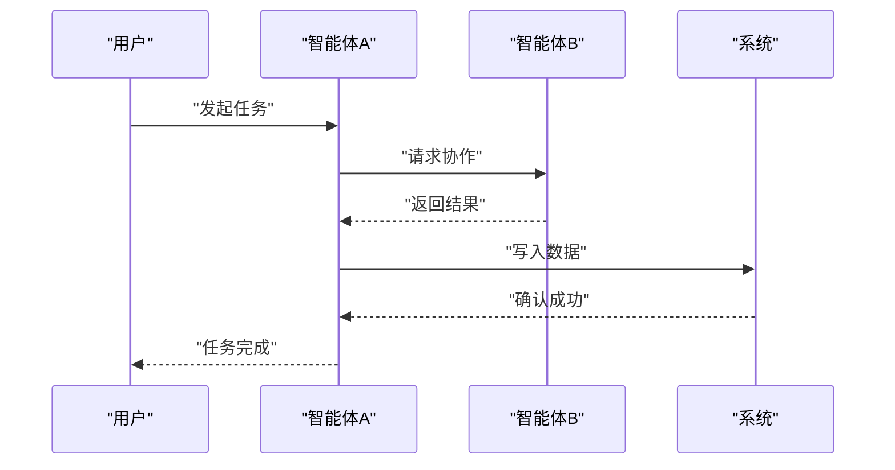
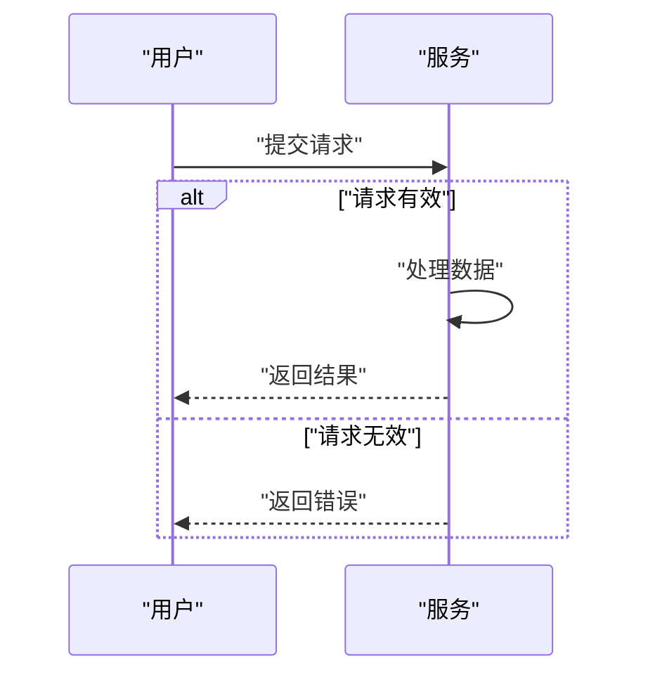

# 时序图模板

```mermaid
sequenceDiagram
    participant U as "用户"
    participant A as "智能体A"
    participant B as "智能体B"
    participant S as "系统"
    U->>A: "发起任务"
    A->>B: "请求协作"
    B-->>A: "返回结果"
    A->>S: "写入数据"
    S-->>A: "确认成功"
    A-->>U: "任务完成"
```

## 时序图语法要点

- `->>` 实线箭头（请求/调用）
- `-->>` 虚线箭头（响应/返回）
- `participant` 定义参与者，`as` 后用双引号包裹中文显示名
- 消息文本含中文/特殊字符时用双引号包裹
- 代码块内禁止空行
- alt/opt/loop 块之间禁止空行，块内文本同样加引号

## 条件/循环示例

```mermaid
sequenceDiagram
    participant U as "用户"
    participant S as "服务"
    U->>S: "提交请求"
    alt "请求有效"
        S->>S: "处理数据"
        S-->>U: "返回结果"
    else "请求无效"
        S-->>U: "返回错误"
    end
```
