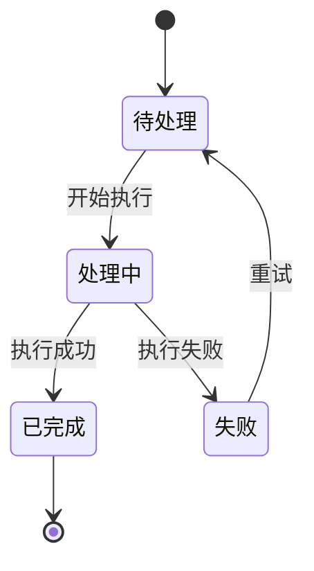
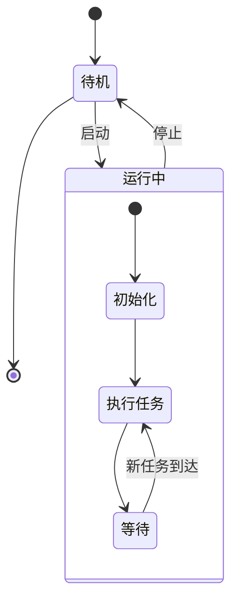

# 状态图模板

## 状态图语法要点

- 使用 `stateDiagram-v2`（v2版本兼容性更好）
- **状态名引号规则**：
  - 裸中文/英文标识符（无空格、无特殊字符）不需要引号：`待处理 --> 处理中`
  - 含空格或特殊字符（`/`、`:`、`{`、`}`等）的状态名需双引号包裹：`"等级 A/B"`
- **迁移标签**（`:` 后）：含空格/特殊字符时建议加双引号：`: "执行成功"`
- `state 状态ID : "中文描述"` 格式为状态添加描述，描述文本含空格时加引号
- `[*]` 表示起始/结束状态
- 复合状态：`state EN_ID { ... }` 或 `state "中文名称" as EN_ID { ... }`
- 代码块内禁止空行
- 避免列表触发：状态名/标签中不使用 `"1. 步骤"`、`"- 项目"` 等模式

## 含复合状态示例

