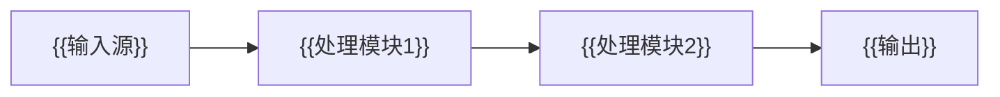

# 核心功能与工作原理

本章不讲功能列表，讲"黑盒里发生了什么"——这是Wiki区别于官网产品页的核心价值所在。

## 一、整体工作流程

（用Mermaid图展示完整的通信链路和工作流程）

## 二、{{核心技术1}}工作原理

（详细解释技术原理，包括关键步骤、数据流向、为什么这样设计）

### 关键技术点

- （技术点1）
- （技术点2）

## 三、{{核心技术2}}工作原理

## 四、关键技术取舍分析

| 技术选择 | 优势 | 劣势 | 为什么这样选 |
|---------|------|------|------------|
| （方案A） | （优势） | （劣势） | （设计决策理由） |
| （方案B） | （优势） | （劣势） | （设计决策理由） |

***

| 返回主索引 | [上一章](prev-chapter.md) | [下一章](next-chapter.md) |
|-----------|--------------------------|---------------------------|