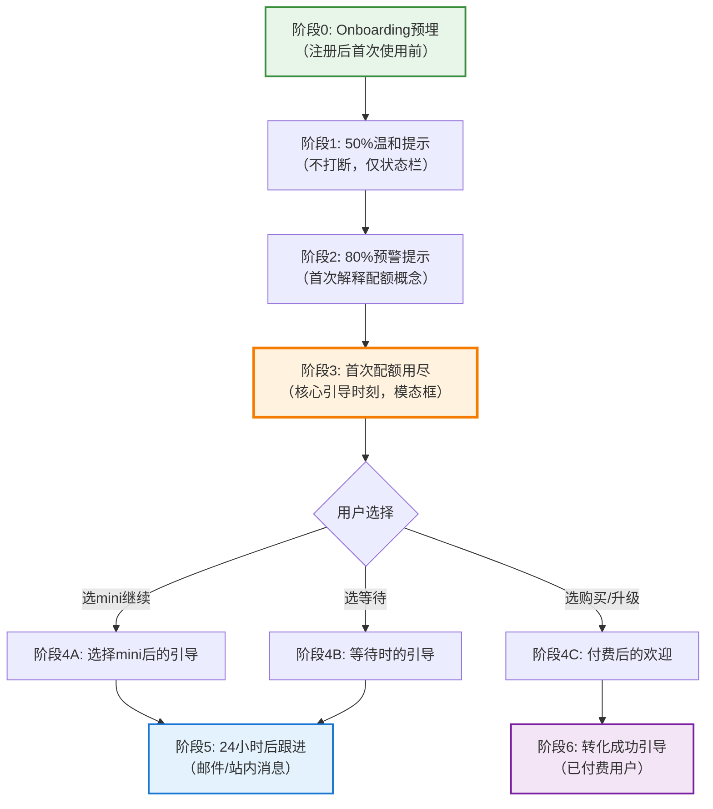

# 新用户首次配额告警引导流程设计

> 配套文档：[saas-pricing-quickref.md](saas-pricing-quickref.md) | [saas-pricing-checklist-template.md](saas-pricing-checklist-template.md)

---

## 一、核心理念：首次配额告警是"教育时刻"，不是"挫败时刻"

### 为什么新用户首次配额用尽需要特殊设计？

新用户第一次遇到配额限制时，和老用户的处境完全不同：

| 维度 | 老用户 | 新用户（首次遇到） |
|---|---|---|
| 对产品的认知 | 已经知道Codex能做什么、值不值 | 还在建立认知，可能还没完全体验到价值 |
| 对配额的理解 | 知道配额机制是什么、怎么恢复 | 完全不理解"配额"是什么，以为坏了 |
| 对mini模型的认知 | 知道mini是什么、什么时候能用 | 不知道mini和主模型有什么区别 |
| 付费意愿 | 已经认可价值，可能愿意付费 | 还没建立足够信任，谈付费会吓跑 |
| 情绪状态 | "哦配额用完了，正常" | "怎么回事？不能用了？是不是被骗了？" |
| 流失风险 | 低（知道怎么继续） | **极高**（可能以为产品坏了直接卸载） |

**核心设计原则**：
1. **首次配额告警是Teachable Moment（可教育时刻）**——用户正遇到问题，是教育他理解产品机制的最好时机
2. **先帮助继续工作，再解释机制**——不要先弹一个"配额说明"的教学，先让用户能继续干活
3. **零成本选项放第一位**——新用户第一次绝不要先推销付费，先让他免费继续
4. **用用户能听懂的语言**——不要说"配额""滑动窗口""API rate limit"，说"今天用得比较多""稍等一会儿就能继续"
5. **情绪第一，信息第二**——先安抚"没关系，很正常"，再给选项，最后解释机制

---

## 二、流程全景图

新用户首次配额引导分为 **6个阶段**，从Onboarding到首次用尽后跟进：



---

## 三、分阶段详细设计

### 阶段0：Onboarding预埋（注册后首次使用前）

**时机**：新用户完成注册，进入产品，发第一条消息之前
**目的**：提前打预防针，不要等用完了才告诉用户有配额这回事
**UI形式**：非强制的小提示条/Tooltip（不阻塞使用）

**文案（网页/桌面）**：
```
┌─────────────────────────────────────────────────────────┐
│  💡 小提示：Free 版每天有足够的配额可以完成小项目。      │
│     如果用得比较多，您可以随时切换到轻量模型继续，      │
│     或者升级到 Plus 获得更多使用量。                    │
│                                                        │
│     [知道了]                                            │
└─────────────────────────────────────────────────────────┘
```

**文案（IDE/CLI）**：
```
Welcome to Codex! Free tier includes generous quota for small projects.
Tip: If you hit a limit, you can switch to mini with /model mini or upgrade anytime.
```

**设计要点**：
- 不要用弹窗，用不阻塞的提示条
- 不要详细解释机制，只种下一颗种子"有配额、可以切mini、可以升级"
- 不要推销付费，只说"升级可以获得更多"
- 30秒自动消失，不阻塞用户开始干活

**禁忌**：
- ❌ 不要弹一个"配额机制说明"的教学弹窗
- ❌ 不要列出详细的配额数字吓用户
- ❌ 不要在欢迎页面就说"免费版配额有限，请升级"

---

### 阶段1：50%温和提示（首次使用过程中）

**时机**：新用户第一次用到配额的50%时
**触发条件**：注册7天内 + 首次配额消耗到50% + 之前没有触发过此提示
**目的**：温和提醒，不打断工作，让用户有心理准备
**UI形式**：状态栏/底部的一个极小的Toast，3秒自动消失

**文案**：
```
💡 今天用了一半啦，继续加油！需要的话可以随时切到轻量版。
```

**设计要点**：
- 极度温和，不说"配额"这个词
- 不给具体数字，不说"还剩多少条"
- 不打断对话，不弹模态框
- 3秒自动消失，不要求用户操作
- 只出现一次（新用户第一次50%时），老用户不显示

**禁忌**：
- ❌ 不要用"警告""注意"这类警示性图标
- ❌ 不要弹模态框打断用户正在进行的对话
- ❌ 不要出现"购买""升级""付费"这类词

---

### 阶段2：80%预警提示（首次解释配额概念）

**时机**：新用户第一次用到配额的80%时
**触发条件**：注册7天内 + 首次配额消耗到80% + 之前没有触发过此提示
**目的**：第一次正式告诉用户"配额"的存在，但用友好的语言解释
**UI形式**：对话流内插入的一条系统消息（不是弹窗，融入对话流）

**文案**：
```
┌─────────────────────────────────────────────────────────┐
│                                                         │
│  😊 顺便说一下——您今天用 Codex 用得比较多！             │
│                                                         │
│  Free 版每天有足够的使用量来尝试各种功能，               │
│  如果今天用得差不多了，您有两个简单的选择：              │
│                                                         │
│  🟢 切换到轻量模型（mini）——速度更快，简单任务完全够用， │
│     现在就能继续用，不会打断您的工作                     │
│                                                         │
│  ⏸ 稍作休息——过几个小时使用量会自动恢复，               │
│     您之前做的东西都不会丢                               │
│                                                         │
│  [切换到轻量模型继续]  ·  [继续使用当前模型]            │
│                                                         │
└─────────────────────────────────────────────────────────┘
```

**设计要点**：
- 融入对话流，不是独立弹窗——像朋友在旁边提醒你一样
- 第一次用"使用量"而不是"配额"（"配额"太技术化）
- 解释"会自动恢复""之前做的都不丢"——消除两个最大的焦虑
- 只给两个免费选项，不提付费/购买/升级——新用户还没准备好
- 用户点"继续使用当前模型"就继续，不要反复骚扰

**禁忌**：
- ❌ 不要弹模态框打断对话
- ❌ 不要出现"付费""购买""升级""$20""Pro"这类词
- ❌ 不要说"您即将到达限制"这种焦虑的语言
- ❌ 不要显示倒计时或者精确的剩余条数（会让用户焦虑）

---

### 阶段3：首次配额用尽（核心引导时刻）

**时机**：新用户第一次真正用完配额，发出新消息无法得到主模型响应时
**触发条件**：注册7天内 + 首次触发配额限制 + 之前没有成功触发过付费转化
**目的**：这是最关键的时刻——友好地解释情况、给零成本出口、教育机制、为后续转化铺垫
**UI形式**：全屏模态框（必须打断，因为确实没法继续用主模型了），但设计要温暖、友好、有帮助

**文案（中文，网页/桌面端）**：

```
┌─────────────────────────────────────────────────────────────┐
│                                                             │
│  🌱 今天用了不少呀！                                         │
│                                                             │
│  看起来您今天和 Codex 聊得很投入，Free 版的使用量暂时用满了。│
│  别担心，这很正常——有几个简单的办法可以马上继续：           │
│                                                             │
│  ┌───────────────────────────────────────────────────────┐  │
│  │                                                       │  │
│  │  🟢  推荐：切换到轻量模型，立即继续（免费）           │  │
│  │                                                       │  │
│  │  轻量模型响应更快，写代码、改文字、简单问题完全够用。  │  │
│  │  不会丢失我们刚才的对话内容——Codex 记得之前在说什么。  │  │
│  │                                                       │  │
│  │  [立即切换，继续工作]   ← 绿色主按钮                  │  │
│  │                                                       │  │
│  └───────────────────────────────────────────────────────┘  │
│                                                             │
│  ┌───────────────────────────────────────────────────────┐  │
│  │                                                       │  │
│  │  ☕  休息一下，使用量过一会儿自动恢复                  │  │
│  │                                                       │  │
│  │  采用 5 小时滑动机制——也就是说，您几个小时前用的量会   │  │
│  │  慢慢"还回来"。                                       │  │
│  │  大约 3 小时 20 分钟后（今天下午 5:42）就能继续用了。  │  │
│  │  您也可以先去做别的事，Codex 会在这里等您回来。        │  │
│  │                                                       │  │
│  │  [好的，我稍后再来]                                   │  │
│  │                                                       │  │
│  └───────────────────────────────────────────────────────┘  │
│                                                             │
│  ┌───────────────────────────────────────────────────────┐  │
│  │                                                       │  │
│  │  💡 想无限制使用？了解一下 Plus                        │  │
│  │                                                       │  │
│  │  如果您每天都要用 Codex，Plus 计划（$20/月）提供      │  │
│  │  充足的使用量、所有功能、全平台支持（IDE/CLI/桌面）。  │  │
│  │  可以免费试用 7 天，不需要现在做决定。                 │  │
│  │                                                       │  │
│  │  [了解 Plus]  ← 文字链接，不是主按钮                  │  │
│  │                                                       │  │
│  └───────────────────────────────────────────────────────┘  │
│                                                             │
│  ───────────────────────────────────────────────────────    │
│                                                             │
│  📖 想了解更多？                                            │
│  [使用量是怎么计算的？]  [不同模型有什么区别？]             │
│                                                             │
└─────────────────────────────────────────────────────────────┘
```

**和老用户提示框的关键区别**：

| 设计元素 | 老用户 | 新用户首次 |
|---|---|---|
| **标题** | "GPT-5.4 配额暂时用满了" | "🌱 今天用了不少呀！"（口语化，友好） |
| **第一个按钮** | "切换到mini继续" | "立即切换，继续工作"（绿色大按钮，突出"免费"） |
| **付费选项位置** | 和其他选项并列卡片 | 放在最下面，弱化处理，文字链接不是按钮 |
| **付费选项文案** | "升级到Pro $200/月" | "了解Plus"（不直接推$200，推$20入门档，且说"不需要现在做决定"） |
| **机制解释** | 简单一句"5小时滑动窗口" | 解释"滑动机制"是什么——"几个小时前用的量会慢慢还回来"（用大白话） |
| **帮助链接** | 无 | 底部加两个帮助链接：使用量怎么算？模型有什么区别？ |
| **信心建立** | 无 | 强调"不丢对话""Codex记得之前在说什么""会在这里等你回来" |
| **购买额度选项** | 有（$5买100条） | **没有**——新用户第一次不要直接谈钱，先用产品建立信任 |

**设计要点详解**：

1. **标题温暖化**：不说"配额用完"，说"今天用了不少呀！"——这是夸奖，不是指责。加个🌱小图标暗示"刚开始用，慢慢来"
2. **先解释情绪再解释事情**："聊得很投入"——把"用得多"框定为好事（说明用户喜欢产品），不是坏事
3. **零成本选项是唯一主按钮**：绿色大按钮"立即切换，继续工作"，视觉上最突出，点击就可以继续免费使用
4. **付费选项弱化处理**：放在第三个位置，用文字链接不是按钮，文案说"了解一下"不是"立即购买"，还加了"不需要现在做决定"降低压力
5. **解释机制用大白话**：不用"滑动窗口"这个技术术语，用"您几个小时前用的量会慢慢还回来"这种比喻
6. **明确恢复时间**：具体到分钟（"3小时20分钟后，今天下午5:42"），不给模糊的"稍后"
7. **消除焦虑点**：
   - "不会丢失对话内容"
   - "Codex记得之前在说什么"
   - "会在这里等您回来"
   - "这很正常"
8. **提供学习入口**：底部两个帮助链接（用文字链接，不强制），让好奇的用户可以了解更多，但不阻塞想快速继续的用户
9. **没有"购买额度"选项**：新用户第一次不要让他掏钱——$5虽然不多，但"第一次遇到问题就让我花钱"的感觉很差

---

### 阶段4：用户选择后的引导

用户在阶段3做出选择后，需要根据选择给出不同的后续引导。

#### 4A. 用户选择"切换到轻量模型继续"

**这是最推荐的路径**——用户没有付费，但继续使用产品了，留存了下来。

**切换成功后的提示（融入对话流的小Toast，3秒消失）**：
```
✅ 已切换到轻量模型，继续工作吧~
    提示：轻量模型适合日常编码和简单任务，复杂推理时您可以随时切回。
    [切回 GPT-5.4]  ← 小字链接
```

**设计要点**：
- 不弹模态框，对话流继续，极小的提示
- 告诉用户"随时可以切回"——消除"被降级"的感觉
- 不要教育mini的缺点，只说"适合日常任务"

**使用mini过程中（10-15分钟后，如果用户持续在用）**：
可以在对话中自然插入一条提示（不是弹窗）：
```
💡 轻量模型用着还顺手吗？升级到 Plus 可以无限制使用完整的 GPT-5.4，
    还有连接器、桌面应用等更多功能。[了解 Plus]
```
（注意：只提一次，不要反复推）

---

#### 4B. 用户选择"稍后再来"

**这部分用户选择离开，流失风险最高**，必须做好两件事：自动通知 + 离开时的温暖告别。

**点击"好的，我稍后再来"后的页面**：
```
┌─────────────────────────────────────────────────────────┐
│                                                         │
│  👋 好的，您先忙！                                      │
│                                                         │
│  我们会在使用量恢复时通知您，大约在下午 5:42。          │
│                                                         │
│  ☑️ 使用量恢复后给我发通知 （默认勾选）                 │
│                                                         │
│  离开前，您可以：                                       │
│  · 浏览一下 Codex 能做的事 [查看功能示例]               │
│  · 看看 Plus 计划有什么不同 [了解 Plus]                 │
│                                                         │
│  [关闭 Codex]                                           │
│                                                         │
└─────────────────────────────────────────────────────────┘
```

**推送通知（配额恢复时，约3-5小时后）**：
```
Codex: 您的使用量恢复啦 👋
之前的对话都还在，继续来做您的项目吧！
[打开 Codex 继续]
```

**设计要点**：
- 默认勾选"恢复时通知我"——不要让用户错过回来的时机
- 不要把"了解Plus"作为主按钮，放在次要位置
- 推送通知文案要温暖，说"继续来做您的项目"，让用户感觉项目还在等着他
- 推送点击直接打开之前的对话，不是首页——降低回来的摩擦

---

#### 4C. 用户选择"了解Plus"（或点击付费）

如果新用户第一次遇到配额就选择了解/付费，说明产品价值已经打动他了——这时候要做的是**降低付费决策门槛**，而不是加推销。

**进入Plus介绍页（首次用户版）**：

不要直接把用户扔到定价页，而是展示一个专门为首次配额告警设计的落地页：

```
┌─────────────────────────────────────────────────────────┐
│                                                         │
│  🎉 您今天用得真投入！                                   │
│                                                         │
│  看起来 Codex 对您挺有帮助——如果每天都要用，             │
│  Plus 计划让您无拘无束地使用：                          │
│                                                         │
│  ✅ 充足的 GPT-5.4 使用量，不用再担心用满              │
│  ✅ 连接器：连接 Gmail、GitHub、Slack、Notion 等工具   │
│  ✅ 全平台支持：网页 + VS Code + CLI + 桌面应用         │
│  ✅ 更快的响应速度                                      │
│                                                         │
│  ───────────────────────────────────────────────────    │
│                                                         │
│  Plus：$20/月                                           │
│                                                         │
│  🎁 专属福利：免费试用 7 天，随时可以取消               │
│                                                         │
│  [开始免费试用]  ← 绿色主按钮（不是"立即订阅"）        │
│                                                         │
│  不需要信用卡？先用免费版，等想升级了随时来。            │
│  [继续使用免费版]  ← 灰色文字链接                       │
│                                                         │
└─────────────────────────────────────────────────────────┘
```

**设计要点**：
- 标题肯定用户的使用（"用得真投入"），不是"想让你付费"
- 先列价值（4个✅），再出价格
- 强调"免费试用7天"降低决策门槛
- 按钮文案是"开始免费试用"不是"立即订阅"
- 给用户退路（"继续使用免费版"），不要让用户觉得被逼到墙角
- 不推Pro $200——首次转化只推$20入门档

---

### 阶段5：24小时后跟进（邮件/站内消息）

如果用户在阶段3选择了等待或mini，没有付费，24小时后通过邮件或站内消息温柔跟进。

**触发条件**：首次配额用尽24小时后 + 用户未付费 + 用户过去24小时有至少1次回访
**目的**：在用户已经体验过产品价值之后，再次温柔提醒，转化为付费用户

**站内消息（温和的Inbox消息）**：
```
标题：昨天的项目做得怎么样？😊

内容：
嗨！昨天您和 Codex 一起做了不少事——希望有帮到您。

如果您发现自己每天都在用 Codex，Plus 计划能让您用得更爽：
- 不用再等使用量恢复
- 可以连接您的 GitHub/Slack/Notion 等工具
- IDE 里直接用，不用切来切去

7天免费试用，不满意随时取消。
[了解 Plus]

暂时不需要？没关系，免费版可以一直用。
继续加油做项目！💪
```

**邮件版**：
- 主题行不要用"升级""特价"这类推销词，用："您昨天用 Codex 做了什么？"或"昨天的项目还顺利吗？"
- 正文简短，3段以内
- 一个CTA按钮"了解Plus"
- 底部明显的退订选项
- **绝对不要**发"您的配额即将过期""最后X小时优惠"这类虚假紧迫感的邮件

---

### 阶段6：付费成功后的引导（转化成功）

如果用户成功升级（无论什么时候），要做好Onboarding让他不后悔付费。

**付费成功页面**：
```
┌─────────────────────────────────────────────────────────┐
│                                                         │
│  🎉 欢迎加入 Plus！                                     │
│                                                         │
│  您现在可以：                                           │
│                                                         │
│  · 无限制使用 GPT-5.4 和更多模型                        │
│  · 连接您的工具（GitHub/Slack/Notion/...）              │
│     [连接第一个工具]                                    │
│  · 在 VS Code 里使用 Codex                              │
│     [安装 IDE 扩展]                                     │
│  · 邀请朋友体验 Codex                                   │
│                                                         │
│  [开始使用 Codex]  ← 主按钮                             │
│                                                         │
└─────────────────────────────────────────────────────────┘
```

**设计要点**：
- 庆祝语气，感谢用户信任
- 立刻给3-4个下一步行动（连接工具、装IDE扩展）——让用户感觉"我付了钱立刻就能用更多功能"
- 主按钮让用户回到工作流，不是在欢迎页面停留
- 第一周内发送1-2封"使用技巧"邮件，帮助用户发现付费价值（连接器怎么用、IDE扩展怎么装）

---

## 四、文案原则（新用户专属）

基于[saas-pricing-quickref.md](saas-pricing-quickref.md)中的文案原则，新用户首次配额告警的文案需额外遵守：

### 用词替换表

| ❌ 不要说（技术/焦虑词汇） | ✅ 应该说（大白话/友好词汇） |
|---|---|
| 配额 | 使用量 / 今天用的量 |
| 配额已用尽 / 达到限制 | 今天用得比较多 / 暂时用满了 |
| 滑动窗口机制 | 过几个小时会自动恢复 / 用掉的量慢慢"还回来" |
| 升级到Plus/Pro | 了解一下Plus / 想无限制使用？ |
| 购买 / 付费 / 订阅 | 了解更多 / 试试看（提供免费试用） |
| Rate limit / API限制 | （直接不要提这些技术术语） |
| GPT-5.4-mini | 轻量模型 / 更快的版本 |
| 您必须 / 您需要 | 您可以 / 建议您 / 推荐 |
| 错误 / 失败 / 拒绝 | 暂时 / 等一下 / 稍后 |

### 情绪曲线设计

好的首次配额引导，用户的情绪应该是这样的：

```
正常使用中 → "哎？怎么不能用了？"（小困惑）
    → 看到弹窗标题："今天用了不少呀！"（被夸奖，小开心）
    → "别担心，这很正常"（安心）
    → "有几个办法可以马上继续"（有希望）
    → 看到绿色大按钮"立即切换继续工作"（有出口，不焦虑）
    → 切换成功继续干活（问题解决，好感度反而上升）
```

**绝对不能出现的情绪曲线**：
```
正常使用中 → 突然卡住 → 弹"您的配额已用完，请升级"
    → "什么配额？我还没干什么呢就要钱？"（愤怒/困惑）
    → 找不到免费继续的选项（焦虑）
    → 关闭页面，再也不回来（流失）
```

---

## 五、8个首次配额引导反模式

| 反模式 | 具体表现 | 后果 | 正确做法 |
|---|---|---|---|
| **第一次就强推付费** | 配额用完弹框只放"立即升级$20/月"，没有免费继续选项 | 用户觉得被割韭菜，还没体验价值就被要钱，直接流失 | 零成本选项（切mini）是唯一主按钮，付费放最下面弱化 |
| **用技术术语解释** | "您已达到API rate limit，滑动窗口将在5小时后重置" | 新用户听不懂，以为产品坏了 | 用大白话："今天用得比较多，过几个小时就恢复了" |
| **不告诉多久恢复** | 只说"稍后恢复""请耐心等待" | 用户焦虑，不知道等多久，直接走了 | 精确到分钟："大约3小时20分钟后（下午5:42）恢复" |
| **弹教学弹窗先讲机制** | 配额一用完先弹一个3页的"配额机制说明"教程 | 用户正想继续干活被强迫看教程，极度烦躁 | 先给出口让用户继续，教育放在之后 |
| **没有"等恢复后通知我"选项** | 用户选"稍后回来"就完了，没有通知机制 | 用户忘了回来，永久流失 | 默认勾选"恢复时通知我"，推送+邮件提醒 |
| **推$200 Pro给新用户** | 付费选项直接放Pro $200/月 | 新用户被价格吓跑，觉得这产品用不起 | 首次转化只推$20 Plus入门档，Pro是老用户的选项 |
| **丢失对话上下文** | 用户切mini/回来后之前的对话不见了 | 用户极度愤怒——做了一半的东西丢了 | 明确承诺"对话内容不会丢"，并且技术上确保不丢 |
| **反复弹窗骚扰** | 用户点了"继续用mini"还不停弹"升级Plus"提示 | 用户觉得产品太啰嗦，卸载 | 首次引导只弹一次，之后不在mini使用过程中频繁推销 |

---

## 六、自检清单（首次配额引导上线前）

- [ ] 新用户第一次用完配额时，弹窗标题是否温暖友好（不是"配额用完"这类冷冰冰的词）？
- [ ] 零成本免费选项（切mini）是不是视觉上最突出的主按钮？
- [ ] 付费选项是否放在最后/最弱的位置，不是主按钮？
- [ ] 是否用大白话解释恢复机制，没有"滑动窗口""rate limit"这类技术术语？
- [ ] 是否精确告诉用户多久后恢复（具体到分钟）？
- [ ] 是否明确承诺"不会丢失对话内容"？
- [ ] 用户选"稍后回来"时，是否默认勾选"恢复时通知我"？
- [ ] 是否避免了第一次就推$200 Pro，只推$20 Plus？
- [ ] 是否提供了免费试用（7天）降低付费决策门槛？
- [ ] 用户切mini后，是否没有反复弹窗推销升级？
- [ ] 24小时后是否有温和的跟进邮件/站内消息，而不是硬推销？
- [ ] 付费成功后，是否立刻给用户3-4个可操作的下一步（连接工具/装IDE等）？
- [ ] 推送通知/文案是否避免了虚假紧迫感（"最后X小时""即将过期"）？
- [ ] 整个流程中，用户是否随时有免费退路（"继续用免费版"按钮始终可见）？

---

**核心记忆**：
- 首次配额告警不是"向用户要钱的时机"，而是"帮助用户成功的时机"
- 用户能继续免费干活→他用得越多越觉得有价值→他自然会付费
- 第一次遇到问题就逼用户付费的产品，用户会跑；帮用户解决问题的产品，用户会留下来
- 新用户要的是"能继续干活"，不是"了解定价方案"——先干活，再谈钱
