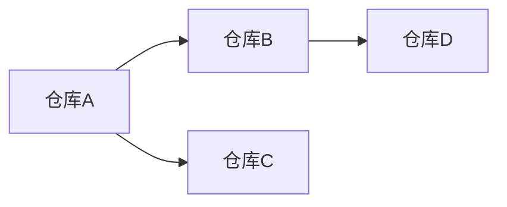

# Pre-flight预探索模板

> **适用场景**：中大规模分析任务（≥5个子代理/分析对象），在任务分解后、子代理执行前执行预探索阶段。

## 预探索阶段目标

由主控代理一次性完成所有分析对象的结构概览，将预探索结果作为共享上下文注入所有子代理prompt，减少子代理重复探索成本（预计节省15-20%时间）。

## 预探索输出结构

### 1. 文档站点概览

| 文档站点 | 主页URL | 子页面列表 | 核心入口页面 | 导航结构 |
|---------|--------|-----------|-------------|---------|
| {站点名} | {URL} | {页面1, 页面2, ...} | {核心页面} | {导航层次} |

### 2. 代码仓库顶层目录结构

| 仓库名 | 根目录文件数 | 核心子目录 | 入口文件 | 依赖文件 |
|-------|------------|-----------|---------|---------|
| {仓库名} | {数量} | {dir1, dir2, ...} | {入口文件} | {requirements.txt/pyproject.toml} |

### 3. 核心入口文件路径

| 仓库名 | 类型 | 文件路径 | 说明 |
|-------|------|---------|------|
| {仓库名} | CLI入口 | {路径} | {描述} |
| {仓库名} | API入口 | {路径} | {描述} |
| {仓库名} | 配置入口 | {路径} | {描述} |

### 4. 跨仓库依赖关系

### 5. 关键术语预识别

| 术语/概念 | 首次出现位置 | 初步定义 | 跨模块关联 |
|----------|-------------|---------|-----------|
| {术语} | {文件/页面} | {定义} | {关联模块} |

### 6. 分析维度提示（新增）

为每个分析对象推荐对应的分析维度模板，减少子代理的思考负担：

| 分析对象 | 类型 | 推荐模板 | 核心分析维度 |
|---------|------|---------|-------------|
| {对象名} | CLI/Tool | [cli-tool-dimension.md](analysis-dimension-templates/cli-tool-dimension.md) | 命令体系、配置管理、认证机制、输出约定 |
| {对象名} | CI/Integration | [ci-integration-dimension.md](analysis-dimension-templates/ci-integration-dimension.md) | 认证流程、构建验证、元数据提取、平台集成 |
| {对象名} | Infrastructure/Config | [infrastructure-config-dimension.md](analysis-dimension-templates/infrastructure-config-dimension.md) | 配置结构、风控策略、并发限制、安全更新 |
| {对象名} | Example/Demo | [example-demo-dimension.md](analysis-dimension-templates/example-demo-dimension.md) | 项目结构、集成方式、演示功能、测试模式 |
| {对象名} | Skills/Plugin | [skills-plugin-dimension.md](analysis-dimension-templates/skills-plugin-dimension.md) | Skill定义、触发词设计、协作模式、最佳实践 |

## 预探索执行步骤

1. **文档站点探索**：使用defuddle提取站点sitemap，识别核心页面和导航结构
2. **代码仓库探索**：递归列出每个仓库的顶层目录（深度2-3层），识别入口文件和配置文件
3. **依赖关系识别**：分析requirements.txt/pyproject.toml，识别跨仓库依赖
4. **关键术语提取**：从README和核心文档中提取高频专业术语
5. **结构化输出**：按上述结构生成preflight-exploration.md，注入所有子代理prompt

## 预探索结果使用方式

- 作为子代理prompt的「共享上下文」部分注入
- 子代理可基于预探索结果直接定位核心文件，无需自行遍历
- 主控代理在整合阶段可基于预探索的跨仓库依赖关系进行关联分析

## 预探索触发条件

| 任务规模 | 是否触发预探索 |
|---------|--------------|
| 小型（<5个分析对象） | 可选，建议简化跳过 |
| 中型（5-10个分析对象） | 推荐 |
| 大型（>10个分析对象） | 必须 |
