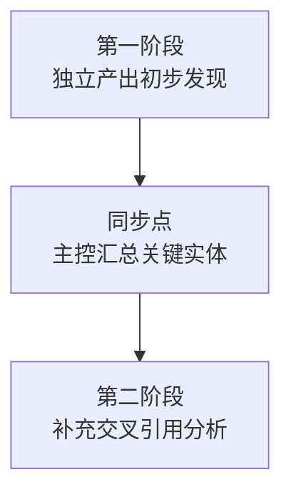
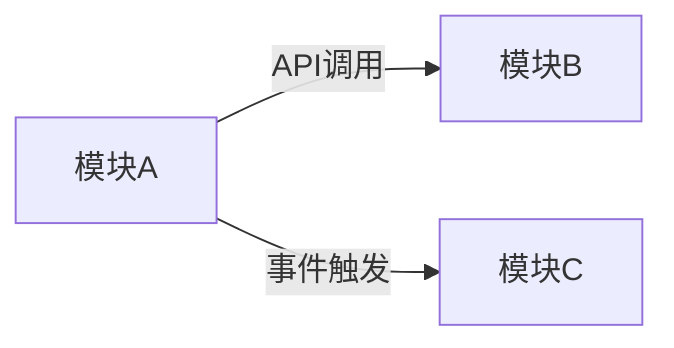

# 两阶段并行上下文传递机制模板

> **适用场景**：≥6个子代理的中大规模任务，减少整合阶段术语对齐工作量（预计减少20%），提升跨模块关联发现质量。

## 核心机制



## 第一阶段：独立产出初步发现

### 关键实体标记格式

子代理在产出draft时，必须使用统一标记格式标记关键实体：

```markdown
## 关键实体标记

### API接口
- `[API]` `POST /api/v1/test/run` - 执行测试任务接口
- `[API]` `GET /api/v1/test/report/{id}` - 获取测试报告接口

### 配置项
- `[CONFIG]` `MINITEST_API_KEY` - API密钥配置
- `[CONFIG]` `MINITEST_ENDPOINT` - 服务端点配置

### 事件类型
- `[EVENT]` `test.completed` - 测试完成事件
- `[EVENT]` `test.failed` - 测试失败事件

### 模块名
- `[MODULE]` `minitest.cli.commands` - CLI命令模块
- `[MODULE]` `minitest.agent.skills` - Agent Skills模块
```

### 标记类型定义

| 标记类型 | 格式 | 说明 | 示例 |
|---------|------|------|------|
| API接口 | `[API]` | REST/gRPC/WebSocket接口 | `[API] GET /users` |
| 配置项 | `[CONFIG]` | 环境变量或配置文件项 | `[CONFIG] DEBUG=true` |
| 事件类型 | `[EVENT]` | 事件驱动架构中的事件名 | `[EVENT] order.created` |
| 模块名 | `[MODULE]` | 代码模块/包名 | `[MODULE] utils.helpers` |
| 数据模型 | `[MODEL]` | 数据结构/类定义 | `[MODEL] UserProfile` |
| 工具命令 | `[TOOL]` | CLI工具/命令 | `[TOOL] docker build` |

### 第一阶段输出要求

- 每个子代理产出独立的draft报告
- 关键实体必须使用上述标记格式
- 报告末尾附「关键实体汇总表」

## 同步点：主控汇总

### 同步点执行步骤

1. **收集关键实体**：从所有draft中提取标记的关键实体
2. **术语对齐**：识别相同实体的不同命名，统一术语
3. **交叉引用分析**：识别跨模块关联关系
4. **生成共享上下文**：按以下格式生成同步报告

### 同步报告格式

```markdown
# 同步点报告

## 1. 关键术语统一

| 原始术语 | 统一术语 | 出现次数 | 涉及子代理 |
|---------|---------|---------|-----------|
| {术语1} | {统一术语} | {次数} | {任务1, 任务2} |

## 2. 跨模块关联



## 3. 共享上下文注入

以下内容将注入所有子代理第二阶段prompt：

### 已知API列表
- `[API]` `POST /api/v1/test/run` - 执行测试任务（task1/task3引用）

### 已知配置项列表
- `[CONFIG]` `MINITEST_API_KEY` - API密钥（task2引用）
```

## 第二阶段：补充交叉引用分析

### 第二阶段输入

- 第一阶段draft报告
- 同步点报告（共享上下文）

### 第二阶段输出要求

- 在原有draft基础上补充跨模块关联分析
- 识别与其他模块的协作关系
- 更新关键实体汇总表，标注跨模块引用

## 简化模式（中小规模任务）

对于<6个子代理的任务，采用简化模式：

1. 子代理独立产出，按标记格式标注关键实体
2. 主控在整合阶段统一处理关系层
3. 无需显式同步点，但要求子代理标记关键实体

## 触发条件

| 任务规模 | 是否启用两阶段 |
|---------|--------------|
| 小型（<6个子代理） | 简化模式，子代理标记关键实体 |
| 中型（6-10个子代理） | 推荐启用 |
| 大型（>10个子代理） | 必须启用 |
