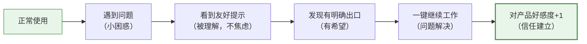
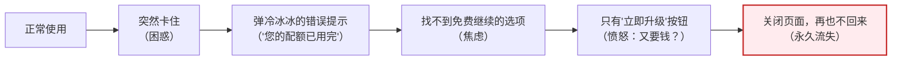

# Freemium产品UI设计避坑指南

> 聚焦场景：配额提示、付费转化、新用户引导、错误/状态提示
> 配套文档：
> - [new-user-first-quota-onboarding.md](file:///d:/spaces/SpecWeave/.agents/templates/new-user-first-quota-onboarding.md)
> - [saas-pricing-quickref.md](file:///d:/spaces/SpecWeave/.agents/templates/saas-pricing-quickref.md)
> - [saas-pricing-checklist-template.md](file:///d:/spaces/SpecWeave/.agents/templates/saas-pricing-checklist-template.md)

---

## 一、用词避坑：❌绝对不要说 vs ✅应该怎么说

### 1.1 配额/限制相关

| ❌ 禁止使用（焦虑/技术/指责） | ✅ 推荐使用（友好/大白话/安抚） | 使用场景 |
|---|---|---|
| 您的配额已用完 | 今天用得比较多 / 使用量暂时用满了 | 配额用尽提示标题 |
| 您已达到限制 | 今天用了不少呀！ | 配额用尽提示 |
| 您已超出配额限制 | 今天和 Codex 聊得很投入 | 新用户首次配额耗尽 |
| API rate limit exceeded | （直接不要出现技术术语） | 所有用户可见界面 |
| 访问被拒绝 | 稍等一下，马上就能继续 | 任何拒绝访问的场景 |
| 您今日配额已用完，请明天再来 | 使用量约 X 小时后自动恢复 | 配额用尽等待提示 |
| Rate limit | （禁止出现） | 所有用户可见界面 |
| 滑动窗口机制 | 过几个小时用掉的量会慢慢"还回来" | 解释恢复机制时 |
| 5小时后重置 | 大约 3 小时 20 分钟后（下午 5:42）恢复 | 告知恢复时间 |
| 稍后重试 | 具体时间（X小时Y分钟后） | 所有等待提示 |

### 1.2 付费/升级相关

| ❌ 禁止使用（强迫/推销感） | ✅ 推荐使用（低压/邀请式） | 使用场景 |
|---|---|---|
| 您必须升级才能继续 | 您可以选择：切到轻量模型/等一会儿/了解Plus | 配额用尽给选项时 |
| 立即购买 | 了解一下 / 试试看 / 开始免费试用 | CTA按钮 |
| 立即订阅 | 开始免费试用 | 付费转化按钮 |
| 请购买Pro版 | 想无限制使用？了解Plus | 付费选项标题 |
| 马上升级 | （不要用催促性词语） | 任何付费按钮 |
| 最后X小时优惠！ | （不要制造虚假紧迫感） | 所有营销文案 |
| 您的免费试用即将过期 | 免费试用还剩X天，继续享受Plus的话可以... | 试用到期提醒 |
| 不升级就无法继续 | 免费也能继续用轻量模型 | 新用户首次配额提示 |
| 仅$20/月！太划算了！ | Plus提供充足使用量，$20/月 | 价格展示 |

### 1.3 模型/功能相关

| ❌ 禁止使用（技术化/贬低） | ✅ 推荐使用（用户视角/中性） | 使用场景 |
|---|---|---|
| GPT-5.4-mini | 轻量模型 / 更快的版本 | 切换模型选项 |
| 降级到mini | 切换到轻量模型继续 | 模型切换提示 |
| mini模型能力有限 | 轻量模型适合日常编码和简单任务，速度更快 | 解释mini用途 |
| 您被降级了 | （永远不要说"降级"） | 任何模型切换场景 |
| 弱模型/小模型 | 轻量模型 / 更快版本 | 内部术语禁止出现在UI |
| 旗舰模型/Pro模型 | 完整版 / 完整能力 | 区别模型能力时 |

### 1.4 通用错误/状态提示

| ❌ 禁止使用（生硬/负面） | ✅ 推荐使用（友好/解决导向） | 使用场景 |
|---|---|---|
| 错误 / 失败 | 暂时遇到点小问题 | 通用错误提示 |
| 操作失败 | 刚才没成功，我们再试一次？ | 操作未成功 |
| 无效输入 | 这个格式好像不太对，试试这样... | 表单验证 |
| 您输入错了 | 换个方式试试看？ | 用户输入错误 |
| 不允许 / 禁止 | 这个操作目前还不支持 | 功能不可用 |
| 网络错误 | 网络好像断了，检查一下连接？ | 网络问题 |
| 系统错误 | 我们这边出了点问题，正在修复 | 服务器错误 |
| 未知错误 | 出了点意料之外的问题，已记录 | 捕获异常 |

---

## 二、8大配额引导反模式（含正确做法）

| # | 反模式 | 具体表现 | 用户心理/后果 | ✅ 正确做法 |
|---|---|---|---|---|
| 1 | **第一次就强推付费** | 配额用完弹框只放"立即升级$20/月"，没有免费继续选项 | "还没干什么就要钱？这产品想钱想疯了"→直接关闭流失 | 零成本选项（切轻量模型）是唯一主按钮（绿色大按钮），付费选项放在最下面用文字链接弱化处理 |
| 2 | **用技术术语解释** | "您已达到API rate limit，滑动窗口将在5小时后重置" | "什么是rate limit？什么是滑动窗口？产品坏了吧？"→困惑离开 | 用大白话："今天用得比较多，过几个小时就自动恢复了，用掉的量会慢慢还回来" |
| 3 | **不告诉多久恢复** | 只说"稍后恢复""请耐心等待""请重试" | "稍后是多久？1分钟还是1天？我等不等？"→焦虑离开 | 精确到分钟："大约3小时20分钟后（今天下午5:42）恢复"，并提供"恢复时通知我"选项 |
| 4 | **弹教学弹窗先讲机制** | 配额一用完先弹一个3页的"配额机制说明"教程 | "我正干活呢你让我看教程？？"→极度烦躁关闭 | 先给出口让用户立即继续工作，教育内容放在底部帮助链接（"使用量怎么算？"），想看的人自己点 |
| 5 | **没有"等恢复后通知我"选项** | 用户选"稍后回来"就完了，没有通知机制 | "算了我先走吧"→忘记回来→永久流失 | 默认勾选"恢复时通知我"，配额恢复后发推送+邮件，点击通知直接打开之前的对话（不是首页） |
| 6 | **新用户首推$200 Pro** | 付费选项直接展示Pro $200/月 | "这也太贵了！用不起用不起"→吓跑 | 首次转化只推$20 Plus入门档，$200 Pro是给老用户/重度用户的选项；并且强调"7天免费试用，随时取消" |
| 7 | **丢失上下文/对话** | 切模型/回来后之前的对话不见了 | "我做了一半的东西丢了！！！"→极度愤怒卸载 | 明确承诺"不会丢失我们之前的对话内容"，并且技术上确保100%不丢——这是信任底线 |
| 8 | **反复弹窗骚扰推销** | 用户点了"继续用轻量模型"还不停弹"升级Plus"提示 | "这产品怎么这么啰嗦，不让人好好用？"→卸载 | 首次引导只弹一次核心模态框；用户选择继续免费后，10-15分钟内最多自然提一次（融入对话流，非弹窗），之后不再主动推销 |

---

## 三、按钮设计避坑

### 3.1 CTA按钮层级错误

| ❌ 错误做法 | 为什么错 | ✅ 正确做法 |
|---|---|---|
| 付费按钮是绿色主按钮，免费选项是灰色文字链接 | 视觉上强推付费，用户觉得被逼 | **零成本/主路径选项是绿色大按钮**，付费选项弱化（文字链接或浅色按钮） |
| 弹窗里所有按钮都是同一种颜色 | 用户不知道该点哪个，决策瘫痪 | 一个主按钮（推荐路径）+ 一个次按钮 + 文字链接（其他选项） |
| "升级"按钮比"继续免费"按钮大 | 强迫用户付费的视觉暗示 | 用户最可能需要的按钮（继续免费工作）最大最显眼 |
| 关闭按钮（X）藏得很深 | 用户觉得被绑架，出不去 | 模态框右上角必须有清晰可见的关闭X按钮，ESC键也要能关闭 |

### 3.2 按钮文案避坑

| ❌ 按钮文案 | ✅ 替代文案 | 场景 |
|---|---|---|
| 立即升级 | 了解 Plus | 首次配额提示的付费入口 |
| 立即购买 | 开始免费试用 | 付费页主按钮 |
| 确认付费 | 开始7天免费试用 | 试用转化按钮 |
| 取消 | 我再想想 / 稍后再说 | 放弃付费/离开按钮（"取消"有负面感） |
| 关闭 | 好的，我知道了 | 关闭提示按钮 |
| 确定 | [直接描述动作，如"继续工作"] | 通用确认按钮（"确定"毫无信息） |
| 提交 | 发送 / 保存 / 创建[具体对象] | 表单提交按钮 |

### 3.3 按钮颜色使用规范

| 颜色 | 用途 | 禁止用于 |
|---|---|---|
| 🟢 **绿色/品牌主色** | 推荐路径、零成本继续、主CTA | 付费按钮（除非用户已经主动想付费） |
| 🔵 **蓝色** | 了解更多、次要操作、链接式按钮 | 主CTA |
| ⚫ **深色/黑色** | 付费主按钮（在专门的付费页面） | 配额提示弹窗里的付费按钮 |
| ⚪ **灰色/文字链接** | 放弃、跳过、"稍后再说" | 推荐路径/主操作 |
| 🔴 **红色** | 仅用于危险操作（删除、撤销等不可逆操作） | 普通操作、付费、升级 |

---

## 四、弹窗/模态框设计避坑

### 4.1 什么情况不应该弹模态框

| 场景 | 应该用什么 instead of 模态框 |
|---|---|
| 配额用到50%温和提醒 | 底部极小Toast，3秒自动消失 |
| 配额用到80%预警 | 对话流内插入系统消息（融入对话） |
| 切换模型成功提示 | 对话流内小行文字，3秒消失 |
| "了解更多"链接内容 | 新页面/侧边抽屉，不要模态框套模态框 |
| Onboarding小提示 | 非阻塞Tooltip/提示条，不阻塞内容 |

### 4.2 什么情况必须弹模态框

- 配额真正用尽、主模型无法继续响应时（确实需要打断）
- 不可逆的付费确认
- 数据删除等危险操作

### 4.3 模态框设计禁忌

- ❌ 不要在模态框里再弹模态框（双层弹窗是极差体验）
- ❌ 不要让模态框内容超过屏幕高度，主要内容必须一屏可见
- ❌ 不要禁止用户按ESC关闭
- ❌ 不要让点击模态框外部无法关闭（除非有未保存的重要内容）
- ❌ 不要在用户正在输入/打字的中途突然弹模态框

---

## 五、情绪曲线设计避坑

### 5.1 你想要的正面情绪曲线

### 5.2 必须避免的负面情绪曲线

### 5.3 情绪管理原则

1. **第一句话永远是安抚，不是信息**："别担心/没关系/这很正常"放在最前面
2. **永远给用户掌控感**："您有几个选择"永远比"您必须..."好
3. **不要让用户猜**：明确的时间、明确的按钮、明确的后果
4. **承认用户的投入**："聊得很投入""用得真多"是夸奖，不是指责
5. **问题解决后给正反馈**：成功切换/操作后用✅小奖励，不要默默继续

---

## 六、文案写作通用原则

### 6.1 五条金律

1. **说人话**：写完文案后大声读出来——如果平时你不会跟朋友这么说，就重写
2. **先情绪后信息**：先说"没关系""别担心"，再解释发生了什么
3. **给选项不要给命令**："您可以选择A或B"优于"您必须做A"
4. **具体不要模糊**："3小时20分钟后（下午5:42）"优于"稍后"
5. **承诺要明确**："不会丢失对话"比"您的内容是安全的"更让用户安心

### 6.2 写完文案后自检三问

- [ ] 如果我是一个完全不懂技术的新用户，能看懂吗？
- [ ] 读完这句话我会感到焦虑/愤怒，还是被理解/安心？
- [ ] 用户看完知道下一步该点哪个按钮吗？

---

## 七、跨平台一致性避坑

| 平台 | 特殊注意事项 | 禁忌 |
|---|---|---|
| **网页/桌面** | 模态框可详细设计，选项可多列 | 不要一进首页弹付费弹窗 |
| **IDE（VS Code/JetBrains）** | 提示要极度紧凑，不遮挡代码 | 不要弹大模态框打断编码流，用内联提示 |
| **CLI终端** | 信息密度要高，用快捷键数字选项 | 不要有大段ASCII art或长说明 |
| **移动端** | 按钮要够大（至少44px），文案要短 | 不要在小屏上展示4-5个选项卡片，最多2-3个 |
| **推送通知** | 正文控制在2行以内，给明确行动点 | 不要发"你的配额快用完了"这类焦虑推送 |

---

## 八、快速自查清单（UI评审时用）

评审配额/付费/错误相关UI时，快速过一遍：

- [ ] 文案有没有用技术术语（配额/rate limit/滑动窗口）？
- [ ] 有没有用让用户焦虑的词（用完/限制/必须/错误）？
- [ ] 零成本/免费继续选项是不是视觉上最突出的主按钮？
- [ ] 付费按钮是不是被弱化了（非主按钮位置）？
- [ ] 用户能在3秒内知道"我现在能做什么"吗？
- [ ] 有没有告诉用户具体等多久（精确到分钟）？
- [ ] 有没有承诺"不丢数据/不丢上下文"？
- [ ] 用户能不能一键继续（免费），不需要做选择题？
- [ ] 弹窗右上角有没有关闭X？按ESC能关吗？
- [ ] 有没有反复弹窗骚扰同一个用户？
- [ ] 新用户看到的付费选项是不是$20入门档而非$200 Pro？
- [ ] 所有按钮文案是不是具体动作而非"确定/取消"？

---

**记忆口诀**：
- 先安抚，再给路，最后才提付费处
- 说人话，别装酷，技术术语全挡住
- 绿色按钮免费路，付费链接放暗处
- 精确时间不模糊，不丢内容是底线
- 新用户，先帮助，熟了再谈钱的事
