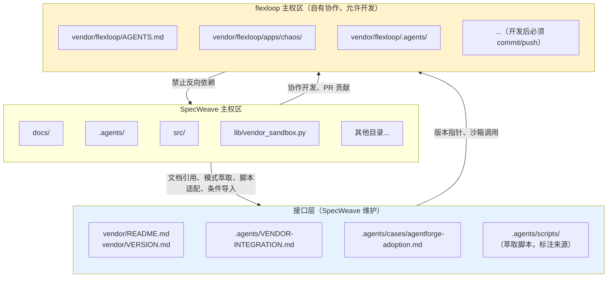

# 02 边界划分与协作原则

## 第3章 边界划分原则

项目空间划分为三个区域，各区域有明确的主权和操作规则：

**SpecWeave 主权区**：除 `vendor/` 外的所有目录。SpecWeave 完全控制，可以自由创建、修改、删除文件。

**flexloop 主权区**：`vendor/flexloop/` 下所有内容（.git 追踪的 submodule 内容）。**允许子模块内开发，所有修改必须 commit 并 push 到 flexloop 远程仓库，禁止未提交的工作树修改长期存留**。定制需求可在子模块内开发后通过 PR 合并，或通过模式萃取到 SpecWeave 主权区。

**接口层**：位于 SpecWeave 主权区内，用于管理与 flexloop 的交互，包含：
- `vendor/README.md` 和 `vendor/VERSION.md`：SpecWeave 维护，记录元数据和版本锁定信息
- `.agents/VENDOR-INTEGRATION.md`：本文档，协同操作规范
- `.agents/cases/agentforge-adoption.md`：案例文档，对照说明复用模式
- `.agents/scripts/` 中从 flexloop 萃取并适配的脚本（在文件中标注来源）
- `lib/vendor_sandbox.py`：沙箱运行和条件导入工具（SpecWeave 维护）

## 第3.5章 协作四原则

与第三方只读子模块"不侵入、不直引、不跟版、不裸考"的四不原则不同，自有协作子模块遵循以下协作四原则：

| 原则 | 含义 | 第三方只读模式 | 自有协作模式 |
|------|------|----------------|--------------|
| **可编辑** | 允许在子模块内开发，修改必须 commit/push 到 flexloop 仓库 | ❌ 禁止任何本地修改 | ✅ 允许开发，修改必须提交并推送 |
| **条件引** | 通过 try/except ImportError 条件导入，未初始化时优雅降级 | ❌ 禁止任何 import | ✅ 允许条件导入，禁止裸 import 和 sys.path 永久插入 |
| **跟分支** | 跟踪 main 分支，通过 `git submodule update --remote` 按需更新 | 🔒 固定 commit，不跟踪分支 | 🔄 跟踪 main 分支，按需更新 |
| **沙箱护** | 运行 flexloop 脚本必须使用沙箱工具（vendor_sandbox.py），限制写入范围 | — | ✅ 必须通过沙箱运行，隔离环境 |

核心区别：第三方只读模式下 flexloop 是不可触碰的外部依赖；自有协作模式下 flexloop 是可双向迭代的协作仓库，但仍需通过条件导入和沙箱机制保护 SpecWeave 主体的稳定性。
---

## 相关模式

- [双模式子模块治理](../../docs/retrospective/patterns/methodology-patterns/governance-strategy/dual-mode-submodule-governance.md)
- [Vendor生命周期治理](../../docs/retrospective/patterns/methodology-patterns/governance-strategy/vendor-lifecycle-governance.md)
- [子模块元数据外部化](../../docs/retrospective/patterns/architecture-patterns/submodule-metadata-externalization.md)
---

← 上一章: [01 概述与快速入门](01-overview-quickstart.md) | **[返回索引](../VENDOR-INTEGRATION.md)** | 下一章: [03 交互接口规范](03-interfaces.md) →
