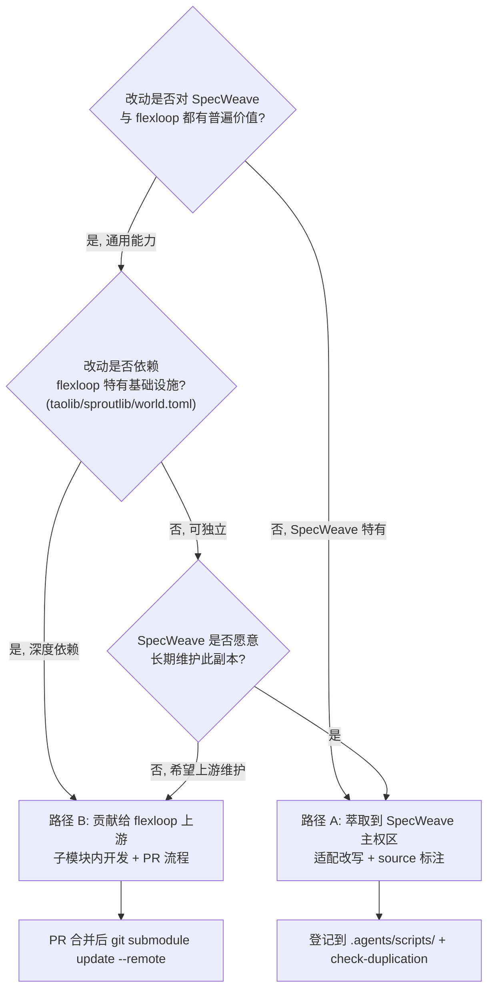

# 05 测试隔离与模式萃取

## 第7章 测试环境隔离

两个项目的测试环境必须完全隔离，禁止交叉污染。

**Python 环境**：
- SpecWeave 使用根目录 `.venv/` 虚拟环境
- flexloop 使用 `vendor/flexloop/apps/chaos/` 下的 uv 环境
- 初始化 flexloop 环境：`cd vendor/flexloop/apps/chaos && uv sync`

**pytest 配置**：
- SpecWeave 的 pytest 必须排除 vendor/ 目录，在 pytest.ini 或 pyproject.toml 中配置：
  ```ini
  norecursedirs = vendor .temp .venv
  ```
- 确保测试收集器不会遍历 vendor/ 下的测试文件

**独立运行 flexloop 测试**：

```bash
cd vendor/flexloop/apps/chaos
uv run pytest
```

必须在 flexloop 自己的目录和环境中运行其测试，不要在 SpecWeave 根目录调用。

**测试数据隔离**：
- 两个项目的测试数据、fixture、临时文件完全隔离
- SpecWeave 测试不访问 vendor/flexloop/ 下的任何测试数据
- flexloop 测试也不访问 SpecWeave 的文件

## 第8章 模式萃取与同步

### 8.0 贡献 vs 萃取决策树

在 flexloop 与 SpecWeave 之间流转改动时，必须先判定走"萃取到主权区"还是"贡献给上游"，避免灰色地带。



判定要点：

- **通用性 + 依赖性双维度判定**，而非仅看"是否好用"
- **路径 A（萃取）**：适合 SpecWeave 特有需求，或希望自主演进、不依赖 flexloop 基础设施的脚本
- **路径 B（贡献）**：适合依赖 flexloop 基础设施（taolib/sproutlib/world.toml 等）且对 flexloop 也有价值的能力
- **禁止灰色地带**：临时修改必须在合并前二选一收尾，不允许"既不萃取也不贡献"的悬挂状态

从 flexloop 中萃取有价值的模式和脚本到 SpecWeave，需遵循以下 6 步流程：

### 萃取流程

1. **评估通用性**：判断该模式/脚本是否仅适用于 flexloop 特定场景？是否对 SpecWeave 有普遍价值？仅萃取有跨项目复用价值的内容。

2. **阅读理解**：完整阅读原始实现，理解其依赖关系、前置假设、输入输出约定、边界条件处理。

3. **适配改写**：
   - 调整命名规范以符合 SpecWeave 风格
   - 修改路径处理，使用 `.agents/scripts/lib/` 中的共享路径工具
   - 调整导入语句，使用 SpecWeave 的共享库
   - 调整输出格式，遵循 `lib.cli` 的输出规范
   - 移除 flexloop 特有的约束和依赖

4. **来源标注**：
   - 在 Python 脚本头部添加注释：`# Source: vendor/flexloop/apps/chaos/.agents/scripts/xxx.py`
   - 在 TOML frontmatter 中添加：`source = "vendor/flexloop/apps/chaos/.agents/scripts/xxx.py"`
   - 如有重大适配修改，简要说明适配内容

5. **测试验证**：
   - 为萃取后的代码编写适配 SpecWeave 环境的测试用例
   - 运行测试验证在 SpecWeave 环境中正常工作
   - 边界条件测试，确保不依赖 flexloop 特有路径

6. **登记更新**：
   - 更新相关索引文件（如 `.agents/scripts/README.md`）
   - 如适用，更新 [agentforge-adoption.md](../cases/agentforge-adoption.md) 案例文档
   - 运行 `python scripts/check-duplication.py` 确认未引入重复代码

### 回流建议

SpecWeave 的创新改进若同样适用于 flexloop：
- **直接在子模块内开发**（遵循 6.2 子模块开发流程）：在 vendor/flexloop/ 内创建功能分支，修改后 commit 并 push，通过 PR 合并到 flexloop main 分支
- 也可以通过向 gitcode.com:flexloop/flexloop 提交 issue 的方式反馈建议
- 提供清晰的问题描述、改进方案和代码示例
- **禁止**在 vendor/flexloop/ 内修改后不 commit/push 就直接提交到 SpecWeave 仓库
---

## 相关模式

- [双模式子模块治理](../../docs/retrospective/patterns/methodology-patterns/governance-strategy/dual-mode-submodule-governance.md)
- [Vendor生命周期治理](../../docs/retrospective/patterns/methodology-patterns/governance-strategy/vendor-lifecycle-governance.md)
- [子模块元数据外部化](../../docs/retrospective/patterns/architecture-patterns/submodule-metadata-externalization.md)
---

← 上一章: [04 版本控制与子模块流程](04-versioning-workflows.md) | **[返回索引](../VENDOR-INTEGRATION.md)** | 下一章: [06 常见问题与故障排查](06-troubleshooting.md) →
