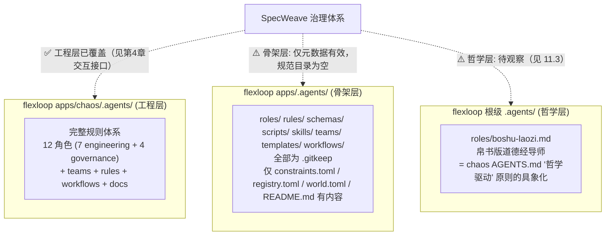

# 07 检查清单与体系定位

## 第10章 快速检查清单

执行任何与 vendor/flexloop 相关的操作前，快速过一遍以下检查项：

- [ ] 我在 vendor/flexloop/ 内的修改是否已 commit 并 push？（禁止未提交的修改长期存留）
- [ ] 我是否使用了条件导入（try/except）？禁止裸 import
- [ ] 我是否将 vendor/ 路径加入了 sys.path 永久？（不应如此，条件导入临时添加除外）
- [ ] 更新 submodule 后，我是否同步更新了 vendor/VERSION.md 中的分支名和 commit 记录？
- [ ] `git status vendor/flexloop` 是否显示 clean（无 modified content）？
- [ ] 所有 Markdown 文档引用是否使用相对路径（无 file:/// 绝对路径）？
- [ ] 萃取的脚本是否标注了 source 来源？
- [ ] 我是否在 SpecWeave 环境而非 flexloop 环境中运行了 flexloop 测试？（不应如此）
- [ ] 运行 flexloop 脚本是否使用了 vendor_sandbox.py 沙箱工具？

全部确认无误后再进行提交。

## 第11章 flexloop .agents 体系定位

flexloop 的 `.agents` 体系实际分三层，SpecWeave 治理文件此前仅覆盖工程层。本章明确三层结构与 SpecWeave 的关系，并声明根级 `.agents` 的处置策略。

### 11.1 三层结构

### 11.2 各层处置策略

| 层级 | 路径 | 处置策略 | SpecWeave 引用方式 |
|------|------|----------|---------------------|
| 工程层 | `vendor/flexloop/apps/chaos/.agents/` | 已纳入既有治理（第4章接口、第8章萃取） | 相对路径引用 + 条件导入 + 沙箱运行 |
| 骨架层 | `vendor/flexloop/apps/.agents/` | 仅元数据文件（constraints/registry/world.toml）有效，规范子目录为空骨架 | 不直接引用；如需元数据通过沙箱读取 |
| 哲学层 | `vendor/flexloop/.agents/` | 待观察模式（见 11.3） | 暂不引用、暂不萃取 |

### 11.3 哲学层处置：待观察模式

flexloop 根级 `.agents/roles/boshu-laozi.md`（帛书版道德经导师）是 flexloop "哲学驱动"原则（chaos AGENTS.md 第1节"以'反者道之动，弱者道之用'为重要设计依据"）的具象化角色，属于"知识/哲学角色"，非工程角色。

SpecWeave 当前角色体系（orchestrator/architect/developer/reviewer/tester/co-founder/team-admin）全部为工程角色，未引入"知识角色"概念。处置策略如下：

- **当前状态**：标记为"待观察模式"，SpecWeave 暂不引用、暂不萃取
- **登记位置**：在 [cases/agentforge-adoption.md](../cases/agentforge-adoption.md) 案例文档中记录该模式作为 flexloop 的特色实践
- **触发萃取条件**：当 SpecWeave 出现领域知识角色需求（如特定专业领域的 AI 研习导师）时，再评估是否萃取"知识角色"类到 `.agents/roles/`，并定义对应 frontmatter schema
- **禁止行为**：在触发萃取条件前，不得在 SpecWeave 主权区创建知识角色文件，不得要求 flexloop 移除或改造 boshu-laozi
---

## 相关模式

- [双模式子模块治理](../docs/retrospective/patterns/methodology-patterns/governance-strategy/dual-mode-submodule-governance.md)
- [Vendor生命周期治理](../docs/retrospective/patterns/methodology-patterns/governance-strategy/vendor-lifecycle-governance.md)
- [子模块元数据外部化](../docs/retrospective/patterns/architecture-patterns/submodule-metadata-externalization.md)
---

← 上一章: [06 常见问题与故障排查](06-troubleshooting.md) | **[返回索引](../VENDOR-INTEGRATION.md)**
