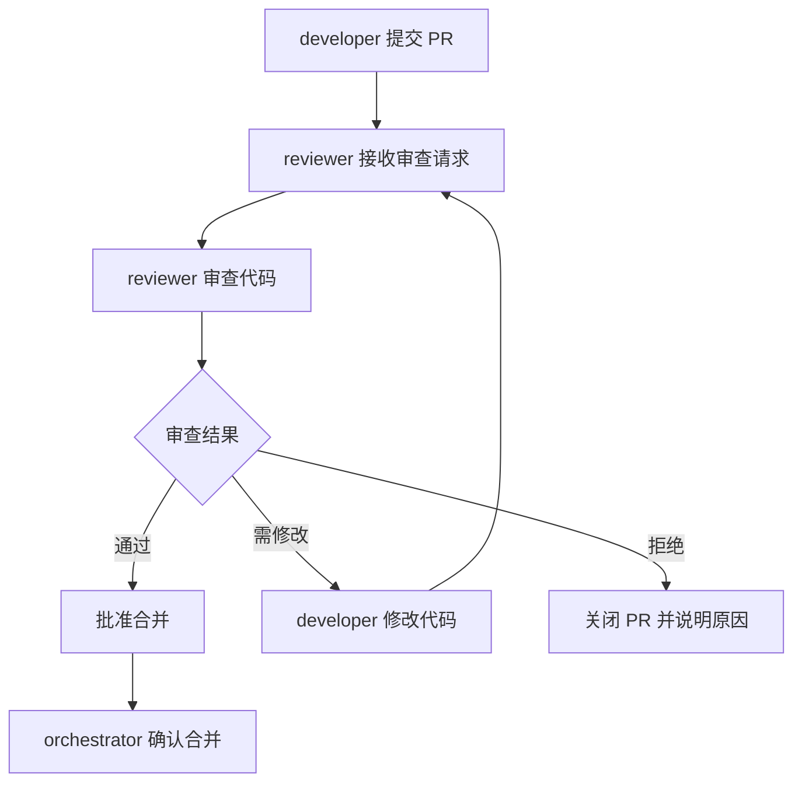

# 代码审查流程

## 流程概览



## 检查清单

| 检查项 | 说明 | 通过标准 |
|---|---|---|
| 代码规范 | 遵循项目编码规范 | 无 lint 错误 |
| 功能正确性 | 实现符合需求 | 功能测试通过 |
| 测试覆盖 | 单元测试覆盖率达标 | 覆盖率 >= 80% |
| 敏感信息安全 | 无硬编码敏感信息 | 通过敏感信息检测（见§4.1） |
| 输入输出安全 | 输入校验与输出编码符合安全规范 | 无注入风险、无敏感数据泄露 |
| 依赖安全 | 依赖组件无已知高危漏洞 | 无CVE高危漏洞 |
| 性能 | 无性能退化 | 性能测试通过 |
| 文档 | 必要文档已更新 | 文档完整 |
| 治理闭环 | 同一领域/文件第二次问题是否触发治理闭环 | 二次暴露问题必须有根因分析+预防工具，提交信息包含`governance-loop`标记 |

## 角色参与

| 角色 | 阶段 | 输入 | 输出 | 职责 |
|---|---|---|---|---|
| developer | 提交 PR | 代码实现 | Pull Request | 提交代码并编写 PR 描述 |
| reviewer | 代码审查 | Pull Request | 审查报告 | 依据检查清单进行审查 |
| orchestrator | 合并确认 | 审查通过结果 | 合并决策 | 确认合并并协调后续流程 |

## 审查标准

### 1. 代码规范

- 代码风格符合项目配置（如 `.editorconfig`、`eslint`、`prettier` 等）。
- 命名清晰、含义准确，符合项目命名约定。
- 文件结构与模块划分合理，无冗余代码。

### 2. 功能正确性

- 实现逻辑与需求文档一致。
- 边界条件与异常路径已处理。
- 关键业务逻辑具备必要的注释说明。

### 3. 测试覆盖

- 单元测试覆盖率不低于 80%。
- 测试用例覆盖正常路径、边界条件与异常场景。
- 测试代码可独立运行，无外部依赖残留。

### 4. 安全性

#### 4.1 敏感信息硬编码检查（必检项）

> 💡 **自动化辅助**：pre-commit 钩子会在提交时自动检测，CI流水线也会运行检测。Code Review时仍需人工确认以下类别。

reviewer 必须逐一确认以下类别不存在硬编码：

| 类别 | 检查要点 | 常见风险位置 |
|------|---------|-------------|
| **API密钥/Token** | 无硬编码的 API Key、Access Token、Secret Key | 配置文件、常量定义、请求头、SDK初始化 |
| **数据库凭据** | 无硬编码的数据库密码、连接串（含明文密码） | 数据库配置、ORM连接、DATABASE_URL |
| **账号密码** | 无硬编码的用户名/密码组合 | 测试代码、初始化脚本、默认账号配置 |
| **私钥/证书** | 无私钥内容（PEM格式BEGIN/END标记）、PEM证书 | 认证模块、JWT配置、SSL/TLS配置 |
| **手机号/个人信息** | 无真实手机号、身份证号等个人信息 | 测试数据、Mock数据、日志输出 |
| **内部URL/IP** | 无生产环境内网地址、IP:Port组合 | 服务发现配置、Webhook地址、调试地址 |
| **云服务凭据** | 无AK/SK、云服务Access Key | 云存储配置、短信/邮件服务配置 |
| **个人路径** | 无开发者本地绝对路径（`/Users/xxx/`、`C:\Users\xxx\`） | 日志路径、配置路径、导入路径 |
| **.env文件** | `.env`、`.env.local` 等文件未被提交 | 仓库根目录、配置目录 |
| **第三方服务密钥** | 无微信/支付宝/支付平台密钥、OAuth Client Secret | 支付模块、第三方登录、Webhook |

**豁免规则**：
- 标记为示例/测试数据的，代码行尾必须加 `# nosec` 注释
- `.env.example` 等模板文件只包含占位符（如 `your-api-key-here`）
- 公开文档中的示例密钥使用明确的占位符格式（如 `sk-xxxxxxxxxxxxxxxxxxxx`）

**快速自查命令**：
```bash
python .agents/scripts/check-sensitive-info.py
python .agents/scripts/check-sensitive-info.py --fix  # 自动修复
```

#### 4.2 输入输出安全

- 所有外部输入均经过校验与消毒，不存在SQL注入、XSS、命令注入风险。
- API响应中不返回敏感字段（密码、Token、完整手机号等）。
- 错误信息不泄露系统内部路径、堆栈、数据库结构。

#### 4.3 依赖安全

- 新增依赖已确认无已知CVE高危漏洞。
- 不引入来源不明的第三方包。
- 依赖版本锁定（lock文件）已同步更新。

### 5. 性能

- 无明显的性能退化（与基线对比）。
- 避免不必要的循环嵌套与重复计算。
- 数据库查询与外部调用已优化。

### 6. 文档

- 接口变更已同步更新 API 文档。
- 复杂逻辑已补充必要的设计说明。
- README 或 CHANGELOG 已按要求更新。

## 审查结果处理

- **通过**：reviewer 批准 PR，通知 orchestrator 执行合并。
- **需修改**：reviewer 列出修改建议，退回 developer 修改后重新提交审查。
- **拒绝**：reviewer 说明拒绝原因，关闭 PR 并通知 orchestrator。
