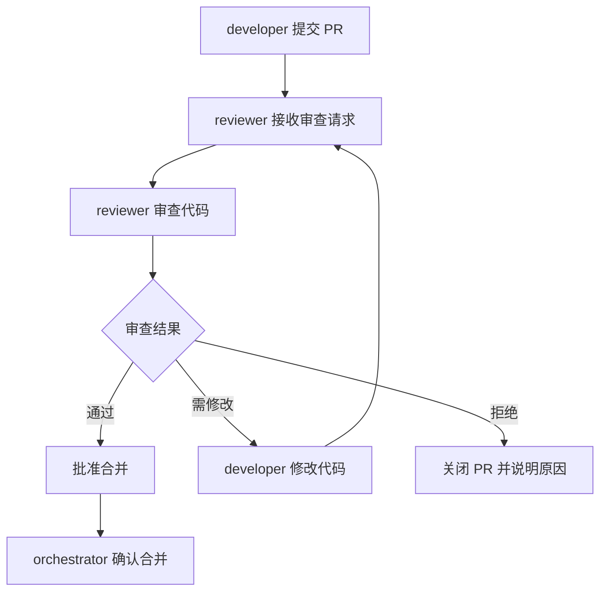

# 代码审查流程

## 流程概览

## 检查清单

| 检查项 | 说明 | 通过标准 |
|---|---|---|
| 代码规范 | 遵循项目编码规范 | 无 lint 错误 |
| 功能正确性 | 实现符合需求 | 功能测试通过 |
| 测试覆盖 | 单元测试覆盖率达标 | 覆盖率 >= 80% |
| 安全性 | 无安全漏洞 | 无高危漏洞 |
| 性能 | 无性能退化 | 性能测试通过 |
| 文档 | 必要文档已更新 | 文档完整 |
| 治理闭环 | 同一领域/文件第二次问题是否触发治理闭环 | 二次暴露问题必须有根因分析+预防工具，提交信息包含`governance-loop`标记 |

## 角色参与

| 角色 | 阶段 | 输入 | 输出 | 职责 |
|---|---|---|---|---|
| developer | 提交 PR | 代码实现 | Pull Request | 提交代码并编写 PR 描述 |
| reviewer | 代码审查 | Pull Request | 审查报告 | 依据检查清单进行审查 |
| orchestrator | 合并确认 | 审查通过结果 | 合并决策 | 确认合并并协调后续流程 |

## 审查标准

### 1. 代码规范

- 代码风格符合项目配置（如 `.editorconfig`、`eslint`、`prettier` 等）。
- 命名清晰、含义准确，符合项目命名约定。
- 文件结构与模块划分合理，无冗余代码。

### 2. 功能正确性

- 实现逻辑与需求文档一致。
- 边界条件与异常路径已处理。
- 关键业务逻辑具备必要的注释说明。

### 3. 测试覆盖

- 单元测试覆盖率不低于 80%。
- 测试用例覆盖正常路径、边界条件与异常场景。
- 测试代码可独立运行，无外部依赖残留。

### 4. 安全性

- 无硬编码的密钥、密码或敏感信息。
- 输入校验与输出编码符合安全规范。
- 依赖组件无已知高危漏洞。

### 5. 性能

- 无明显的性能退化（与基线对比）。
- 避免不必要的循环嵌套与重复计算。
- 数据库查询与外部调用已优化。

### 6. 文档

- 接口变更已同步更新 API 文档。
- 复杂逻辑已补充必要的设计说明。
- README 或 CHANGELOG 已按要求更新。

## 审查结果处理

- **通过**：reviewer 批准 PR，通知 orchestrator 执行合并。
- **需修改**：reviewer 列出修改建议，退回 developer 修改后重新提交审查。
- **拒绝**：reviewer 说明拒绝原因，关闭 PR 并通知 orchestrator。
