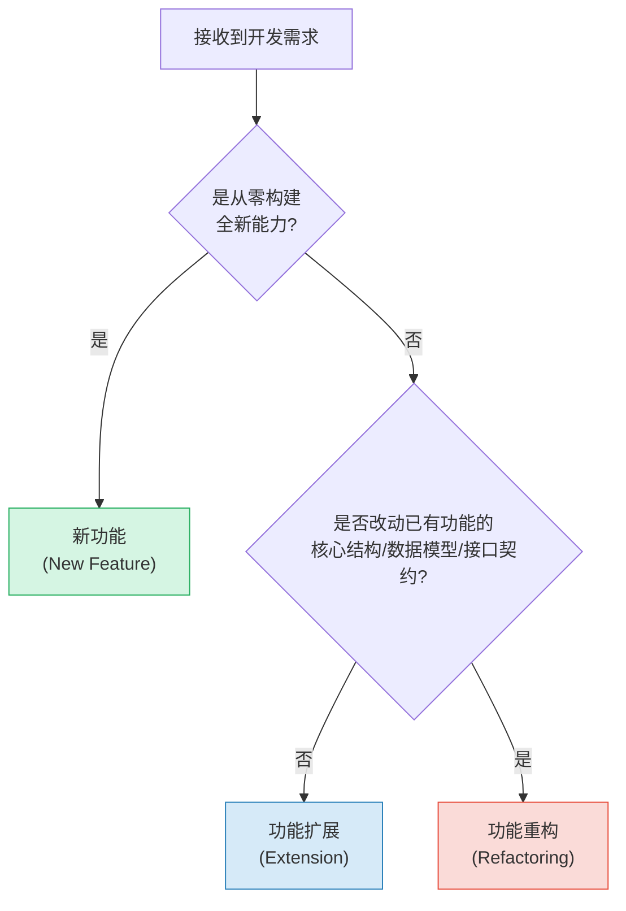
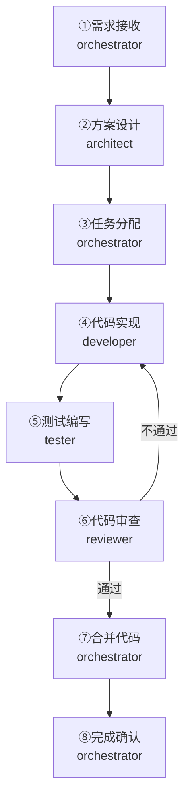
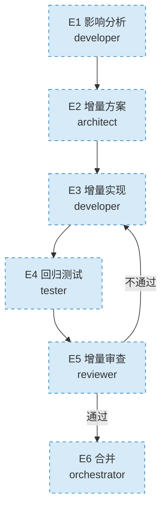
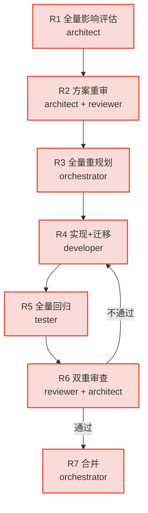

# 功能开发流程

本流程定义功能开发的标准阶段序列、角色参与、变更类型分类与执行要点。所有开发任务必须遵循本流程，并遵守阶段守卫规则和前置文档强制读取协议。

## 变更类型判定

在启动任何开发任务前，orchestrator必须首先判定变更类型，选择对应的流程路径。

| 变更类型 | 定义 | 风险等级 | 流程路径 |
|---------|------|---------|---------|
| **新功能** | 从零构建的全新能力，不涉及已有功能的修改 | 中 | 完整8步流程 |
| **功能扩展** | 在已有功能上新增能力，不破坏现有结构和接口 | 低 | 轻量6步流程 |
| **功能重构** | 改动已有功能的核心结构、数据模型或接口契约，可能影响现有行为 | 高 | 重量7步流程 |

**判定依据必须记录在任务分解清单中。**

---

## 流程概览

### 新功能完整流程（8步）

### 功能扩展轻量流程（6步）

### 功能重构重量流程（7步）

---

## 角色参与

| 角色 | 新功能 | 功能扩展 | 功能重构 |
|---|---|---|---|
| orchestrator | 需求接收、任务分配、合并、确认 | 指派任务、合并 | 重规划、合并 |
| architect | 方案设计 | 增量方案确认 | 全量评估、方案重审 |
| developer | 代码实现 | 影响分析+增量实现 | 实现+数据迁移 |
| tester | 测试编写 | 新增测试+回归测试 | 全量回归测试 |
| reviewer | 代码审查 | 增量审查 | 双重审查（代码+架构） |

---

## 新功能完整流程步骤详情

### 步骤 1：需求接收与分解

- **负责角色**：orchestrator
- **阶段守卫**：只允许需求分析、边界澄清、验收标准定义；禁止讨论技术实现方案、禁止编写代码
- **📋 前置文档**：用户需求原始描述、项目README.md、相关历史spec
- **输入**：需求文档（含功能描述、验收标准、约束条件）
- **输出**：任务分解清单
- **执行要点**：
  1. 解析需求文档，明确功能边界与验收标准。
  2. 将需求拆分为可独立执行的子任务。
  3. 评估任务优先级与依赖关系。
  4. 判定变更类型（新功能/功能扩展/功能重构）并记录。
  5. 创建任务卡片，分配至对应角色。
- **完成标志**：所有子任务已创建并分配负责人，变更类型已标注。

### 步骤 2：方案设计

- **负责角色**：architect
- **阶段守卫**：只允许架构设计、技术选型、接口定义、风险评估；禁止编写业务代码
- **📋 前置文档**：任务分解清单、项目技术栈文档、现有架构文档、开发规范
- **输入**：任务分解清单
- **输出**：技术方案文档
- **执行要点**：
  1. 分析任务的技术可行性与影响范围。
  2. 进行架构设计与模块划分。
  3. 完成技术选型与接口定义。
  4. 识别技术风险并给出应对策略。
- **完成标志**：技术方案经 orchestrator 确认。

### 步骤 3：任务分配

- **负责角色**：orchestrator
- **阶段守卫**：只允许任务拆分、角色匹配、优先级排序；禁止修改技术方案核心内容
- **📋 前置文档**：技术方案文档、角色能力矩阵
- **输入**：技术方案文档
- **输出**：任务分配结果
- **执行要点**：
  1. 依据技术方案调整任务分解。
  2. 按角色能力匹配任务。
  3. 明确任务交付时间与验收标准。
- **完成标志**：任务分配通知已发送至各角色。

### 步骤 4：代码实现

- **负责角色**：developer
- **阶段守卫**：只允许按方案编码；禁止擅自变更架构决策、禁止跳过单元测试、禁止实现方案外功能
- **📋 前置文档**：技术方案文档、任务分解清单、开发规范、相关模块现有代码
- **输入**：技术方案文档
- **输出**：代码实现与单元测试
- **执行要点**：
  1. 依据技术方案进行编码实现。
  2. 编写单元测试并保证本地通过。
  3. 遵循项目编码规范与代码风格。
  4. 提交代码并发起 Pull Request。
- **完成标志**：代码已提交，PR 已创建。

### 步骤 5：测试编写

- **负责角色**：tester
- **阶段守卫**：只允许测试设计与执行、缺陷记录；禁止自行修复缺陷（须反馈developer）
- **📋 前置文档**：需求文档、技术方案文档、代码实现、测试规范
- **输入**：技术方案文档
- **输出**：测试用例与测试代码
- **执行要点**：
  1. 依据需求与技术方案设计测试用例。
  2. 编写自动化测试代码。
  3. 执行测试并记录结果。
  4. 发现缺陷时反馈至 developer。
- **完成标志**：测试用例全部执行，测试报告已生成。

### 步骤 6：代码审查

- **负责角色**：reviewer
- **阶段守卫**：只允许质量审查、改进建议；禁止直接修改代码
- **📋 前置文档**：需求文档、技术方案文档、代码实现、测试报告、审查checklist
- **输入**：代码实现与测试报告
- **输出**：审查报告
- **执行要点**：
  1. 审查代码规范、功能正确性、测试覆盖。
  2. 检查安全性与性能指标。
  3. 给出审查意见与改进建议。
  4. 审查通过则批准合并，否则退回 developer 修改。
- **完成标志**：审查报告已输出，合并决策已明确。

### 步骤 7：合并代码

- **负责角色**：orchestrator
- **阶段守卫**：只允许确认审查结果、执行合并、触发CI；禁止在审查未通过或CI失败时强行合并
- **📋 前置文档**：审查通过报告、CI检查结果
- **输入**：审查通过的报告
- **输出**：合并后的主干代码
- **执行要点**：
  1. 确认审查通过且无阻塞问题。
  2. 确认CI流程全部通过。
  3. 执行代码合并至主干分支。
  4. 触发持续集成与部署流程。
- **完成标志**：代码已合并至主干，CI 流程通过。

### 步骤 8：完成确认

- **负责角色**：orchestrator
- **阶段守卫**：只允许验收核对、状态更新、通知；禁止在验收标准未满足时标记完成
- **📋 前置文档**：合并结果、测试报告、验收标准清单
- **输入**：合并结果与测试报告
- **输出**：任务完成确认
- **执行要点**：
  1. 核对验收标准是否全部满足。
  2. 更新任务状态为已完成。
  3. 通知相关角色任务结束。
- **完成标志**：任务状态已更新，相关方已收到通知。

---

## 功能扩展轻量流程

适用于在已有功能上新增能力、不破坏现有结构和接口的场景（如"给评论加点赞"、"增加导出Excel功能"）。

### E1：影响分析

- **负责角色**：developer
- **📋 前置文档**：原始需求、待扩展功能的需求文档和技术方案、待扩展功能的现有代码
- **执行要点**：
  1. 分析新增能力对已有代码的影响范围。
  2. 列出需修改/新增的文件清单。
  3. 评估对已有接口和数据模型的影响（应无破坏性变更）。
- **输出**：影响分析报告（文件清单+影响范围）

### E2：增量方案确认

- **负责角色**：architect
- **📋 前置文档**：影响分析报告、待扩展功能的技术方案
- **执行要点**：
  1. 确认影响分析的完整性。
  2. 给出增量实现方案（不重新设计整体架构）。
  3. 明确回归测试范围（哪些已有功能必须验证）。
- **输出**：增量方案（含回归测试范围）

### E3：增量实现

- **负责角色**：developer
- **📋 前置文档**：增量方案、待扩展功能现有代码、开发规范
- **执行要点**：
  1. 按增量方案编码，保持已有代码不变。
  2. 为新增功能编写单元测试。
  3. 不修改已有功能的接口和行为。
  4. 提交PR。
- **输出**：增量代码实现
- **注意**：跳过"任务分配"阶段，由orchestrator直接指派developer执行。

### E4：回归测试

- **负责角色**：tester
- **📋 前置文档**：增量方案、代码实现、回归测试范围
- **执行要点**：
  1. 执行新增功能的测试。
  2. 按architect指定的范围执行已有功能的回归测试。
  3. 发现缺陷反馈至developer。
- **输出**：测试报告（含回归测试结果）

### E5：增量审查

- **负责角色**：reviewer
- **📋 前置文档**：增量方案、增量代码、回归测试报告
- **执行要点**：
  1. 审查增量代码的质量和规范符合性。
  2. 确认回归测试已通过。
  3. 审查通过则批准合并，否则退回developer。
- **输出**：审查报告

### E6：合并

- **负责角色**：orchestrator
- **执行要点**：
  1. 确认增量审查通过、回归测试通过。
  2. 执行合并。
- **完成标志**：代码已合并至主干。

---

## 功能重构重量流程

适用于改动已有功能核心结构、数据模型或接口契约的场景（如"重构认证模块从Session改为JWT"、"修改数据库表结构"）。

### R1：全量影响评估

- **负责角色**：architect
- **📋 前置文档**：待重构功能的全部历史文档（需求+方案+测试）、影响范围内所有模块的代码、相关历史BUG修复记录
- **执行要点**：
  1. 评估重构对所有相关模块、接口、数据的影响。
  2. 列出所有受影响的文件和模块清单。
  3. 识别数据迁移需求。
  4. 评估回滚可行性。
- **输出**：全量影响分析报告

### R2：方案重审

- **负责角色**：architect + reviewer
- **📋 前置文档**：全量影响分析报告、原有技术方案
- **执行要点**：
  1. architect重新设计方案。
  2. reviewer参与方案审查（双重审查）。
  3. 方案必须包含：回滚策略、数据迁移方案（如涉及）、向后兼容策略。
- **输出**：新的技术方案文档（含回滚策略）

### R3：全量任务重规划

- **负责角色**：orchestrator
- **📋 前置文档**：新技术方案
- **执行要点**：
  1. 根据新方案重新拆分任务。
  2. 重新分配角色。
  3. 明确数据迁移任务（如涉及）。
- **输出**：新的任务分解清单

### R4：实现与迁移

- **负责角色**：developer
- **📋 前置文档**：新技术方案、任务清单、开发规范、回滚策略文档
- **执行要点**：
  1. 按新方案实现代码。
  2. 确保向后兼容或提供迁移路径。
  3. 如涉及数据迁移，编写迁移脚本并验证。
  4. 确保回滚路径可用。
  5. 提交PR。
- **输出**：重构后代码+迁移脚本（如涉及）

### R5：全量回归

- **负责角色**：tester
- **📋 前置文档**：新技术方案、重构后代码、全部现有测试用例
- **执行要点**：
  1. 执行重构后功能的完整测试。
  2. 执行全量回归测试（不只是相关模块，是全部功能）。
  3. 如涉及数据迁移，验证迁移脚本正确性和数据完整性。
  4. 验证回滚路径的可行性。
- **输出**：全量测试报告

### R6：双重审查

- **负责角色**：reviewer + architect
- **📋 前置文档**：新技术方案、重构代码、全量测试报告、回滚策略
- **执行要点**：
  1. reviewer审查代码质量、规范符合性、测试覆盖。
  2. architect审查架构一致性、方案符合度。
  3. 双重审查均通过才进入合并，否则退回developer。
- **输出**：双重审查报告（代码审查+架构审查）

### R7：合并

- **负责角色**：orchestrator
- **执行要点**：
  1. 确认双重审查通过、全量回归通过。
  2. 如涉及数据迁移，确认迁移脚本已准备好。
  3. 确认回滚策略可用。
  4. 执行合并，必要时分阶段合并（先合代码，再执行迁移）。
- **完成标志**：代码已合并至主干，迁移完成（如涉及），系统运行正常。

---

## 治理规则引用

开发过程中必须遵守以下治理规则：

- **阶段守卫**：详见 [.agents/rules/stage-guardrails.md](../rules/stage-guardrails.md)
- **前置文档读取**：详见 [.agents/protocols/pre-document-reading.md](../protocols/pre-document-reading.md)
- **任务交接**：详见 [.agents/protocols/handoff.md](../protocols/handoff.md)
- **硬编码治理**：详见 [.agents/rules/enforcement-guidelines.md](../rules/enforcement-guidelines.md)

## 交接协议

各步骤之间的任务交接须遵循 `.agents/protocols/handoff.md` 中定义的交接协议，确保上下文完整传递。交接时应使用 `templates/handoff-template.md` 模板填写交接信息，包括已完成工作、待办事项与风险提示。
