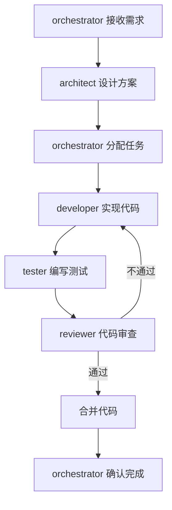

# 功能开发流程

## 流程概览

## 角色参与

| 角色 | 阶段 | 输入 | 输出 | 职责 |
|---|---|---|---|---|
| orchestrator | 需求接收 | 需求文档 | 任务分解 | 需求分析与任务分解 |
| architect | 方案设计 | 任务分解 | 技术方案 | 架构设计与技术选型 |
| developer | 代码实现 | 技术方案 | 代码实现 | 编码与单元测试 |
| tester | 测试编写 | 技术方案 | 测试用例 | 测试设计与执行 |
| reviewer | 代码审查 | 代码实现 | 审查报告 | 质量审查与改进建议 |

## 步骤详情

### 步骤 1：需求接收与分解

- **负责角色**：orchestrator
- **输入**：需求文档（含功能描述、验收标准、约束条件）
- **输出**：任务分解清单
- **执行要点**：
  1. 解析需求文档，明确功能边界与验收标准。
  2. 将需求拆分为可独立执行的子任务。
  3. 评估任务优先级与依赖关系。
  4. 创建任务卡片，分配至对应角色。
- **完成标志**：所有子任务已创建并分配负责人。

### 步骤 2：方案设计

- **负责角色**：architect
- **输入**：任务分解清单
- **输出**：技术方案文档
- **执行要点**：
  1. 分析任务的技术可行性与影响范围。
  2. 进行架构设计与模块划分。
  3. 完成技术选型与接口定义。
  4. 识别技术风险并给出应对策略。
- **完成标志**：技术方案经 orchestrator 确认。

### 步骤 3：任务分配

- **负责角色**：orchestrator
- **输入**：技术方案文档
- **输出**：任务分配结果
- **执行要点**：
  1. 依据技术方案调整任务分解。
  2. 按角色能力匹配任务。
  3. 明确任务交付时间与验收标准。
- **完成标志**：任务分配通知已发送至各角色。

### 步骤 4：代码实现

- **负责角色**：developer
- **输入**：技术方案文档
- **输出**：代码实现与单元测试
- **执行要点**：
  1. 依据技术方案进行编码实现。
  2. 编写单元测试并保证本地通过。
  3. 遵循项目编码规范与代码风格。
  4. 提交代码并发起 Pull Request。
- **完成标志**：代码已提交，PR 已创建。

### 步骤 5：测试编写

- **负责角色**：tester
- **输入**：技术方案文档
- **输出**：测试用例与测试代码
- **执行要点**：
  1. 依据需求与技术方案设计测试用例。
  2. 编写自动化测试代码。
  3. 执行测试并记录结果。
  4. 发现缺陷时反馈至 developer。
- **完成标志**：测试用例全部执行，测试报告已生成。

### 步骤 6：代码审查

- **负责角色**：reviewer
- **输入**：代码实现与测试报告
- **输出**：审查报告
- **执行要点**：
  1. 审查代码规范、功能正确性、测试覆盖。
  2. 检查安全性与性能指标。
  3. 给出审查意见与改进建议。
  4. 审查通过则批准合并，否则退回 developer 修改。
- **完成标志**：审查报告已输出，合并决策已明确。

### 步骤 7：合并代码

- **负责角色**：orchestrator
- **输入**：审查通过的报告
- **输出**：合并后的主干代码
- **执行要点**：
  1. 确认审查通过且无阻塞问题。
  2. 执行代码合并至主干分支。
  3. 触发持续集成与部署流程。
- **完成标志**：代码已合并至主干，CI 流程通过。

### 步骤 8：完成确认

- **负责角色**：orchestrator
- **输入**：合并结果与测试报告
- **输出**：任务完成确认
- **执行要点**：
  1. 核对验收标准是否全部满足。
  2. 更新任务状态为已完成。
  3. 通知相关角色任务结束。
- **完成标志**：任务状态已更新，相关方已收到通知。

## 交接协议

各步骤之间的任务交接须遵循 `.agents/protocols/handoff.md` 中定义的交接协议，确保上下文完整传递。交接时应使用 `templates/handoff-template.md` 模板填写交接信息，包括已完成工作、待办事项与风险提示。
