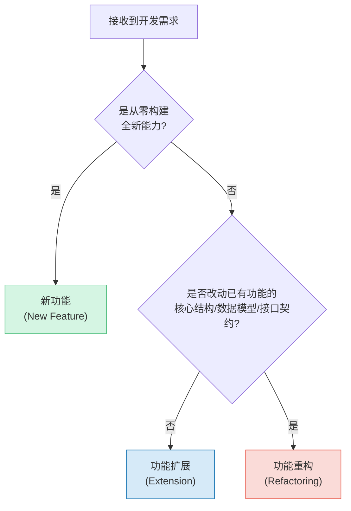
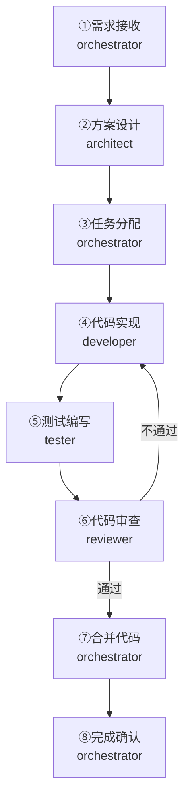
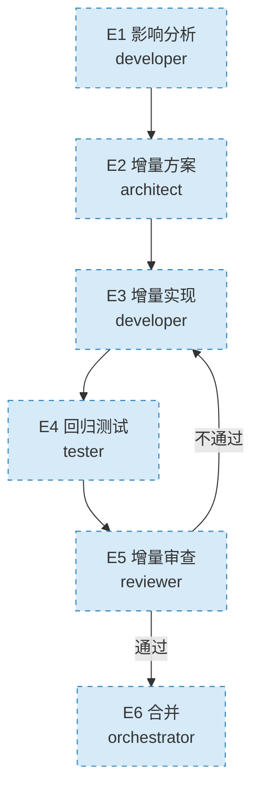
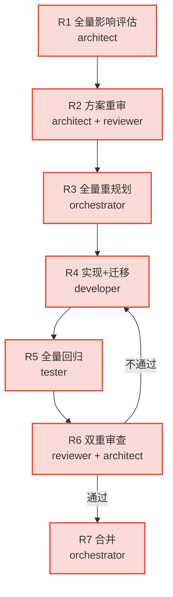

# 01 变更类型判定与流程概览

在启动任何开发任务前，orchestrator必须首先判定变更类型，选择对应的流程路径。

| 变更类型 | 定义 | 风险等级 | 流程路径 |
|---------|------|---------|---------|
| **新功能** | 从零构建的全新能力，不涉及已有功能的修改 | 中 | 完整8步流程 |
| **功能扩展** | 在已有功能上新增能力，不破坏现有结构和接口 | 低 | 轻量6步流程 |
| **功能重构** | 改动已有功能的核心结构、数据模型或接口契约，可能影响现有行为 | 高 | 重量7步流程 |

**判定依据必须记录在任务分解清单中。**

---

### 新功能完整流程（8步）

### 功能扩展轻量流程（6步）

### 功能重构重量流程（7步）

---

| 角色 | 新功能 | 功能扩展 | 功能重构 |
|---|---|---|---|
| orchestrator | 需求接收、任务分配、合并、确认 | 指派任务、合并 | 重规划、合并 |
| architect | 方案设计 | 增量方案确认 | 全量评估、方案重审 |
| developer | 代码实现 | 影响分析+增量实现 | 实现+数据迁移 |
| tester | 测试编写 | 新增测试+回归测试 | 全量回归测试 |
| reviewer | 代码审查 | 增量审查 | 双重审查（代码+架构） |

---

---

## 相关模式

- [学习-验证-采用](../../docs/retrospective/patterns/methodology-patterns/governance-strategy/learn-validate-adopt.md)
- [两阶段处理](../../docs/retrospective/patterns/methodology-patterns/document-architecture/two-phase-processing.md)
---

**[返回索引](../feature-development.md)** | 下一章: [02 新功能完整流程（8步）](02-new-feature-flow.md) →
