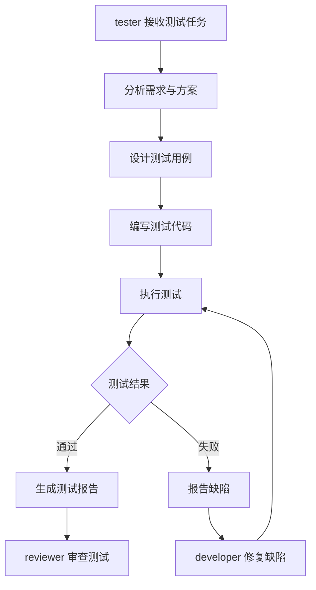

# 测试流程

## 流程概览



## 验收标准

| 验收项 | 说明 | 标准 |
|---|---|---|
| 单元测试 | 模块级测试 | 覆盖率 >= 80% |
| 集成测试 | 模块间集成 | 全部通过 |
| 功能测试 | 需求功能点 | 全部覆盖 |
| 性能测试 | 性能指标 | 达标 |
| 回归测试 | 已有功能 | 无退化 |

## 角色参与

| 角色 | 阶段 | 输入 | 输出 | 职责 |
|---|---|---|---|---|
| tester | 测试执行 | 技术方案与需求 | 测试用例与测试报告 | 设计用例、编写代码、执行测试 |
| developer | 缺陷修复 | 缺陷报告 | 修复代码 | 定位并修复缺陷 |
| reviewer | 测试审查 | 测试报告 | 审查意见 | 审查测试覆盖与质量 |

## 测试报告格式

测试报告应包含以下内容：

### 1. 基本信息

```
任务名称: {任务名称}
任务 ID: {任务 ID}
测试负责人: {角色 ID}
测试时间: {ISO 8601 时间戳}
测试环境: {环境描述}
```

### 2. 测试概要

```
测试用例总数: {数量}
通过用例数: {数量}
失败用例数: {数量}
跳过用例数: {数量}
通过率: {百分比}
```

### 3. 测试结果明细

| 测试用例 ID | 用例名称 | 类型 | 结果 | 备注 |
|---|---|---|---|---|
| TC-001 | {用例名称} | 单元测试 | 通过 | - |
| TC-002 | {用例名称} | 集成测试 | 失败 | {缺陷 ID} |

### 4. 缺陷清单

| 缺陷 ID | 严重程度 | 描述 | 影响范围 | 状态 |
|---|---|---|---|---|
| BUG-001 | 高 | {缺陷描述} | {影响范围} | 已报告 |
| BUG-002 | 中 | {缺陷描述} | {影响范围} | 已修复 |

### 5. 覆盖率统计

| 覆盖率类型 | 比例 | 是否达标 |
|---|---|---|
| 行覆盖率 | {百分比} | 是/否 |
| 分支覆盖率 | {百分比} | 是/否 |
| 函数覆盖率 | {百分比} | 是/否 |

### 6. 结论与建议

- 测试结论：{通过 / 不通过}
- 遗留风险：{风险描述}
- 后续建议：{改进建议}
