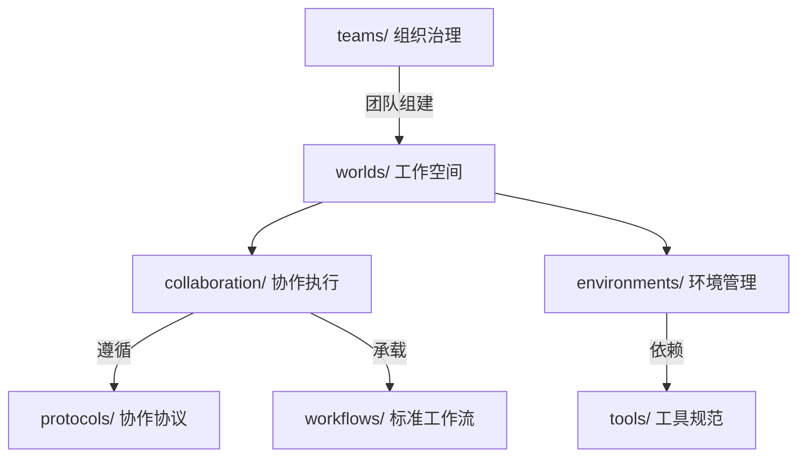
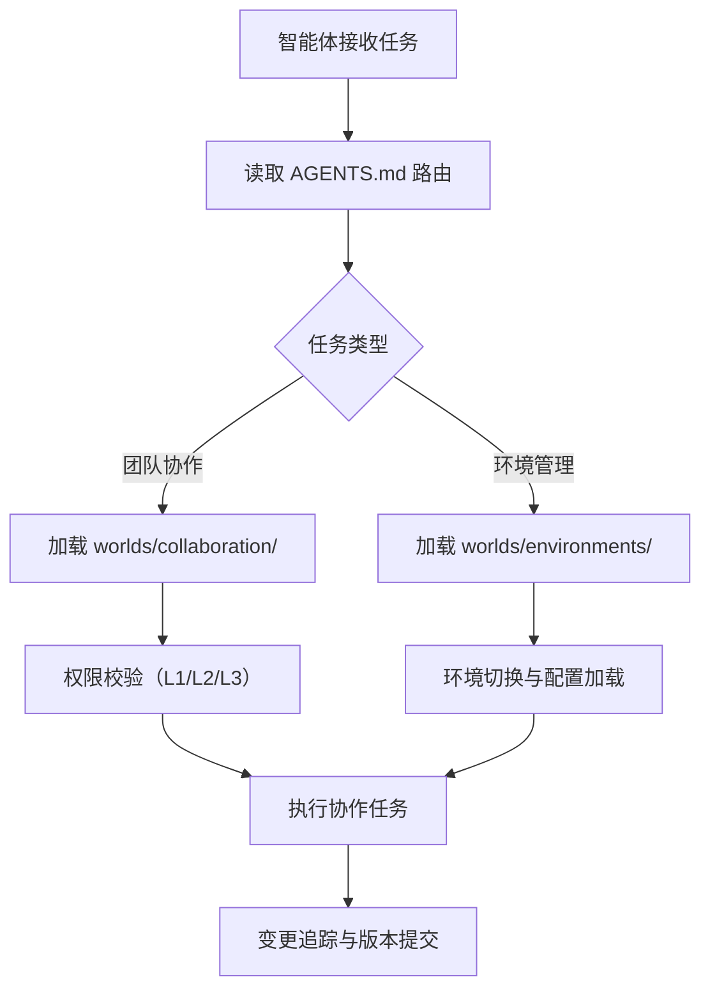

# 工作空间模块索引

本目录是团队协作执行与环境管理的规范容器，存放多用户协作支持与环境管理规范。模块解决「团队在哪里协作、协作过程如何追踪、运行在何种环境之上」的运行时问题，是 `teams/` 组织治理落地为实际工作空间的承载层。

## 目录结构

```
.agents/worlds/
├── README.md                    # 本文件，目录索引与使用指引
├── collaboration/               # 团队协作支持
│   ├── README.md                # 协作模块索引
│   ├── permissions.md            # 多用户权限管理
│   ├── collaborative-editing.md # 协作编辑机制
│   ├── change-tracking.md       # 变更追踪
│   └── version-control.md       # 版本控制集成
└── environments/                # 环境管理
    ├── README.md                # 环境模块索引
    ├── multi-environment.md     # 多环境配置与切换
    ├── variables.md             # 环境变量管理
    ├── resource-isolation.md    # 资源隔离
    └── status-monitoring.md     # 环境状态监控
```

## 各子模块职责矩阵

| 子模块 | 职责 | 核心内容 |
|---|---|---|
| collaboration/ | 团队协作支持 | 多用户权限管理、协作编辑、变更追踪、版本控制 |
| environments/ | 环境管理 | 多环境配置与切换、环境变量管理、资源隔离、环境状态监控 |

## 核心概念关系图



## 使用流程示例



## 与其他模块的关系

| 关联模块 | 关系 | 说明 |
|---|---|---|
| teams/ | 上游 | teams/ 管理团队组织结构，worlds/ 提供团队协作的工作空间 |
| protocols/ | 引用 | worlds/ 的协作机制遵循 protocols/ 中的交接、消息传递、冲突解决协议 |
| workflows/ | 协作 | worlds/ 提供工作空间承载，workflows/ 定义工作流程 |
| tools/ | 依赖 | worlds/ 的环境管理依赖 tools/ 中的文件操作与代码执行规范 |
| AGENTS.md | 上游 | worlds/ 入口须在 AGENTS.md 上下文路由表中注册 |

## 使用约束

1. **权限前置**：所有协作与环境管理操作须先完成对应级别的验证。
2. **操作留痕**：所有 L2/L3 操作须记录审计日志。
3. **最小权限**：权限分配与环境变量注入遵循最小权限原则。
4. **环境隔离**：多环境并行运行时须确保资源隔离。
5. **索引同步**：worlds/ 目录变更后须同步更新 `.agents/README.md` 与 `AGENTS.md`。
