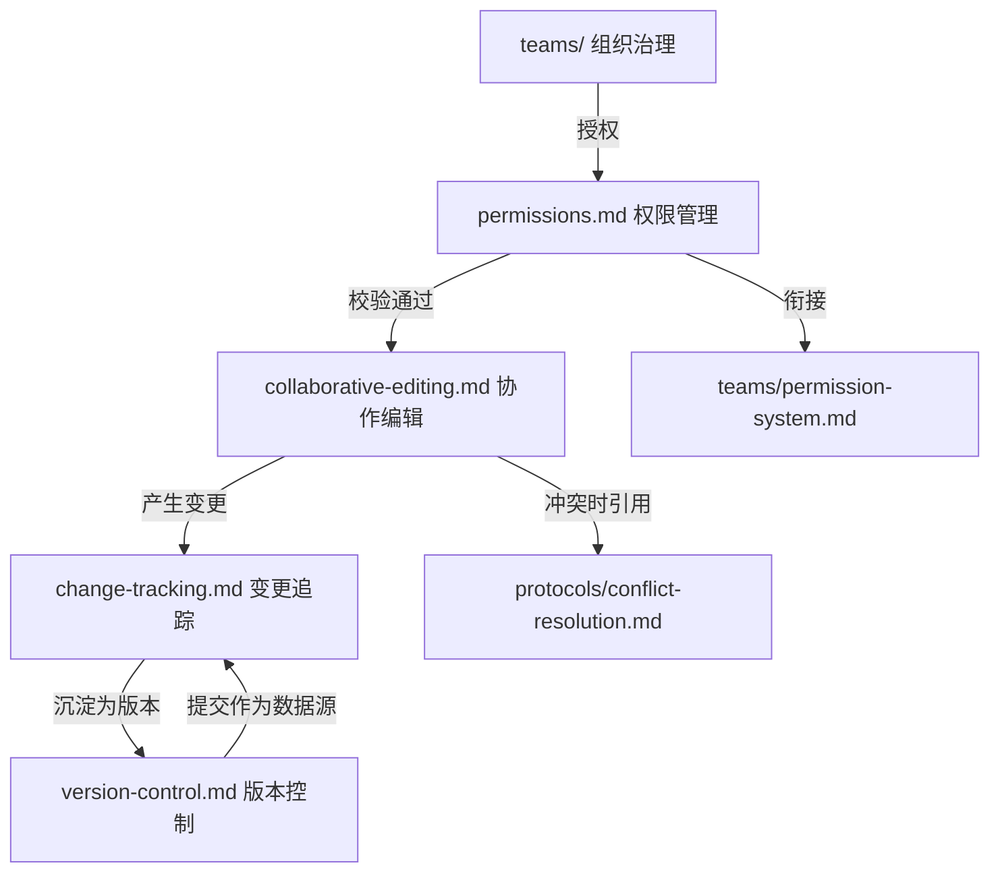
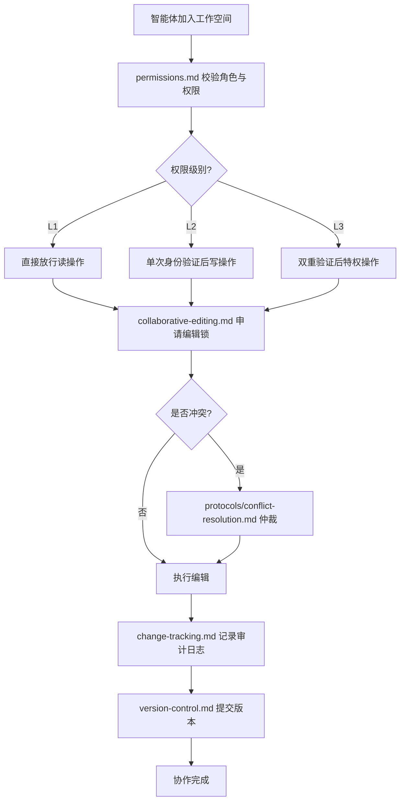

# 协作模块索引

本目录是团队协作支持规范的容器，定义多用户在工作空间内进行协作所需的权限管理、并发编辑、变更追踪与版本控制机制。模块解决「谁能协作、如何避免冲突、变更如何留痕、版本如何演进」的运行时问题，是 `teams/` 组织治理与 `protocols/` 协作协议在工作空间层级的落地实现。

## 目录结构

```
.agents/worlds/collaboration/
├── README.md                    # 本文件，协作模块索引与使用指引
├── permissions.md               # 多用户权限管理规范
├── collaborative-editing.md     # 协作编辑机制规范
├── change-tracking.md           # 变更追踪规范
└── version-control.md           # 版本控制集成规范
```

## 文件职责矩阵

| 文件 | 职责 | 核心内容 |
|---|---|---|
| README.md | 模块索引 | 目录导航、文件职责、概念关系、使用流程 |
| permissions.md | 多用户权限管理 | RBAC 扩展模型、工作空间角色、权限分配与回收、校验流程 |
| collaborative-editing.md | 协作编辑机制 | 锁机制、乐观并发控制、冲突解决、合并与回滚策略 |
| change-tracking.md | 变更追踪 | 审计日志格式、不可篡改机制、检索维度、保留策略 |
| version-control.md | 版本控制集成 | Git 工作流、分支策略、标签管理、提交规范 |

## 核心概念关系图



## 与其他模块的关系

| 关联模块 | 关系 | 说明 |
|---|---|---|
| teams/ | 上游 | teams/ 定义角色与权限分级，collaboration/ 在工作空间层级扩展并落地 |
| protocols/ | 引用 | 协作编辑冲突解决遵循 protocols/conflict-resolution.md 的仲裁规则 |
| workflows/ | 协作 | workflows/ 定义标准流程，collaboration/ 提供执行时的并发与版本支撑 |
| tools/ | 依赖 | 文件操作与代码执行依赖 tools/file-operations.md 与 tools/code-execution.md |
| environments/ | 平级 | collaboration/ 关注协作过程，environments/ 关注运行环境，二者共同构成工作空间运行时 |

## 使用流程示例



## 使用约束

1. **权限前置**：所有协作操作须先依据 `permissions.md` 完成对应级别的权限校验。
2. **冲突可解**：协作编辑冲突须遵循 `collaborative-editing.md` 与 `protocols/conflict-resolution.md` 的解决流程。
3. **变更留痕**：所有 L2/L3 写操作须依据 `change-tracking.md` 记录审计日志。
4. **版本可溯**：所有正式产出须依据 `version-control.md` 提交并打标签，确保可回溯。
5. **索引同步**：本目录文件变更后须同步更新 `../README.md` 与 `../../AGENTS.md` 路由表。
