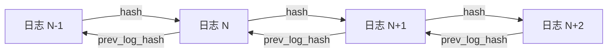
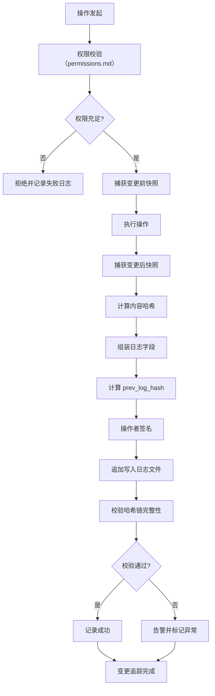

# 变更追踪规范

本规范定义工作空间内所有变更操作的审计日志格式、不可篡改机制、检索维度与保留策略，确保协作过程完整可追溯、可审计、可复盘。审计日志是权限校验、冲突解决与版本控制的共同数据基础。

## 审计日志格式

审计日志采用结构化 JSON 格式，每条记录包含以下字段：

| 字段 | 类型 | 是否必填 | 说明 |
|---|---|---|---|
| log_id | string | 是 | 日志唯一标识，UUID v4 |
| operator | string | 是 | 操作者标识（智能体 ID 或成员 ID） |
| operator_role | string | 是 | 操作者当时的工作空间角色 |
| timestamp | string | 是 | 操作时间戳，ISO 8601 格式，时区为 UTC |
| operation_type | string | 是 | 操作类型枚举（见下表） |
| resource_type | string | 是 | 目标资源类型枚举 |
| resource_id | string | 是 | 目标资源唯一标识 |
| before_content | object | 否 | 变更前内容快照（创建操作可省略） |
| after_content | object | 否 | 变更后内容快照（删除操作可省略） |
| content_hash | string | 是 | 变更内容哈希（SHA-256） |
| prev_log_hash | string | 是 | 前一条日志的哈希值，构成哈希链 |
| signature | string | 是 | 操作者签名，确保不可抵赖 |
| metadata | object | 否 | 扩展元数据，如分支、环境、关联任务等 |

### 操作类型枚举

| 操作类型 | 标识 | 说明 | 留痕要求 |
|---|---|---|---|
| 创建资源 | create | 新建文件、目录、配置等 | 记录 after_content |
| 读取资源 | read | 读取资源内容 | 仅 L3 资源读取需记录 |
| 修改资源 | update | 修改资源内容或属性 | 记录 before_content 与 after_content |
| 删除资源 | delete | 删除资源 | 记录 before_content |
| 权限操作 | permission | 权限授予或回收 | 记录权限变更详情 |
| 环境切换 | env_switch | 切换工作空间环境 | 记录前后环境标识 |
| 合并操作 | merge | 合并冲突版本 | 记录合并方案与双方标识 |
| 回滚操作 | rollback | 回滚至历史版本 | 记录目标版本与回滚原因 |
| 锁操作 | lock | 申请或释放资源锁 | 记录锁类型与持有期 |

### 资源类型枚举

| 资源类型 | 标识 | 说明 |
|---|---|---|
| 文件 | file | 工作空间内文件 |
| 目录 | directory | 工作空间内目录 |
| 配置 | config | 工作空间配置项 |
| 权限 | permission | 权限策略或角色定义 |
| 环境 | environment | 环境配置或状态 |
| 分支 | branch | 版本控制分支 |
| 标签 | tag | 版本控制标签 |

## 审计日志不可篡改机制

审计日志须保证完整性与不可篡改性，采用追加写入、哈希链与签名三重机制。

### 1. 追加写入

- 审计日志仅支持追加写入，禁止修改与删除。
- 日志文件按工作空间与日期分片存储，路径格式：`logs/{world_id}/{date}.jsonl`。
- 每条日志以换行符分隔，便于流式读取与校验。

### 2. 哈希链

每条日志包含 `prev_log_hash` 字段，指向前一条日志的哈希值，形成链式结构。



哈希计算规则：

```
hash(日志 N) = SHA-256(log_id + operator + timestamp + operation_type + resource_id + content_hash + prev_log_hash)
```

校验时，从链首逐条计算并比对哈希值，任一节点不匹配即判定日志被篡改。

### 3. 签名机制

每条日志须由操作者签名，签名算法采用 Ed25519：

- **签名内容**：`log_id + operator + timestamp + operation_type + resource_id + content_hash`
- **签名验证**：审计时使用操作者公钥验证签名，确保不可抵赖。
- **密钥管理**：成员公钥由 world admin 统一管理，密钥轮换须记录日志。

## 检索维度

审计日志支持多维度检索，便于审计与复盘。

| 检索维度 | 字段 | 适用场景 |
|---|---|---|
| 按时间 | timestamp | 查询某时间段内的所有操作 |
| 按操作者 | operator | 查询某成员的所有操作记录 |
| 按资源类型 | resource_type | 查询某类资源的所有变更 |
| 按资源标识 | resource_id | 查询某资源的完整变更历史 |
| 按操作类型 | operation_type | 查询某类操作的所有记录 |
| 按内容哈希 | content_hash | 查询特定内容的变更记录 |
| 组合检索 | 多字段组合 | 复合条件查询，如某成员在某时间段内的写操作 |

### 检索权限

| 角色 | 可检索范围 |
|---|---|
| world owner | 全部审计日志 |
| world admin | 全部审计日志 |
| world member | 自身操作记录 + 公开资源变更记录 |
| world viewer | 公开资源变更记录 |

## 日志保留策略

### 1. 保留周期

| 日志级别 | 保留周期 | 归档方式 | 销毁方式 |
|---|---|---|---|
| L1 操作日志 | 90 天 | 90 天后归档至冷存储 | 归档后 1 年销毁 |
| L2 操作日志 | 180 天 | 180 天后归档至冷存储 | 归档后 2 年销毁 |
| L3 操作日志 | 永久 | 不归档，不销毁 | 永久保留 |

### 2. 归档机制

- **归档触发**：日志达到保留周期后自动归档。
- **归档格式**：归档为压缩包（gzip），文件名包含工作空间标识与时间范围。
- **归档校验**：归档时生成归档文件哈希，并记录至归档索引。
- **归档存储**：归档文件存储于冷存储，访问须 world admin 审批。
- **归档恢复**：恢复归档日志须校验归档文件哈希，确保完整性。

### 3. 销毁机制

- **销毁审批**：日志销毁须 world owner 审批，并记录销毁决议。
- **销毁执行**：销毁须彻底擦除存储介质，禁止仅删除索引。
- **销毁记录**：销毁操作本身须记录至独立的销毁日志，永久保留。
- **L3 例外**：L3 操作日志永不销毁，即使工作空间解散也须迁移至全局审计库。

## 变更追踪流程



## 使用约束

1. **日志先行**：所有 L2/L3 操作须先记录审计日志再执行，确保可追溯。
2. **日志完整**：审计日志字段须完整填写，禁止省略必填字段。
3. **日志不可改**：审计日志一经写入禁止任何形式的修改或删除。
4. **哈希链校验**：每日定时执行哈希链完整性校验，异常须立即告警。
5. **签名不可抵赖**：操作者须妥善保管私钥，私钥泄露须立即报告并轮换。
6. **检索权限受控**：审计日志检索须遵循检索权限矩阵，禁止越权检索。
7. **归档可恢复**：归档日志须可在审批后恢复，恢复后须校验完整性。
8. **L3 永久保留**：L3 操作日志永久保留，禁止销毁。
9. **与版本控制衔接**：Git 提交作为变更追踪的数据源之一，详见 `version-control.md`。
