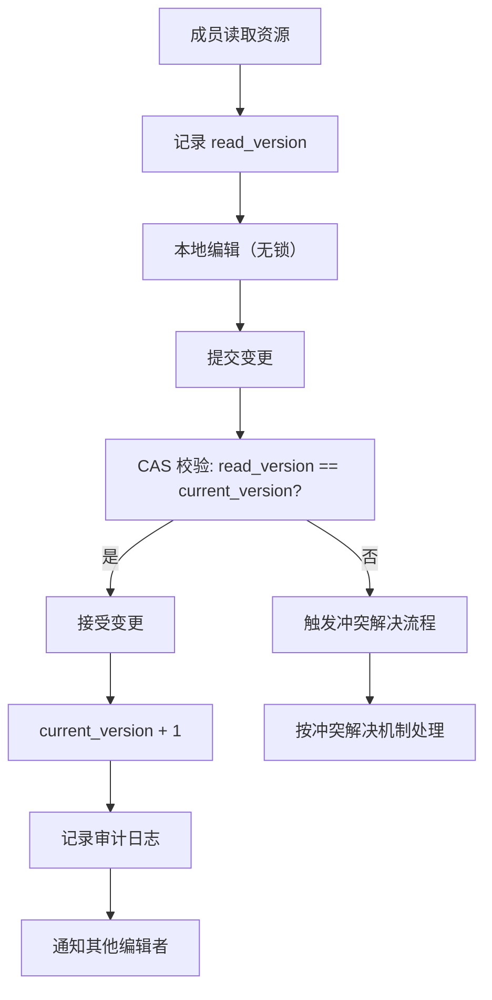
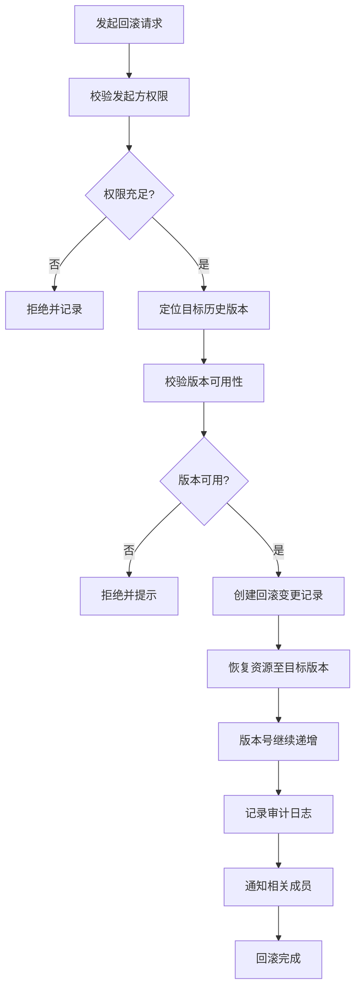
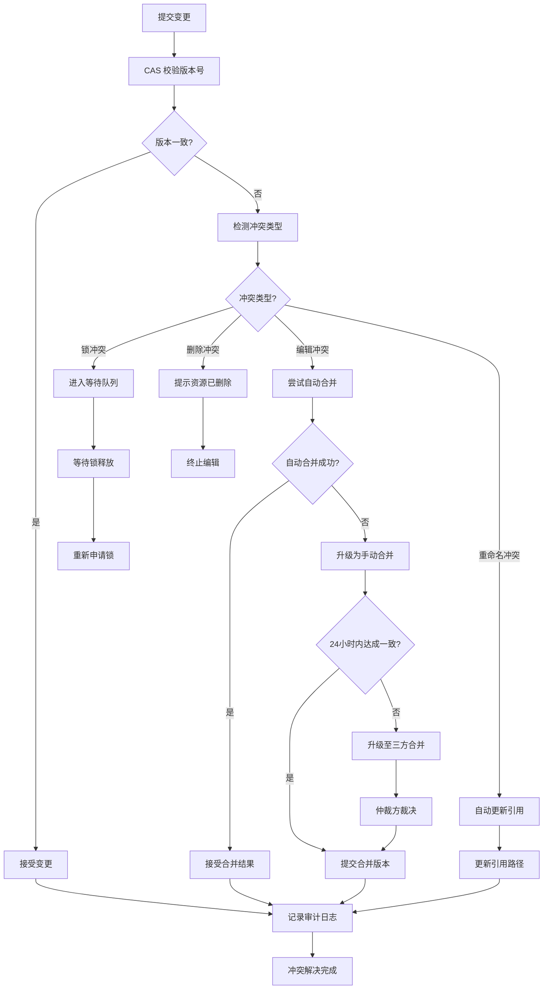

# 协作编辑机制规范

本规范定义多用户在工作空间内并发编辑资源时的锁机制、并发控制策略、冲突解决、合并与回滚机制，确保协作过程高效、有序且可追溯。冲突解决遵循 `../../protocols/conflict-resolution.md` 的仲裁规则。

## 锁机制定义

工作空间支持悲观锁与乐观锁两种机制，按资源类型与冲突频率选择适用策略。

| 锁类型 | 适用场景 | 持有期 | 释放方式 | 典型资源 |
|---|---|---|---|---|
| 悲观锁 | 长时间写操作、强一致性要求资源 | 显式持有至操作完成 | 主动释放或超时自动释放 | 构建任务、测试执行、配置文件 |
| 乐观锁 | 短时间编辑、读多写少资源 | 不持有显式锁，提交时校验 | 提交时校验版本号 | 文档编辑、代码片段、元数据 |

### 1. 悲观锁规则

- **申请**：编辑前须申请资源锁，锁信息包含持有者、资源标识、申请时间、超时时间。
- **互斥**：同一资源同一时刻仅允许一个持有者，其他申请者进入等待队列。
- **超时**：锁持有超过默认时长（30 分钟）自动释放，并通知持有者。
- **释放**：操作完成后须主动释放，禁止依赖超时机制作为常规释放方式。
- **异常处理**：持有者异常退出时，由 world admin 强制释放并记录日志。

### 2. 乐观锁规则

- **版本号**：每个资源维护单调递增的版本号，编辑时记录读取版本号。
- **无锁编辑**：编辑过程不持有锁，允许多用户并发编辑。
- **提交校验**：提交时校验读取版本号与当前版本号是否一致。
- **冲突处理**：版本号不一致时触发冲突解决流程。

## 乐观并发控制策略

乐观并发控制（OCC）通过版本号与 CAS（Compare-And-Swap）机制实现，适用于多数编辑场景。

### 1. 版本号机制

| 字段 | 说明 |
|---|---|
| resource_id | 资源唯一标识 |
| current_version | 当前版本号，单调递增 |
| read_version | 编辑时读取的版本号 |
| content_hash | 内容哈希，用于快速比对 |

### 2. CAS 提交流程

## 冲突解决机制

冲突解决遵循 `../../protocols/conflict-resolution.md` 的仲裁规则，并按工作空间场景细化处理流程。

### 1. 冲突类型

| 冲突类型 | 说明 | 解决方式 |
|---|---|---|
| 编辑冲突 | 多用户同时修改同一资源同一区域 | 自动合并或手动合并 |
| 锁冲突 | 多用户同时申请同一资源的悲观锁 | 串行排队，按优先级调度 |
| 删除冲突 | 一方删除资源，另一方编辑同一资源 | 删除优先，编辑方提示资源已删除 |
| 重命名冲突 | 一方重命名资源，另一方引用原名称 | 引用方自动更新引用路径 |

### 2. 仲裁规则衔接

冲突仲裁遵循 `../../protocols/conflict-resolution.md` 的通用规则，并补充以下工作空间级规则：

- **优先级原则**：高优先级任务的编辑请求优先处理，低优先级任务进入等待队列。
- **历史归属原则**：若编辑为某成员此前工作的延续，优先采纳该成员的变更。
- **最小变更原则**：在功能等价前提下，优先选择变更范围更小的合并方案。
- **可维护性原则**：合并方案应优先考虑代码可读性与可维护性。
- **升级机制**：自动合并失败时升级为手动合并，手动合并无法解决时升级至 orchestrator 仲裁。

## 合并策略

### 1. 自动合并

适用于非重叠区域的并发编辑，由系统自动完成合并。

| 条件 | 处理方式 |
|---|---|
| 编辑区域不重叠 | 自动合并双方变更 |
| 编辑区域重叠但语义等价 | 自动合并并提示 |
| 编辑区域重叠且语义冲突 | 升级为手动合并 |

### 2. 手动合并

由冲突双方协商解决，须在 24 小时内完成，超时升级至 orchestrator 仲裁。

| 步骤 | 说明 |
|---|---|
| 步骤 1 | 系统提示冲突双方进入手动合并流程 |
| 步骤 2 | 双方查看对方变更内容 |
| 步骤 3 | 双方协商确定合并方案 |
| 步骤 4 | 任一方提交合并后的版本 |
| 步骤 5 | 系统记录合并决议与审计日志 |

### 3. 三方合并

当手动合并无法达成一致时，引入第三方（architect 或 world admin）进行三方合并。

| 角色 | 职责 |
|---|---|
| 冲突方 A | 提交变更方案与理由 |
| 冲突方 B | 提交变更方案与理由 |
| 仲裁方 | 基于 `../../protocols/conflict-resolution.md` 仲裁规则裁决 |
| world admin | 执行最终合并并记录 |

## 回滚策略

工作空间支持回滚至任意历史版本，回滚操作须由 world member 及以上角色发起，并记录审计日志。

### 1. 回滚场景

| 场景 | 触发条件 | 回滚范围 |
|---|---|---|
| 误操作回滚 | 成员误删或误改资源 | 单资源回滚至前一版本 |
| 合并失败回滚 | 合并后引入严重问题 | 回滚至合并前版本 |
| 发布失败回滚 | 发布版本验证失败 | 回滚至上一发布版本 |
| 灾难恢复 | 工作空间数据损坏 | 全量回滚至最近稳定版本 |

### 2. 回滚流程

## 冲突解决流程

## 使用约束

1. **锁优先级**：悲观锁优先级高于乐观锁，持有悲观锁的资源禁止乐观编辑。
2. **锁超时上限**：悲观锁最长持有时间不超过 2 小时，超时须由 world admin 审批延期。
3. **版本号单调性**：版本号须严格单调递增，禁止回退或跳跃。
4. **回滚不可逆**：回滚操作本身亦产生新版本，禁止通过删除回滚记录恢复原状态。
5. **冲突报告及时性**：冲突发生后须立即按 `../../protocols/messaging.md` 报告，禁止拖延。
6. **审计日志完整**：所有合并、回滚操作须记录完整审计日志，详见 `change-tracking.md`。
7. **通知机制**：合并与回滚完成后须通知所有相关成员，避免后续编辑基于过期版本。
