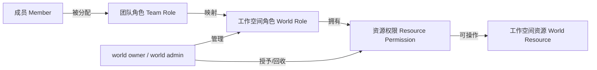
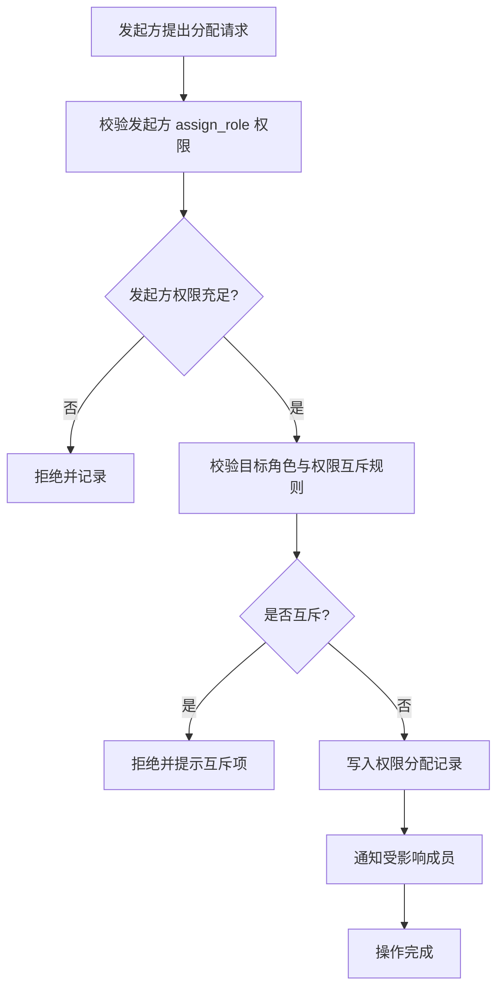
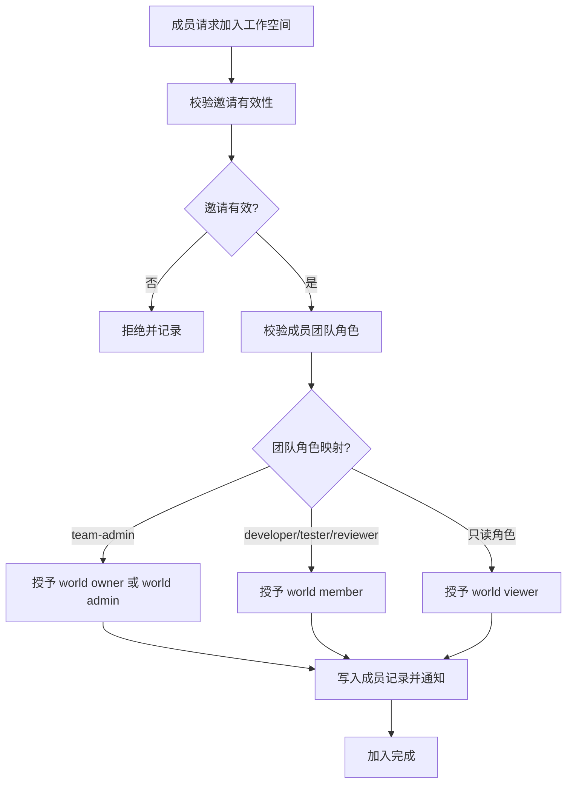
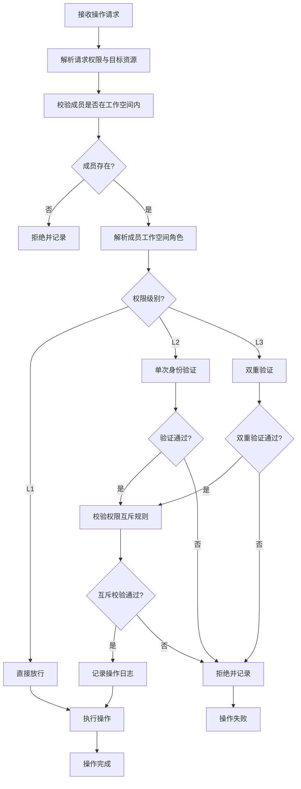

# 多用户权限管理规范

本规范定义工作空间层级的权限管理模型，基于 `../../teams/permission-system.md` 的 RBAC 模型与 L1/L2/L3 分级体系扩展，覆盖工作空间内的角色定义、权限分配、回收与校验流程。权限系统遵循最小权限原则，确保每个成员仅拥有完成职责所必需的权限。

## RBAC 扩展模型

工作空间权限模型在团队级 RBAC 基础上扩展为「团队角色 → 工作空间角色 → 资源权限」三层结构，权限通过工作空间角色间接授予成员。

## 工作空间角色定义

工作空间角色分为四种，与团队级角色形成映射关系，但权限范围限定于单个工作空间内。

| 角色 | 标识 | 团队角色映射 | 权限范围 | 典型职责 |
|---|---|---|---|---|
| 工作空间所有者 | world owner | team-admin | 全部权限，含 L3 特权 | 创建工作空间、指派 world admin、解散工作空间 |
| 工作空间管理员 | world admin | team-admin | L1/L2 权限，不含 L3 | 邀请/移除成员、分配 world member 角色、修改工作空间配置 |
| 工作空间成员 | world member | developer/tester/reviewer | L1 权限 + 受限 L2 写权限 | 编辑工作空间内资源、提交变更、参与协作 |
| 工作空间观察者 | world viewer | 任意只读角色 | 仅 L1 读权限 | 查看工作空间内容、查看审计日志 |

## 权限分级映射

工作空间权限沿用 `../../teams/permission-system.md` 的 L1/L2/L3 分级体系，并按工作空间场景细化。

| 级别 | 标识 | 工作空间典型权限 | 校验要求 |
|---|---|---|---|
| L1 | public | view_world_info、view_member_list、view_world_config（脱敏）、read_resource | 无需额外校验 |
| L2 | internal | invite_member、modify_world_config、write_resource、switch_environment | 单次身份验证 |
| L3 | privileged | dissolve_world、revoke_permission、modify_permission_policy、export_audit_log | 双重验证 + 操作日志 |

## 权限分配与回收流程

### 1. 权限分配流程

权限分配须由具备 `assign_role` 权限的角色（world owner 或 world admin）发起，并记录完整操作日志。

### 2. 权限回收流程

权限回收须遵循 `../../teams/permission-system.md` 的回收规则，并补充工作空间层级的处理。

| 回收场景 | 触发条件 | 执行方式 | 留痕要求 |
|---|---|---|---|
| 角色变更 | 成员工作空间角色调整 | 自动回收原角色的 L2/L3 权限 | 记录变更前后角色 |
| 成员移除 | 成员被移出工作空间 | 回收所有权限并清理资源锁 | 记录移除原因与执行者 |
| 权限滥用 | 检测到违规操作 | 立即回收相关权限并上报 | 记录违规证据与处理结果 |
| 临时权限到期 | 有效期结束 | 自动回收 | 记录回收时间与原授权范围 |
| 工作空间解散 | world owner 发起解散 | 全量回收所有成员权限 | 记录解散决议与备案 |

### 3. 操作留痕要求

所有权限分配与回收操作须记录以下字段，写入审计日志（详见 `change-tracking.md`）：

| 字段 | 说明 |
|---|---|
| operator | 操作者标识 |
| target_member | 被操作成员标识 |
| operation | 操作类型（grant/revoke） |
| role_before | 变更前角色 |
| role_after | 变更后角色 |
| permissions | 涉及的权限列表 |
| reason | 操作原因 |
| timestamp | 操作时间戳（ISO 8601，UTC） |

## 权限校验场景

### 1. 加入工作空间

### 2. 执行写操作

| 校验步骤 | 校验内容 | 失败处理 |
|---|---|---|
| 步骤 1 | 成员是否在工作空间成员列表中 | 拒绝并提示未加入 |
| 步骤 2 | 成员角色是否具备目标资源的写权限 | 拒绝并提示权限不足 |
| 步骤 3 | 写操作是否属于 L2 级别 | 若是，执行单次身份验证 |
| 步骤 4 | 写操作是否触发资源锁冲突 | 若是，按 `collaborative-editing.md` 处理 |
| 步骤 5 | 写操作完成后是否记录审计日志 | 必须记录，详见 `change-tracking.md` |

### 3. 环境切换

环境切换属于 L2 级别操作，须由 world member 及以上角色发起，并遵循 `../environments/multi-environment.md` 的切换流程。

| 校验项 | 要求 |
|---|---|
| 角色权限 | world member 及以上 |
| 目标环境 | 须为已注册环境，且成员具备访问权限 |
| 操作日志 | 须记录切换前后环境标识 |
| 资源清理 | 切换前须释放当前环境持有的资源锁 |

## 权限校验流程

## 与 teams/permission-system.md 的衔接关系

| 衔接维度 | teams/permission-system.md | 本规范 |
|---|---|---|
| 权限模型 | RBAC 基础模型 | 在 RBAC 基础上扩展为三层结构 |
| 权限分级 | L1/L2/L3 三级 | 沿用三级，并按工作空间场景细化典型权限 |
| 角色定义 | team-admin、developer、reviewer 等团队角色 | 新增 world owner、world admin、world member、world viewer 四种工作空间角色 |
| 权限互斥 | 定义团队级互斥规则 | 沿用团队级互斥规则，并补充工作空间级互斥项 |
| 权限回收 | 定义角色变更、成员移除等回收场景 | 沿用并补充工作空间解散场景 |
| 操作留痕 | L2/L3 操作须记录审计日志 | 所有权限分配与回收操作须记录完整字段 |

## 使用约束

1. **角色映射唯一性**：一个成员在同一工作空间内只能拥有一个工作空间角色，禁止多角色叠加。
2. **权限继承受限**：工作空间角色仅可继承 L1 权限，L2 与 L3 权限须显式授予。
3. **临时权限有效期**：临时授予的 L2/L3 权限须设置有效期，到期自动回收。
4. **权限变更通知**：权限授予或回收须通过 `../../protocols/messaging.md` 通知受影响成员。
5. **审计日志保留**：所有权限操作审计日志保留期不少于 90 天，详见 `change-tracking.md`。
6. **禁止权限转授**：拥有 `assign_role` 权限的角色不得将自身权限转授他人。
7. **工作空间解散备案**：解散工作空间须 world owner 发起，并经 orchestrator 备案。
