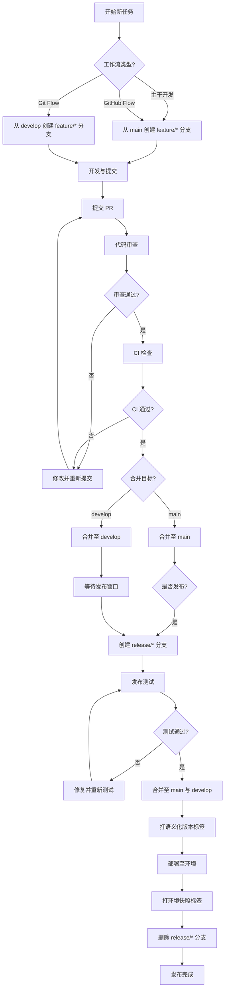

# 版本控制集成规范

本规范定义工作空间内版本控制的 Git 工作流、分支策略、标签管理与提交信息规范，确保协作产出可追溯、可回溯、可发布。Git 提交作为变更追踪的数据源之一，与 `change-tracking.md` 共同构成完整的版本演进记录。

## Git 工作流定义

工作空间支持三种 Git 工作流，按项目规模与发布节奏选择适用方案。

| 工作流 | 适用场景 | 分支复杂度 | 发布节奏 | 典型项目 |
|---|---|---|---|---|
| 主干开发 | 持续集成、快速迭代的小型项目 | 低，仅 main 分支 | 频繁发布 | 工具脚本、原型验证 |
| Git Flow | 有明确发布周期、需维护多版本的项目 | 高，多分支并行 | 周期性发布 | 企业级应用、库 |
| GitHub Flow | 持续部署、特性驱动的项目 | 中，main + feature | 持续发布 | Web 应用、SaaS 服务 |

### 1. 主干开发（Trunk-Based Development）

- 所有变更直接提交至 `main` 分支或通过短生命周期的 feature 分支合并。
- 适合小团队、快速迭代、持续部署场景。
- 要求完善的自动化测试与持续集成保障。

### 2. Git Flow

- 维护 `main`、`develop`、`feature/*`、`release/*`、`hotfix/*` 多类分支。
- 适合有明确发布周期、需并行维护多版本的项目。
- 流程较重，适合中大型团队。

### 3. GitHub Flow

- 维护 `main` 与 `feature/*` 两类分支，main 始终可部署。
- 适合持续部署、特性驱动的项目。
- 流程简洁，适合中小型团队。

## 分支策略

### 1. 分支定义

| 分支 | 命名规则 | 来源 | 合并目标 | 生命周期 | 权限要求 |
|---|---|---|---|---|---|
| main | main | - | - | 永久 | world admin 合并，world member 提交 PR |
| develop | develop | main | main（发布时） | 永久 | world admin 合并，world member 提交 PR |
| feature/* | feature/{task-id}-{brief-desc} | develop 或 main | develop 或 main | 临时，合并后删除 | world member 创建与合并 |
| release/* | release/{version} | develop | main + develop | 临时，发布后删除 | world admin 创建与合并 |
| hotfix/* | hotfix/{issue-id}-{brief-desc} | main | main + develop | 临时，修复后删除 | world admin 创建与合并 |
| env/* | env/{env-name}-{version} | main 或 release/* | 不合并，仅打标签 | 临时，环境切换后归档 | world admin 创建 |

### 2. 分支保护规则

| 分支 | 保护规则 |
|---|---|
| main | 禁止直接推送，须通过 PR 合并；须通过代码审查；须通过 CI 检查 |
| develop | 禁止直接推送，须通过 PR 合并；须通过代码审查 |
| release/* | 禁止直接推送，须通过 PR 合并；须通过 world admin 审批 |
| hotfix/* | 禁止直接推送，须通过 PR 合并；须通过 world admin 审批 |

### 3. 分支命名约束

- 分支名须使用小写字母、数字与连字符。
- 分支名须包含任务 ID 或议题 ID，便于追溯。
- 分支名禁止使用中文与特殊字符。
- feature 分支命名示例：`feature/T-1024-add-permission-module`。

## 标签管理

### 1. 语义化版本标签

发布版本须打语义化版本标签，遵循 [Semantic Versioning](https://semver.org/) 规范。

| 标签格式 | 说明 | 示例 |
|---|---|---|
| v{major}.{minor}.{patch} | 正式发布版本 | v1.0.0、v1.2.3 |
| v{major}.{minor}.{patch}-alpha.{n} | Alpha 预发布版本 | v1.0.0-alpha.1 |
| v{major}.{minor}.{patch}-beta.{n} | Beta 预发布版本 | v1.0.0-beta.1 |
| v{major}.{minor}.{patch}-rc.{n} | Release Candidate 版本 | v1.0.0-rc.1 |

版本号递增规则：

| 版本位 | 递增条件 | 示例 |
|---|---|---|
| major | 不兼容的 API 变更 | v1.0.0 → v2.0.0 |
| minor | 向下兼容的功能新增 | v1.0.0 → v1.1.0 |
| patch | 向下兼容的缺陷修复 | v1.0.0 → v1.0.1 |

### 2. 环境快照标签

环境部署时须打环境快照标签，便于回滚与追溯。

| 标签格式 | 说明 | 示例 |
|---|---|---|
| env/{env-name}-v{version} | 环境部署快照 | env/dev-v1.0、env/staging-v2.3 |
| env/{env-name}-{date} | 环境日期快照 | env/prod-20260623 |

### 3. 标签管理规则

- 标签一经创建禁止删除或重命名，须保证可追溯性。
- 标签须由 world admin 创建，并记录审计日志。
- 标签须附带说明信息，包含发布内容、发布者、发布时间。
- 环境快照标签须记录部署的环境标识与版本号。

## 提交信息规范

提交信息遵循 [Conventional Commits](https://www.conventionalcommits.org/) 规范，格式为 `type(scope): subject`。

### 1. 提交信息格式

```
type(scope): subject

body?

footer?
```

### 2. 类型枚举

| 类型 | 说明 | 示例 |
|---|---|---|
| feat | 新功能 | feat(permission): 新增工作空间角色映射 |
| fix | 缺陷修复 | fix(editing): 修复乐观锁版本号校验问题 |
| refactor | 重构 | refactor(tracking): 重构审计日志写入逻辑 |
| test | 测试 | test(permission): 补充权限校验单元测试 |
| docs | 文档 | docs(collaboration): 更新协作模块索引 |
| chore | 杂项 | chore(deps): 升级依赖版本 |
| perf | 性能优化 | perf(tracking): 优化哈希链校验性能 |

### 3. Scope 枚举

| Scope | 说明 |
|---|---|
| permission | 权限管理相关 |
| editing | 协作编辑相关 |
| tracking | 变更追踪相关 |
| version | 版本控制相关 |
| collaboration | 协作模块整体 |
| env | 环境管理相关 |

### 4. 提交信息约束

- `subject` 须使用中文描述，简明扼要说明「为什么」而非仅「做了什么」。
- `subject` 长度不超过 50 字符。
- `body` 用于补充说明变更背景、影响范围与注意事项，每行不超过 72 字符。
- `footer` 用于标注 BREAKING CHANGE、关联议题等。
- 一个提交应聚焦单一职责，禁止混合多个不相关的变更。

### 5. 提交信息示例

```
feat(permission): 新增工作空间角色映射机制

扩展 teams/permission-system.md 的 RBAC 模型，新增 world owner、
world admin、world member、world viewer 四种工作空间角色，
支撑多用户协作场景下的权限隔离。

BREAKING CHANGE: 工作空间角色须显式映射，原团队角色不再直接生效。
```

## 与 change-tracking.md 的关系

Git 提交作为变更追踪的数据源之一，与 `change-tracking.md` 共同构成完整的版本演进记录。

| 维度 | change-tracking.md | version-control.md（本规范） |
|---|---|---|
| 数据来源 | 工作空间运行时操作 | Git 仓库提交记录 |
| 记录粒度 | 单次操作（含读、写、权限、环境等） | 单次提交（聚焦代码与配置变更） |
| 记录时机 | 操作发生时实时记录 | 提交时记录 |
| 不可篡改性 | 哈希链 + 签名 | Git 哈希 + 分支保护 |
| 检索维度 | 操作者、时间、资源、操作类型 | 提交者、时间、分支、标签、提交类型 |
| 保留策略 | 按级别保留 | 永久保留（Git 仓库） |

### 衔接机制

- **提交触发审计**：每次 Git 提交须触发审计日志记录，记录提交哈希、提交者、分支、变更文件列表。
- **标签触发审计**：每次打标签须触发审计日志记录，记录标签名、目标提交、操作者。
- **回滚联动**：Git 回滚操作须同步触发 `collaborative-editing.md` 的回滚流程，并记录审计日志。
- **审计可追溯**：审计日志可通过 Git 提交哈希反查提交内容，实现双向追溯。

## 分支策略流程图



## 使用约束

1. **分支保护**：main 与 develop 分支禁止直接推送，须通过 PR 合并。
2. **提交规范**：所有提交须遵循 Conventional Commits 规范，禁止使用非标准提交信息。
3. **标签不可删**：标签一经创建禁止删除或重命名，须保证可追溯性。
4. **分支及时清理**：feature/* 与 hotfix/* 分支合并后须及时删除，避免分支堆积。
5. **PR 审查**：所有 PR 须至少通过一名 reviewer 审查，L3 变更须 world admin 审批。
6. **审计联动**：所有 Git 提交与标签操作须触发 `change-tracking.md` 的审计日志记录。
7. **环境快照**：每次环境部署须打环境快照标签，便于回滚追溯。
8. **回滚联动**：Git 回滚操作须同步触发 `collaborative-editing.md` 的回滚流程。
9. **提交粒度**：一个提交应聚焦单一职责，禁止混合多个不相关的变更。
10. **禁止强制推送**：禁止对受保护分支执行 `git push --force`，避免历史丢失。
