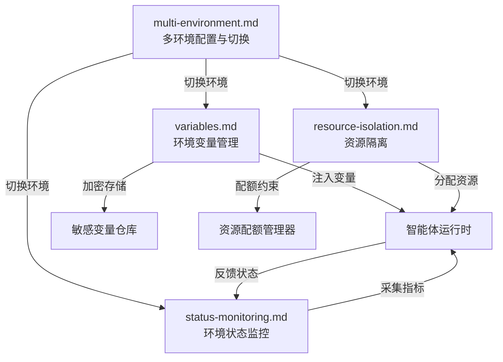
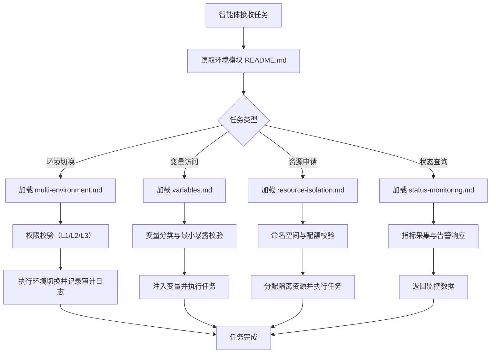

# 环境管理模块索引

本目录是工作空间环境管理规范的集合，定义智能体协作过程中所使用的多环境配置、环境变量管理、资源隔离与状态监控机制。模块解决「智能体运行在何种环境之上、环境如何切换、资源如何隔离、状态如何监控」的运行时基础设施问题，是 `teams/` 组织治理与 `workflows/` 工作流落地为实际执行环境的承载层。

## 模块说明

环境管理规范为团队协作提供统一的运行时环境视图，确保不同环境（开发、测试、生产）之间的配置隔离、变量安全、资源可控与状态可观测。所有智能体在执行涉及环境切换、变量访问、资源申请与状态查询的操作时，必须遵循本目录下的规范。

## 目录结构

```
.agents/worlds/environments/
├── README.md                # 本文件，模块索引与使用指引
├── multi-environment.md     # 多环境配置与切换规范
├── variables.md             # 环境变量管理规范
├── resource-isolation.md    # 资源隔离规范
└── status-monitoring.md     # 环境状态监控规范
```

## 文件职责矩阵

| 文件 | 职责 | 核心内容 | 适用场景 |
|---|---|---|---|
| README.md | 模块索引 | 目录结构、文件职责、模块关系、使用流程 | 入口导航、模块定位 |
| multi-environment.md | 多环境配置与切换 | dev/test/prod 三环境定义、切换流程、权限校验、快照机制 | 环境切换、配置加载、版本快照 |
| variables.md | 环境变量管理 | 集中存储、变量分类、加密存储、注入策略、最小暴露 | 变量读写、敏感信息保护、变量注入 |
| resource-isolation.md | 资源隔离 | 命名空间隔离、配额管理、网络隔离、存储隔离、隔离级别 | 资源申请、隔离配置、冲突避免 |
| status-monitoring.md | 环境状态监控 | 健康指标、采集机制、告警机制、数据保留、趋势查询 | 健康检查、告警响应、趋势分析 |

## 核心概念关系图



## 与其他模块的关系

| 关联模块 | 关系 | 引用路径 | 说明 |
|---|---|---|---|
| teams/ | 上游 | `../../teams/permission-system.md` | 环境切换权限校验依赖 teams/ 的 RBAC 模型与 L1/L2/L3 分级体系 |
| tools/ | 依赖 | `../../tools/file-operations.md` | 环境配置文件读写遵循文件操作规范 |
| tools/ | 依赖 | `../../tools/code-execution.md` | 环境命令执行遵循代码执行规范 |
| workflows/ | 协作 | `../../workflows/` | 环境管理为工作流提供运行时环境承载 |
| protocols/ | 引用 | `../../protocols/` | 环境切换的交接与消息传递遵循协作协议 |
| collaboration/ | 平行 | `../collaboration/` | 协作执行与环境管理共同构成 worlds/ 工作空间 |
| AGENTS.md | 上游 | `../../../AGENTS.md` | 环境管理入口须在 AGENTS.md 上下文路由表中注册 |

## 使用流程示例



## 使用约束

1. **权限前置**：所有环境管理操作须先完成对应级别的验证，生产环境操作须 L3 特权验证。
2. **操作留痕**：所有 L2/L3 环境操作须记录审计日志，保留期不少于 90 天。
3. **最小暴露**：环境变量注入遵循最小暴露原则，仅注入当前任务所需变量。
4. **资源隔离**：多环境并行运行时须确保命名空间、网络与存储隔离。
5. **状态可观测**：所有环境须接入状态监控，关键指标须配置告警规则。
6. **索引同步**：本目录文件变更后须同步更新 `../README.md` 与 `../../../AGENTS.md`。
