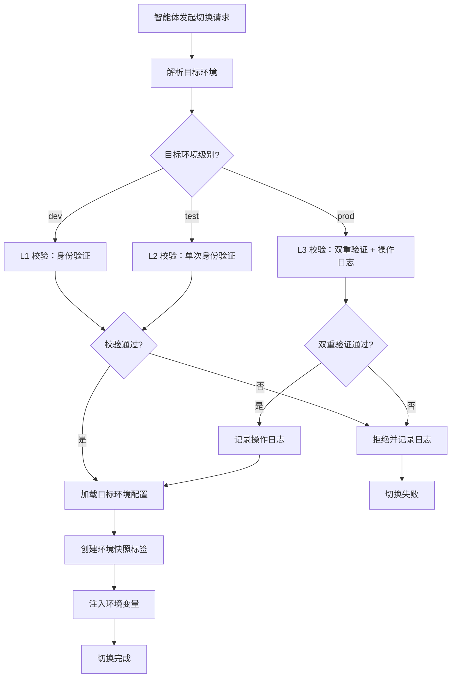

# 多环境配置与切换规范

本规范定义智能体协作过程中所使用的多环境配置体系、环境切换流程、权限校验规则与快照机制，确保不同环境之间的配置隔离、切换可控、版本可追溯。所有智能体在执行环境切换、配置加载与版本快照操作时，必须遵循本规范。

## 环境定义

系统定义三种标准环境，按用途与敏感度分级管理。

| 环境 | 标识 | 用途 | 敏感度 | 默认权限级别 |
|---|---|---|---|---|
| 开发环境 | dev | 智能体日常开发、调试与单元测试 | 低 | L1 |
| 测试环境 | test | 集成测试、验收测试、性能测试 | 中 | L2 |
| 生产环境 | prod | 正式运行环境，承载实际业务 | 高 | L3 |

### 环境特征

| 环境 | 数据来源 | 网络访问 | 资源配额 | 日志级别 | 数据库 |
|---|---|---|---|---|---|
| dev | 模拟数据/脱敏数据 | 内网全开放 | 低配额 | debug | 本地/共享开发库 |
| test | 测试数据集 | 内网受限 | 中配额 | info | 独立测试库 |
| prod | 真实业务数据 | 严格访问控制 | 高配额 | warn | 独立生产库 |

## 配置规范

### 配置文件格式

环境配置统一使用 YAML 格式，存放于 `.agents/worlds/environments/configs/` 目录下。

| 配置文件 | 适用环境 | 说明 |
|---|---|---|
| `dev.yaml` | dev | 开发环境配置 |
| `test.yaml` | test | 测试环境配置 |
| `prod.yaml` | prod | 生产环境配置 |
| `common.yaml` | 全部 | 三环境共享的基础配置 |

### 配置项清单

```yaml
# 环境配置项清单
environment:
  name: dev                      # 环境标识
  version: "1.0.0"               # 配置版本
  description: "开发环境"          # 环境描述

runtime:
  base_path: "d:/AI"             # 项目根目录
  workspace: ".agents/runtime/dev" # 运行时工作空间
  log_level: "debug"             # 日志级别
  timeout: 60                   # 默认超时（秒）

resources:
  cpu_limit: 2                  # CPU 配额（核）
  memory_limit: 4096            # 内存配额（MB）
  storage_limit: 10240          # 存储配额（MB）
  network_bandwidth: 100        # 网络带宽（Mbps）

database:
  host: "localhost"
  port: 5432
  name: "ai_dev"
  pool_size: 10

features:
  enable_debug: true            # 调试模式
  enable_monitoring: true       # 监控开关
  enable_audit_log: true         # 审计日志开关
```

### 默认值矩阵

| 配置项 | dev 默认值 | test 默认值 | prod 默认值 |
|---|---|---|---|
| log_level | debug | info | warn |
| cpu_limit | 2 | 4 | 8 |
| memory_limit | 4096 | 8192 | 16384 |
| storage_limit | 10240 | 51200 | 204800 |
| enable_debug | true | false | false |
| database.pool_size | 10 | 20 | 50 |

## 环境切换流程

环境切换须遵循标准流程，确保切换可控、可审计、可回滚。



### 1. 切换请求

智能体发起环境切换请求时，须提供以下信息：

```json
{
  "request_type": "environment_switch",
  "current_env": "dev",
  "target_env": "test",
  "reason": "执行集成测试",
  "task_id": "task-2026-001",
  "operator": "developer-agent-01"
}
```

### 2. 权限校验

环境切换的权限校验规则与目标环境敏感度对应，详见 [权限校验规则](#权限校验规则) 章节。

### 3. 配置加载

权限校验通过后，按以下顺序加载配置：

1. 加载 `common.yaml` 基础配置
2. 加载目标环境配置文件（如 `test.yaml`）
3. 环境配置覆盖基础配置中的同名项
4. 加载环境变量（见 `variables.md`）
5. 校验配置完整性

### 4. 审计日志

所有环境切换操作须记录审计日志，包含以下字段：

| 字段 | 说明 | 示例 |
|---|---|---|
| timestamp | 操作时间戳 | 2026-06-23T10:30:00+08:00 |
| operator | 操作者 | developer-agent-01 |
| action | 操作类型 | environment_switch |
| from_env | 源环境 | dev |
| to_env | 目标环境 | test |
| reason | 切换原因 | 执行集成测试 |
| task_id | 关联任务 | task-2026-001 |
| status | 切换状态 | success/failure |
| snapshot_tag | 快照标签 | env/test-v1.2 |

## 权限校验规则

环境切换权限校验依赖 `../../teams/permission-system.md` 中的 RBAC 模型与 L1/L2/L3 分级体系。

| 目标环境 | 权限级别 | 校验要求 | 操作日志 |
|---|---|---|---|
| dev | L1 | 身份验证即可 | 记录 |
| test | L2 | 单次身份验证 | 记录 |
| prod | L3 | 双重验证 + 操作日志 + orchestrator 备案 | 强制记录 |

### 生产环境切换特殊要求

生产环境切换除满足 L3 校验要求外，还须满足以下条件：

1. **双重确认**：须由发起者与 orchestrator 双方确认。
2. **影响评估**：切换前须完成影响评估报告，评估对生产业务的影响。
3. **回滚预案**：切换前须准备回滚预案，确保切换失败时可快速回滚。
4. **审批记录**：所有审批记录须保留至少 180 天。
5. **时段限制**：建议在业务低峰时段执行生产环境切换。

## 环境快照机制

环境快照基于 Git 标签实现，记录环境配置在某一时刻的完整状态，用于版本追溯与回滚。

### 快照标签命名规则

```
env/<环境标识>-v<主版本>.<次版本>
```

| 标签示例 | 说明 |
|---|---|
| `env/dev-v1.0` | 开发环境 1.0 版本快照 |
| `env/test-v1.2` | 测试环境 1.2 版本快照 |
| `env/prod-v2.0` | 生产环境 2.0 版本快照 |

### 快照内容

每个环境快照须包含以下内容：

| 内容 | 说明 |
|---|---|
| 环境配置文件 | 完整的环境 YAML 配置 |
| 环境变量清单 | 公开变量清单（敏感变量仅记录引用） |
| 资源配额快照 | 当时的资源配额配置 |
| 依赖版本锁定 | 依赖版本锁定文件 |
| 快照元数据 | 创建时间、操作者、关联任务 |

### 快照操作流程


### 快照回滚

当环境切换失败或出现问题时，可通过快照标签快速回滚：

1. 查询目标快照标签：`git tag -l "env/<环境标识>-v*"`
2. 检出快照配置：`git checkout env/<环境标识>-v<版本> -- .agents/worlds/environments/configs/`
3. 重新加载环境配置
4. 记录回滚审计日志

## 使用约束

1. **禁止跨级切换**：禁止从 dev 直接切换至 prod，须经过 test 环境验证。
2. **配置覆盖优先级**：环境配置 > 基础配置，禁止通过环境变量覆盖配置文件中的关键项。
3. **快照保留**：dev 快照保留 30 天，test 快照保留 90 天，prod 快照永久保留。
4. **并发切换限制**：同一环境同一时刻仅允许一个切换操作，避免配置冲突。
5. **切换失败处理**：切换失败时不应自动重试，应分析失败原因并调整后再执行。
6. **配置变更同步**：环境配置文件变更后须同步更新对应快照标签的次版本号。
