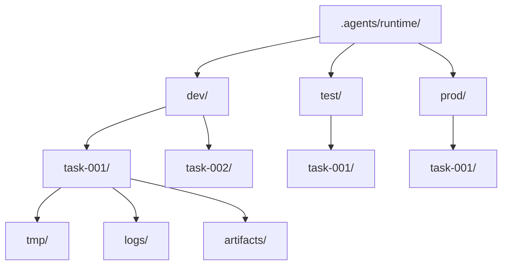
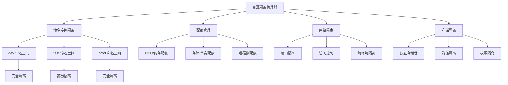

# 资源隔离规范

本规范定义智能体协作过程中所使用的资源隔离机制，包括命名空间隔离、资源配额管理、网络隔离与存储隔离，确保多环境、多任务并行运行时资源互不干扰、配额可控、安全可隔离。所有智能体在执行资源申请、隔离配置与冲突避免操作时，必须遵循本规范。

## 命名空间隔离机制

### 命名规则

命名空间采用层级命名规则，确保资源标识全局唯一。

```
<环境标识>-<团队标识>-<任务标识>-<资源类型>
```

| 组成部分 | 说明 | 示例 |
|---|---|---|
| 环境标识 | dev/test/prod | dev |
| 团队标识 | 团队唯一标识 | team-alpha |
| 任务标识 | 任务唯一标识 | task-001 |
| 资源类型 | 资源类别 | compute/storage/network |

**命名示例**：`dev-team-alpha-task-001-compute`

### 资源前缀

所有资源须携带命名空间前缀，便于资源归属识别与冲突避免。

| 资源类型 | 前缀格式 | 示例 |
|---|---|---|
| 计算资源 | `<ns>-compute-<id>` | dev-team-alpha-task-001-compute-01 |
| 存储资源 | `<ns>-storage-<id>` | dev-team-alpha-task-001-storage-01 |
| 网络资源 | `<ns>-network-<id>` | dev-team-alpha-task-001-network-01 |
| 进程资源 | `<ns>-process-<id>` | dev-team-alpha-task-001-process-01 |

### 冲突避免

| 冲突类型 | 避免策略 |
|---|---|
| 命名冲突 | 命名空间前缀 + 唯一 ID 生成器 |
| 端口冲突 | 动态端口分配 + 端口池管理 |
| 路径冲突 | 命名空间隔离的目录结构 |
| 资源争用 | 配额管理 + 优先级调度 |

## 资源配额管理

### 配额维度

资源配额按以下维度进行管理，确保资源使用可控。

| 配额维度 | 单位 | 说明 |
|---|---|---|
| CPU | 核 | 计算资源 CPU 配额 |
| 内存 | MB | 计算资源内存配额 |
| 存储 | MB | 存储空间配额 |
| 网络带宽 | Mbps | 网络带宽配额 |
| 进程数 | 个 | 并发进程数量配额 |
| 文件描述符 | 个 | 文件描述符数量配额 |

### 配额分配矩阵

| 环境 | CPU（核） | 内存（MB） | 存储（MB） | 带宽（Mbps） | 进程数 |
|---|---|---|---|---|---|
| dev | 2 | 4096 | 10240 | 100 | 50 |
| test | 4 | 8192 | 51200 | 200 | 100 |
| prod | 8 | 16384 | 204800 | 500 | 200 |

### 配额申请与回收


### 配额超限处理

| 超限场景 | 处理策略 |
|---|---|
| CPU 超限 | 限制新进程启动，等待现有进程释放 |
| 内存超限 | 触发内存回收，必要时终止低优先级任务 |
| 存储超限 | 拒绝新写入，提示清理临时文件 |
| 带宽超限 | 限速处理，降低非关键任务带宽 |
| 进程数超限 | 拒绝新进程创建，提示等待 |

## 网络隔离策略

### 网络策略

| 策略 | 说明 | 适用环境 |
|---|---|---|
| 默认拒绝 | 默认拒绝所有入站与出站流量 | prod |
| 内网开放 | 允许内网所有流量，拒绝外网 | dev |
| 受限访问 | 允许白名单地址访问 | test |

### 端口隔离

| 端口范围 | 用途 | 访问控制 |
|---|---|---|
| 3000-3999 | dev 环境服务端口 | 内网开放 |
| 4000-4999 | test 环境服务端口 | 白名单访问 |
| 5000-5999 | prod 环境服务端口 | 严格访问控制 |
| 8000-8999 | 监控与管理端口 | 仅管理网络访问 |

### 访问控制

| 访问类型 | dev | test | prod |
|---|---|---|---|
| 内网入站 | 允许 | 白名单 | 白名单 |
| 内网出站 | 允许 | 白名单 | 白名单 |
| 外网入站 | 拒绝 | 拒绝 | 拒绝 |
| 外网出站 | 允许 | 白名单 | 白名单 |
| 跨环境访问 | 拒绝 | 拒绝 | 拒绝 |

## 存储隔离

### 独立存储卷

每个环境与任务分配独立的存储卷，避免数据交叉污染。

| 存储卷类型 | 路径 | 说明 |
|---|---|---|
| 环境存储卷 | `.agents/runtime/<env>/` | 环境级共享存储 |
| 任务存储卷 | `.agents/runtime/<env>/<task_id>/` | 任务级独立存储 |
| 临时存储卷 | `.agents/runtime/<env>/<task_id>/tmp/` | 任务临时文件 |
| 日志存储卷 | `.agents/runtime/<env>/<task_id>/logs/` | 任务日志 |
| 产物存储卷 | `.agents/runtime/<env>/<task_id>/artifacts/` | 任务产物 |

### 路径隔离



### 权限隔离

| 存储路径 | 读取权限 | 写入权限 | 说明 |
|---|---|---|---|
| 环境存储卷 | 同环境所有智能体 | 环境管理员 | 环境级共享资源 |
| 任务存储卷 | 任务执行者 | 任务执行者 | 任务级独立资源 |
| 临时存储卷 | 任务执行者 | 任务执行者 | 任务结束后自动清理 |
| 日志存储卷 | L2 权限 | 任务执行者 | 审计与监控访问 |
| 产物存储卷 | L2 权限 | 任务执行者 | 任务产物归档 |

## 隔离级别定义

| 隔离级别 | 标识 | 说明 | 适用场景 |
|---|---|---|---|
| 完全隔离 | full | 命名空间、网络、存储、配额全部隔离 | prod 环境任务、敏感数据处理 |
| 部分隔离 | partial | 命名空间与存储隔离，网络与配额共享 | test 环境任务、集成测试 |
| 共享资源 | shared | 仅命名空间隔离，其他资源共享 | dev 环境任务、单元测试 |

### 隔离级别配置

| 隔离项 | 完全隔离 | 部分隔离 | 共享资源 |
|---|---|---|---|
| 命名空间 | 独立 | 独立 | 独立 |
| 网络 | 独立 | 共享 | 共享 |
| 存储 | 独立 | 独立 | 共享 |
| 配额 | 独立 | 共享 | 共享 |
| 进程 | 独立 | 独立 | 共享 |

## 资源隔离架构



## 使用约束

1. **命名空间唯一**：所有资源须携带唯一命名空间前缀，禁止使用裸资源名。
2. **配额前置校验**：资源申请前须校验配额是否充足，禁止超配分配。
3. **跨环境隔离**：禁止跨环境直接访问资源，须通过标准接口访问。
4. **存储清理**：任务结束后须清理临时存储卷，避免存储泄漏。
5. **网络最小开放**：网络访问遵循最小开放原则，仅开放任务所需端口与地址。
6. **隔离级别匹配**：隔离级别须与环境敏感度匹配，prod 环境任务必须使用完全隔离。
7. **资源回收审计**：所有资源回收操作须记录审计日志，便于资源使用追溯。
