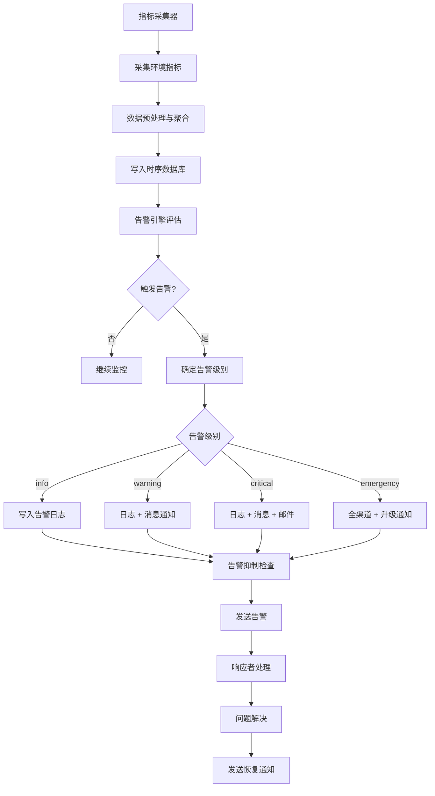

# 环境状态监控规范

本规范定义智能体协作过程中所使用的环境状态监控机制，包括健康指标定义、指标采集机制、告警机制、数据保留策略与历史趋势查询，确保环境运行状态可观测、异常可告警、趋势可分析。所有智能体在执行健康检查、告警响应与趋势查询操作时，必须遵循本规范。

## 健康指标定义

环境健康指标按维度分为四类，全面反映环境运行状态。

| 指标类别 | 指标名称 | 单位 | 说明 |
|---|---|---|---|
| 可用性 | availability | % | 环境可用时间占比 |
| 可用性 | uptime | 秒 | 环境连续运行时长 |
| 资源利用率 | cpu_usage | % | CPU 使用率 |
| 资源利用率 | memory_usage | % | 内存使用率 |
| 资源利用率 | storage_usage | % | 存储使用率 |
| 资源利用率 | network_throughput | Mbps | 网络吞吐量 |
| 错误率 | error_rate | % | 请求错误率 |
| 错误率 | task_failure_rate | % | 任务失败率 |
| 错误率 | exception_count | 个 | 异常计数 |
| 响应时间 | avg_response_time | 毫秒 | 平均响应时间 |
| 响应时间 | p95_response_time | 毫秒 | 95 分位响应时间 |
| 响应时间 | p99_response_time | 毫秒 | 99 分位响应时间 |

### 健康阈值

| 指标 | 正常范围 | 警告阈值 | 严重阈值 |
|---|---|---|---|
| availability | ≥ 99.9% | 99.0% - 99.9% | < 99.0% |
| cpu_usage | < 70% | 70% - 85% | > 85% |
| memory_usage | < 75% | 75% - 90% | > 90% |
| storage_usage | < 80% | 80% - 90% | > 90% |
| error_rate | < 0.1% | 0.1% - 1% | > 1% |
| task_failure_rate | < 1% | 1% - 5% | > 5% |
| avg_response_time | < 200ms | 200ms - 500ms | > 500ms |
| p95_response_time | < 500ms | 500ms - 1000ms | > 1000ms |

## 指标采集机制

### 采集频率

| 指标类别 | 采集频率 | 说明 |
|---|---|---|
| 可用性 | 每 30 秒 | 心跳检测 |
| 资源利用率 | 每 10 秒 | 实时监控 |
| 错误率 | 每 60 秒 | 聚合统计 |
| 响应时间 | 每次请求 | 实时记录 |

### 采集方式

| 采集方式 | 说明 | 适用指标 |
|---|---|---|
| 主动探测 | 监控系统主动探测目标环境 | 可用性 |
| 系统采样 | 读取系统资源使用数据 | 资源利用率 |
| 日志聚合 | 聚合分析运行日志 | 错误率、响应时间 |
| 埋点上报 | 任务执行时上报指标 | 响应时间、任务失败率 |

### 数据格式

采集数据统一采用 JSON 格式，包含指标名、值、时间戳、标签。

```json
{
  "metric": "cpu_usage",
  "value": 65.5,
  "unit": "%",
  "timestamp": "2026-06-23T10:30:00+08:00",
  "environment": "dev",
  "namespace": "dev-team-alpha-task-001",
  "labels": {
    "host": "agent-01",
    "task_id": "task-001"
  }
}
```

## 告警机制

### 告警规则

告警规则定义指标阈值与触发条件，支持单指标告警与组合告警。

| 规则类型 | 说明 | 示例 |
|---|---|---|
| 阈值告警 | 单指标超过阈值 | cpu_usage > 85% |
| 持续告警 | 指标持续超限 | cpu_usage > 70% 持续 5 分钟 |
| 组合告警 | 多指标组合 | cpu_usage > 80% 且 memory_usage > 80% |
| 趋势告警 | 指标趋势异常 | error_rate 连续 3 次采集上升 |

### 告警级别

| 级别 | 标识 | 触发条件 | 响应时效 | 通知渠道 |
|---|---|---|---|---|
| 信息 | info | 指标进入警告范围 | 24 小时内 | 日志 |
| 警告 | warning | 指标达到警告阈值 | 1 小时内 | 日志 + 消息 |
| 严重 | critical | 指标达到严重阈值 | 15 分钟内 | 日志 + 消息 + 邮件 |
| 紧急 | emergency | 多指标严重超限或可用性中断 | 立即 | 全渠道 + 升级通知 |

### 告警渠道

| 渠道 | 适用级别 | 说明 |
|---|---|---|
| 日志 | info 及以上 | 写入告警日志文件 |
| 消息 | warning 及以上 | 发送至智能体消息通道 |
| 邮件 | critical 及以上 | 发送邮件至管理员与 orchestrator |
| 升级通知 | emergency | 通知 team-admin 与 co-founder |

### 告警抑制

为避免告警风暴，设置告警抑制机制：

| 抑制策略 | 说明 |
|---|---|
| 重复抑制 | 同一告警 5 分钟内仅通知一次 |
| 关联抑制 | 根因告警触发后抑制衍生告警 |
| 维护抑制 | 维护期间抑制非关键告警 |
| 恢复通知 | 告警恢复后发送恢复通知 |

## 监控告警流程



## 监控数据保留策略

### 保留周期

| 数据精度 | 保留周期 | 说明 |
|---|---|---|
| 原始数据 | 7 天 | 10 秒级采集数据 |
| 1 分钟聚合 | 30 天 | 1 分钟级聚合数据 |
| 1 小时聚合 | 90 天 | 1 小时级聚合数据 |
| 1 天聚合 | 365 天 | 1 天级聚合数据 |
| 告警记录 | 180 天 | 告警事件记录 |

### 归档机制

| 归档阶段 | 触发条件 | 存储位置 | 说明 |
|---|---|---|---|
| 热数据 | 7 天内 | 时序数据库 | 高频查询 |
| 温数据 | 7-90 天 | 时序数据库（降采样） | 中频查询 |
| 冷数据 | 90-365 天 | 归档存储 | 低频查询 |
| 归档数据 | 超过 365 天 | 长期归档存储 | 审计查询 |

### 数据降采样

| 原始精度 | 降采样精度 | 聚合方式 | 保留周期 |
|---|---|---|---|
| 10 秒 | 1 分钟 | 平均值 | 30 天 |
| 1 分钟 | 1 小时 | 平均值 + 最大值 | 90 天 |
| 1 小时 | 1 天 | 平均值 + 最大值 + 最小值 | 365 天 |

## 历史趋势查询

### 查询接口

| 接口 | 说明 | 参数 |
|---|---|---|
| 实时查询 | 查询当前指标值 | metric、environment、namespace |
| 范围查询 | 查询时间范围内指标 | metric、start、end、step |
| 聚合查询 | 查询聚合指标 | metric、aggregation、period |
| 告警查询 | 查询告警历史 | start、end、level、status |

### 聚合维度

| 维度 | 说明 | 示例 |
|---|---|---|
| 时间维度 | 按时间粒度聚合 | 1分钟、1小时、1天 |
| 环境维度 | 按环境聚合 | dev、test、prod |
| 命名空间维度 | 按命名空间聚合 | team-alpha、team-beta |
| 任务维度 | 按任务聚合 | task-001、task-002 |
| 指标维度 | 按指标类型聚合 | 可用性、资源利用率、错误率 |

### 查询示例

```json
{
  "query_type": "range",
  "metric": "cpu_usage",
  "environment": "dev",
  "namespace": "dev-team-alpha-*",
  "start": "2026-06-23T00:00:00+08:00",
  "end": "2026-06-23T23:59:59+08:00",
  "step": "1h",
  "aggregation": "avg"
}
```

### 可视化

| 可视化类型 | 适用场景 | 说明 |
|---|---|---|
| 折线图 | 时间序列趋势 | 指标随时间变化 |
| 柱状图 | 离散数据对比 | 不同环境/任务指标对比 |
| 仪表盘 | 实时状态展示 | 当前指标值与阈值 |
| 热力图 | 多维度分布 | 资源使用分布 |
| 告警时间线 | 告警历史 | 告警事件时间分布 |

## 使用约束

1. **监控覆盖**：所有环境必须接入监控，关键指标必须配置告警规则。
2. **告警响应**：告警须在规定时效内响应，严重及以上告警须立即处理。
3. **数据完整性**：监控数据须保证完整性，数据丢失率不得超过 0.1%。
4. **查询性能**：趋势查询响应时间不得超过 5 秒，聚合查询不得超过 10 秒。
5. **告警准确性**：告警误报率不得超过 5%，漏报率不得超过 0.1%。
6. **数据安全**：监控数据须按环境隔离，禁止跨环境查询未经授权的数据。
7. **归档及时性**：数据归档须在保留周期到期后 24 小时内完成。
